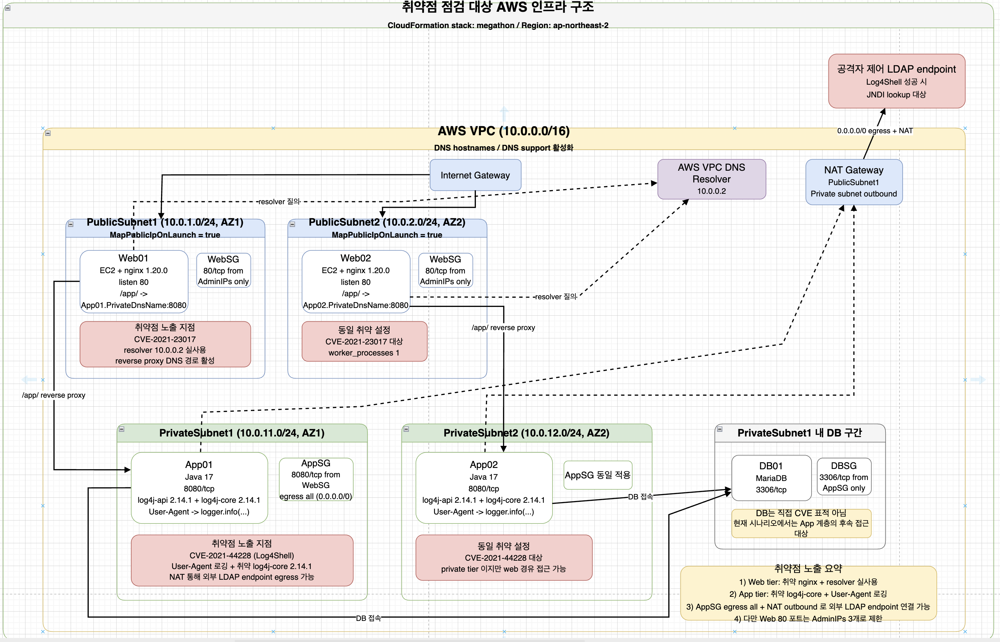

# 취약점 점검 대상 AWS 인프라



Patcher Multi-Agent 시스템의 취약점 수집, 자산 매칭, 위험도 평가, 패치 전략 및 패치 실행 기능을 검증하기 위해 구성한 **AWS 기반 3계층 취약 인프라 환경**입니다.

전체 환경은 하나의 VPC 내부에 다음 계층으로 분리되어 있습니다.

```text
Web Tier
    Nginx Reverse Proxy

App Tier
    Java Application + Log4j

DB Tier
    MariaDB
```

단순히 취약한 소프트웨어 버전만 설치한 것이 아니라, 각 취약점의 실제 동작 조건을 점검할 수 있도록 네트워크 경로, 설정, 프로세스 및 입력 전달 구조를 함께 구성했습니다.

주요 점검 대상 취약점:

```text
CVE-2021-23017
    Nginx Resolver Off-by-One Heap Write

CVE-2021-44228
    Apache Log4j2 JNDI Injection
    Log4Shell
```

> 이 환경은 취약점 분석과 보안 자동화 검증을 위한 격리된 실습 환경입니다. 운영 환경 또는 외부에 공개된 환경에서 동일한 취약 구성을 사용해서는 안 됩니다.

---

## 네트워크 구성

### VPC

| 항목 | 설정 |
| --- | --- |
| VPC CIDR | `10.0.0.0/16` |
| DNS Hostnames | 활성화 |
| DNS Support | 활성화 |
| 내부 DNS Resolver | `10.0.0.2` |
| 인터넷 연결 | Internet Gateway |
| Private Subnet 외부 통신 | NAT Gateway |

VPC DNS 기능을 활성화하여 Web Tier가 App Tier의 Private DNS 이름을 조회할 수 있도록 구성했습니다.

---

## Subnet 구성

| Subnet | CIDR | AZ | 역할 |
| --- | --- | --- | --- |
| PublicSubnet1 | `10.0.1.0/24` | AZ1 | Web01 및 NAT Gateway |
| PublicSubnet2 | `10.0.2.0/24` | AZ2 | Web02 |
| PrivateSubnet1 | `10.0.11.0/24` | AZ1 | App01 |
| PrivateSubnet2 | `10.0.12.0/24` | AZ2 | App02 |
| Private DB 구간 | 별도 Private Subnet | 분리 구성 | DB01 |

Public Subnet에는 Web Tier를 배치하고, Private Subnet에는 App 및 DB Tier를 분리했습니다.

---

## 자산 구성

### Web Tier

| 자산 | 소프트웨어 | Port | 역할 |
| --- | --- | ---: | --- |
| Web01 | Nginx `1.20.0` | 80 | Reverse Proxy |
| Web02 | Nginx `1.20.0` | 80 | Reverse Proxy |

Web 서버는 다음 경로를 App Tier로 전달합니다.

```text
/app/
```

대표 Reverse Proxy 흐름:

```text
Client
    ↓
Web01 또는 Web02
    ↓
Nginx /app/ Location
    ↓
App01.PrivateDnsName:8080
또는
App02.PrivateDnsName:8080
```

Web Tier는 App Tier의 IP 주소를 직접 지정하지 않고 Private DNS 이름을 사용합니다.

구성상 Nginx Resolver를 통해 AWS VPC DNS Resolver에 질의하도록 설정되어 있으므로 Nginx Resolver 코드 경로를 실제로 점검할 수 있습니다.

---

### App Tier

| 자산 | Runtime | 취약 라이브러리 | Port | 역할 |
| --- | --- | --- | ---: | --- |
| App01 | Java 17 | Log4j API/Core `2.14.1` | 8080 | 애플리케이션 서버 |
| App02 | Java 17 | Log4j API/Core `2.14.1` | 8080 | 애플리케이션 서버 |

App Tier는 Web Tier로부터 전달된 요청을 처리합니다.

애플리케이션은 HTTP 요청의 `User-Agent` 값을 Log4j를 통해 기록하도록 구성되어 있습니다.

개념적인 처리 예시:

```java
String userAgent = request.getHeader("User-Agent");
logger.info(userAgent);
```

따라서 공격자 제어 문자열이 Log4j 메시지 처리 경로까지 도달할 수 있습니다.

---

### DB Tier

| 자산 | 소프트웨어 | Port | 역할 |
| --- | --- | ---: | --- |
| DB01 | MariaDB | 3306 | 애플리케이션 데이터 저장 |

DB Tier는 이번 시나리오에서 직접적인 CVE 점검 대상은 아닙니다.

다만 App Tier가 침해된 경우 다음 단계의 후속 접근 대상이 될 수 있습니다.

```text
App Tier 침해
    ↓
애플리케이션 자격증명 또는 설정 파일 확보
    ↓
DB01 접근
    ↓
데이터 조회 또는 변조
```

---

## Security Group 구성

### Web Security Group

```text
Inbound
    TCP/80
    Source: 허용된 관리자 또는 테스트 IP

Outbound
    App Tier TCP/8080
    DNS 및 필요한 AWS 통신
```

Web Tier가 Public Subnet에 배치되어 있어도 Web Port는 무제한 공개하지 않고 허용된 테스트 IP로 제한합니다.

---

### App Security Group

```text
Inbound
    TCP/8080
    Source: Web Security Group

Outbound
    0.0.0.0/0
    NAT Gateway 경유
```

App Tier는 인터넷에서 직접 접근할 수 없습니다.

다만 Outbound 통신은 NAT Gateway를 통해 외부로 전달될 수 있습니다.

이 Outbound 경로는 Log4Shell 점검 시 외부 LDAP 또는 HTTP Endpoint로 연결되는 조건을 검증하는 데 사용됩니다.

---

### DB Security Group

```text
Inbound
    TCP/3306
    Source: App Security Group

Outbound
    기본 또는 제한된 정책
```

DB는 Web Tier 또는 인터넷에서 직접 접근할 수 없으며 App Tier에서만 접근할 수 있습니다.

---

## 주요 통신 흐름

### 사용자 요청 흐름

```text
허용된 Client
    ↓ TCP/80
Web01 또는 Web02
    ↓ /app/ Reverse Proxy
App01 또는 App02
    ↓ TCP/3306
DB01
```

---

### Nginx DNS 조회 흐름

```text
Web01 또는 Web02
    ↓
Private DNS 이름 조회
    ↓
AWS VPC DNS Resolver
    10.0.0.2
    ↓
App Tier Private IP 반환
    ↓
Nginx Reverse Proxy 연결
```

이 경로를 통해 Nginx Resolver 기능이 실제 요청 처리 과정에서 사용됩니다.

---

### App Tier Outbound 흐름

```text
App01 또는 App02
    ↓
Private Subnet Route Table
    ↓
NAT Gateway
    ↓
Internet Gateway
    ↓
외부 Endpoint
```

이 경로는 App Tier에서 다음과 같은 외부 통신이 가능한지 확인하는 데 사용됩니다.

```text
LDAP
HTTP
HTTPS
DNS
```

---

# CVE-2021-23017 점검 환경

## 취약점 개요

`CVE-2021-23017`은 Nginx Resolver에서 발생하는 Off-by-One Heap Write 취약점입니다.

취약한 Nginx가 공격자가 영향을 줄 수 있는 DNS 응답을 처리하면 메모리 손상이 발생할 수 있습니다.

점검 대상 버전:

```text
Nginx 1.20.0
```

---

## 점검 대상 자산

```text
Web01
Web02
```

두 Web 서버 모두 다음 조건을 갖습니다.

```text
Nginx 1.20.0 설치
Nginx 프로세스 실행
resolver 지시문 사용
AWS VPC DNS Resolver 사용
Private DNS 기반 Reverse Proxy
실제 DNS 조회 경로 존재
```

---

## 취약점 점검 조건

| 조건 | 구성 상태 |
| --- | --- |
| 취약한 Nginx 버전 | 충족 |
| Nginx Resolver 사용 | 충족 |
| DNS 질의 발생 | 충족 |
| Reverse Proxy Backend가 DNS 이름 | 충족 |
| 공격자가 영향을 줄 수 있는 DNS 응답 | 별도 검증 필요 |
| 취약 코드 경로 실행 | 점검 가능 |

중요한 점은 단순히 Nginx `1.20.0`이 설치되어 있다는 사실만으로 취약성을 판단하지 않는다는 것입니다.

다음 사실을 함께 확인해야 합니다.

```text
Nginx Resolver가 실제 설정되어 있는가?
        +
실제 요청 처리 시 DNS 조회가 발생하는가?
        +
공격자가 DNS 응답에 영향을 줄 수 있는가?
```

---

## Nginx 설정 개념

```nginx
resolver 10.0.0.2;

location /app/ {
    proxy_pass http://<APP_PRIVATE_DNS_NAME>:8080;
}
```

실제 구성에서는 Runtime DNS Resolution이 발생하도록 Reverse Proxy 설정과 Resolver 사용 방식을 구성해야 합니다.

---

## 점검 흐름

```text
Web 서버 접속
    ↓
Nginx 버전 확인
    ↓
nginx.conf 확인
    ↓
resolver 10.0.0.2 확인
    ↓
/app/ Reverse Proxy 설정 확인
    ↓
실제 DNS 질의 발생 여부 확인
    ↓
Nginx 프로세스와 DNS 트래픽 확인
    ↓
CVE 영향 가능성 평가
```

---

## 확인 명령 예시

### Nginx 버전

```bash
nginx -v
```

또는:

```bash
/usr/local/nginx/sbin/nginx -v
```

### Nginx 설정

```bash
nginx -T
```

### Resolver 설정

```bash
nginx -T 2>&1 | grep -n resolver
```

### Reverse Proxy 설정

```bash
nginx -T 2>&1 | grep -n proxy_pass
```

### DNS 통신 확인

```bash
sudo tcpdump -ni any port 53
```

### Nginx 프로세스 확인

```bash
ps -ef | grep nginx | grep -v grep
```

---

## 기대 근거

자산 매칭 또는 위험도 평가 단계에서 다음과 같은 근거가 수집될 수 있습니다.

```json
{
  "asset_id": "<WEB_INSTANCE_ID>",
  "installed_software": [
    {
      "product": "nginx",
      "version": "1.20.0"
    }
  ],
  "services": [
    {
      "name": "nginx",
      "port": 80,
      "status": "running"
    }
  ],
  "config_findings": [
    {
      "path": "/etc/nginx/nginx.conf",
      "finding": "resolver 10.0.0.2 configured"
    },
    {
      "finding": "runtime DNS resolution used for /app/ reverse proxy"
    }
  ]
}
```

---

## 위험도 평가 시 고려사항

다음 조건은 위험도를 높이는 근거입니다.

- 취약한 Nginx 버전이 실행 중임
- Resolver 지시문이 실제로 사용됨
- 런타임 DNS 질의가 발생함
- Web Tier가 외부 요청을 처리함
- Nginx Master Process가 높은 권한으로 실행됨
- 취약 기능을 비활성화한 근거가 없음

다음 조건은 위험도를 낮추거나 제한하는 근거가 될 수 있습니다.

- Web Port가 제한된 관리 IP에만 허용됨
- Resolver 기능이 실제 요청 경로에서 사용되지 않음
- 취약 버전이 안전한 버전으로 교체됨
- 공격자가 DNS 응답에 영향을 줄 수 없는 구조임
- 추가 네트워크 통제로 DNS 통신이 제한됨

> Resolver가 설정되어 있다는 사실만으로 실제 악용이 보장되는 것은 아닙니다. 공격자가 DNS 응답에 영향을 줄 수 있는지와 취약 코드 경로가 실제로 실행되는지를 별도로 확인해야 합니다.

---

# CVE-2021-44228 점검 환경

## 취약점 개요

`CVE-2021-44228`, Log4Shell은 취약한 Apache Log4j2가 공격자 제어 문자열을 처리할 때 JNDI Lookup이 수행될 수 있는 취약점입니다.

점검 대상 라이브러리:

```text
log4j-api 2.14.1
log4j-core 2.14.1
```

---

## 점검 대상 자산

```text
App01
App02
```

두 App 서버 모두 다음 조건을 갖습니다.

```text
Java 17
Log4j Core 2.14.1
Log4j API 2.14.1
HTTP User-Agent 값 로깅
Private Subnet 배치
NAT Gateway를 통한 외부 통신 가능
```

---

## 취약점 점검 조건

| 조건 | 구성 상태 |
| --- | --- |
| 취약한 Log4j Core 버전 | 충족 |
| 취약 라이브러리가 애플리케이션에 포함됨 | 충족 |
| 공격자 제어 입력 존재 | 충족 |
| User-Agent가 Log4j로 전달됨 | 충족 |
| JNDI Lookup 차단 여부 | 점검 필요 |
| 외부 LDAP 또는 HTTP 통신 | NAT를 통해 가능 |
| 실제 원격 코드 실행 가능성 | Java 및 JNDI 보호 설정에 따라 별도 평가 |

---

## 입력 전달 흐름

```text
공격자 제어 User-Agent
        ↓
Web01 또는 Web02
        ↓
/app/ Reverse Proxy
        ↓
App01 또는 App02
        ↓
HTTP Header 추출
        ↓
logger.info(userAgent)
        ↓
Log4j 메시지 처리
        ↓
JNDI Lookup 가능성
```

---

## 외부 통신 흐름

```text
App01 또는 App02
        ↓
App Security Group Egress
        ↓
Private Subnet Route Table
        ↓
NAT Gateway
        ↓
Internet Gateway
        ↓
외부 LDAP Endpoint
```

App 서버가 Private Subnet에 있다는 사실만으로 Log4Shell의 외부 통신 조건이 제거되지는 않습니다.

NAT Gateway를 통한 Outbound 경로가 존재하므로 JNDI Lookup 과정에서 외부 Endpoint에 연결을 시도할 수 있습니다.

---

## 애플리케이션 코드 개념

```java
@GetMapping("/app")
public String handleRequest(
        @RequestHeader(value = "User-Agent", required = false)
        String userAgent
) {
    logger.info(userAgent);
    return "OK";
}
```

실제 점검에서는 공격자 입력이 다음 경로를 거치는지 확인해야 합니다.

```text
HTTP Header
    ↓
Application Controller
    ↓
Logger 호출
    ↓
Log4j Core
```

---

## 점검 흐름

```text
App 서버 접속
    ↓
Java 프로세스 확인
    ↓
Log4j JAR 버전 확인
    ↓
실행 중인 프로세스의 Classpath 확인
    ↓
User-Agent 로깅 코드 확인
    ↓
테스트 요청 전송
    ↓
로그 반영 여부 확인
    ↓
JNDI Lookup 및 외부 통신 여부 확인
    ↓
완화 설정 확인
    ↓
CVE 영향 가능성 평가
```

---

## 확인 명령 예시

### Java 프로세스

```bash
ps -ef | grep java | grep -v grep
```

### Log4j 파일 확인

```bash
find / -type f -name "log4j-core-*.jar" 2>/dev/null
```

### JAR 버전 확인

```bash
ls -l /app/lib/log4j-core-*.jar
```

### 실행 중인 프로세스가 사용하는 JAR 확인

```bash
sudo lsof -p <JAVA_PID> | grep -i log4j
```

### Java Command Line 확인

```bash
tr '\0' ' ' < /proc/<JAVA_PID>/cmdline
```

### 환경변수 확인

```bash
tr '\0' '\n' < /proc/<JAVA_PID>/environ
```

### 네트워크 연결 확인

```bash
sudo ss -ntp
```

### 외부 LDAP 통신 확인

```bash
sudo tcpdump -ni any port 389
```

---

## 기대 근거

```json
{
  "asset_id": "<APP_INSTANCE_ID>",
  "installed_software": [
    {
      "product": "log4j-api",
      "version": "2.14.1"
    },
    {
      "product": "log4j-core",
      "version": "2.14.1"
    }
  ],
  "services": [
    {
      "name": "java",
      "port": 8080,
      "status": "running"
    }
  ],
  "file_findings": [
    {
      "path": "/app/lib/log4j-core-2.14.1.jar"
    }
  ],
  "config_findings": [
    {
      "finding": "User-Agent header is passed to logger.info()"
    },
    {
      "finding": "Outbound internet access available through NAT Gateway"
    }
  ]
}
```

---

## 위험도 평가 시 고려사항

다음 조건은 위험도를 유지하거나 높이는 근거입니다.

- `log4j-core 2.14.1`이 실제 배포되어 있음
- 실행 중인 Java 프로세스가 취약 JAR를 로드하고 있음
- 공격자 제어 `User-Agent`가 `logger.info()`에 전달됨
- JNDI Lookup 제거 또는 차단 근거가 없음
- NAT Gateway를 통한 외부 통신이 가능함
- 애플리케이션이 높은 권한으로 실행 중임
- 중요 데이터가 있는 DB Tier에 접근 가능함

다음 조건은 위험도를 낮추는 근거가 될 수 있습니다.

- 취약 JAR가 실행 중인 프로세스에서 사용되지 않음
- `JndiLookup.class`가 제거됨
- 안전한 Log4j 버전으로 업데이트됨
- 메시지 Lookup을 차단하는 검증된 완화 조치가 존재함
- 공격자 입력이 Log4j 처리 경로에 도달하지 않음
- 외부 LDAP, RMI 또는 HTTP 통신이 네트워크에서 차단됨

> 실제 원격 코드 실행 가능성은 Java Runtime 버전, JNDI Provider, 원격 Class Loading 제한 및 추가 보안 설정에 따라 달라질 수 있습니다. 따라서 외부 Lookup 발생 여부와 최종 코드 실행 가능성을 분리하여 평가해야 합니다.

---

# CVE별 공격 경로

## Nginx Resolver 경로

```text
외부 요청
    ↓
Web Tier Nginx
    ↓
/app/ Reverse Proxy
    ↓
Private DNS 이름 해석
    ↓
VPC DNS Resolver
    ↓
DNS Response 처리
    ↓
CVE-2021-23017 점검 경로
```

---

## Log4Shell 경로

```text
공격자 제어 HTTP Header
    ↓
Web Tier
    ↓
App Tier
    ↓
logger.info()
    ↓
Log4j Core 2.14.1
    ↓
JNDI Lookup
    ↓
NAT Gateway
    ↓
외부 Endpoint
    ↓
CVE-2021-44228 점검 경로
```

---

## App 침해 이후 DB 접근 경로

```text
App Tier 침해
    ↓
애플리케이션 설정 또는 환경변수 접근
    ↓
DB Credential 획득 가능성
    ↓
DB Security Group에서 허용된 App → DB 경로
    ↓
DB01 TCP/3306
```

DB는 직접적인 CVE 대상이 아니더라도 App Tier 침해 이후의 영향 범위를 판단할 때 중요합니다.

---

# 자산 매칭 기준

자산 매칭 에이전트는 다음 기준으로 취약점과 실제 자산을 연결할 수 있습니다.

## Nginx

```text
product = nginx
version = 1.20.0
process = nginx
port = 80
resolver 설정 존재
reverse proxy 설정 존재
```

## Log4j

```text
product = log4j-core
version = 2.14.1
process = java
port = 8080
취약 JAR 파일 존재
User-Agent 로깅 코드 존재
NAT Egress 존재
```

---

# 위험도 평가 기준

위험도 평가 에이전트는 Base CVSS만 사용하지 않고 다음 자산 맥락을 함께 확인합니다.

```text
취약 소프트웨어 설치 여부
실제 프로세스 실행 여부
취약 기능 사용 여부
외부 노출 수준
공격자 입력 도달성
프로세스 실행 권한
Outbound 통신 가능성
완화 조치 적용 여부
후속 접근 가능한 자산
```

예시:

```text
Nginx 1.20.0 설치
        +
resolver 실제 사용
        +
외부 요청 처리
        ↓
Web 자산 위험도 평가
```

```text
Log4j Core 2.14.1 설치
        +
User-Agent 로깅
        +
NAT를 통한 외부 통신
        +
DB 접근 권한
        ↓
App 자산 위험도 평가
```

---

# 패치 전략 검증

이 인프라는 패치 전략 에이전트의 다음 의사결정을 검증하는 데 사용할 수 있습니다.

## Nginx

```text
취약 버전 교체 가능 여부
Nginx Binary 또는 Package 업데이트
서비스 Reload 또는 Restart 필요 여부
Reverse Proxy 정상 동작 검증
DNS Resolution 정상 여부
Rollback 방식
```

## Log4j

```text
취약 JAR 교체 가능 여부
애플리케이션 재빌드 또는 재배포 필요 여부
Java 프로세스 재시작 필요 여부
임시 완화 조치 적용 가능 여부
새 JAR 실제 로드 여부
애플리케이션 로그 오류 확인
Rollback 방식
```

---

# 패치 후 검증

## Nginx

```bash
nginx -v
nginx -T
ps -ef | grep nginx | grep -v grep
ss -tuln | grep ':80'
curl -I http://127.0.0.1/app/
```

확인 항목:

```text
목표 버전 적용
Nginx 프로세스 정상 실행
80 Port Listening
/app/ Reverse Proxy 정상
Private DNS 조회 정상
```

---

## Log4j

```bash
find /app -name "log4j-core-*.jar"
ps -ef | grep java | grep -v grep
sudo lsof -p <JAVA_PID> | grep -i log4j
curl -H "User-Agent: validation-test" http://127.0.0.1:8080/app/
```

확인 항목:

```text
취약 JAR 제거
안전한 JAR 설치
Java 프로세스 재시작
새 JAR 실제 로드
애플리케이션 정상 응답
오류 로그 미발생
```

---

# CloudFormation 구성 요소

인프라는 다음 AWS Resource로 구성할 수 있습니다.

```text
AWS::EC2::VPC
AWS::EC2::InternetGateway
AWS::EC2::VPCGatewayAttachment
AWS::EC2::Subnet
AWS::EC2::RouteTable
AWS::EC2::Route
AWS::EC2::SubnetRouteTableAssociation
AWS::EC2::NatGateway
AWS::EC2::EIP
AWS::EC2::SecurityGroup
AWS::EC2::Instance
AWS::IAM::Role
AWS::IAM::InstanceProfile
```

---

# 운영 및 보안 주의사항

- 이 인프라는 격리된 취약점 점검 환경에서만 사용합니다.
- 취약한 Nginx와 Log4j 버전을 운영 서비스에 배포하지 않습니다.
- Web Port는 허용된 테스트 IP로 제한합니다.
- SSH Port를 전체 인터넷에 공개하지 않습니다.
- 가능하면 SSH 대신 AWS Systems Manager Session Manager를 사용합니다.
- App Tier는 인터넷에서 직접 접근할 수 없도록 유지합니다.
- 외부 LDAP Endpoint는 통제된 실습 서버만 사용합니다.
- 실습 종료 후 NAT Gateway, EIP 및 EC2를 제거하여 불필요한 비용을 방지합니다.
- 실제 AWS Account ID, Instance ID, Public IP 및 Runtime ARN을 Git에 기록하지 않습니다.
- CloudFormation Parameter에 실제 관리자 IP를 기본값으로 하드코딩하지 않습니다.
- AWS Access Key와 Secret Key를 코드 또는 User Data에 기록하지 않습니다.
- 취약점 검증 로그에는 내부 IP, 자산 정보 및 명령 결과가 포함될 수 있습니다.
- 패치 실행 전 Snapshot, AMI 또는 복원 가능한 백업을 준비합니다.
- AI가 생성한 Shell 명령을 검증 없이 대상 EC2에서 실행하지 않습니다.
- 실제 공격 Payload는 소유하거나 명시적으로 허가받은 환경에서만 사용합니다.

---

# 점검 전 체크리스트

```text
[ ] VPC와 Subnet CIDR가 올바르게 구성되었는가?
[ ] VPC DNS Support와 DNS Hostnames가 활성화되어 있는가?
[ ] Internet Gateway가 Public Route Table에 연결되어 있는가?
[ ] NAT Gateway가 Public Subnet에 배치되어 있는가?
[ ] Private Route Table이 NAT Gateway를 사용하고 있는가?
[ ] Web01과 Web02에서 Nginx 1.20.0이 실행 중인가?
[ ] Nginx resolver가 10.0.0.2를 참조하는가?
[ ] /app/ Reverse Proxy가 App Private DNS 이름을 사용하는가?
[ ] App01과 App02에서 Java 프로세스가 실행 중인가?
[ ] Log4j Core 2.14.1이 실제 Classpath에 포함되어 있는가?
[ ] User-Agent 값이 Log4j를 통해 기록되는가?
[ ] App Tier에서 외부 통신이 가능한가?
[ ] DB Security Group이 App Security Group만 허용하는가?
[ ] Web Port가 허용된 테스트 IP로 제한되어 있는가?
[ ] SSM Agent가 각 EC2에서 정상 동작하는가?
[ ] 패치 전 Backup 또는 Snapshot이 준비되어 있는가?
[ ] 실제 AWS 식별정보와 인증정보가 Git에서 제외되어 있는가?
```

---

# 점검 결과 기대 형태

```json
{
  "assets": [
    {
      "asset_id": "<WEB_INSTANCE_ID>",
      "tier": "web",
      "vulnerabilities": [
        {
          "cve_id": "CVE-2021-23017",
          "installed_version": "1.20.0",
          "vulnerable_component_running": true,
          "exploit_preconditions": {
            "resolver_configured": true,
            "runtime_dns_resolution": true,
            "attacker_controlled_dns_response": "unknown"
          }
        }
      ]
    },
    {
      "asset_id": "<APP_INSTANCE_ID>",
      "tier": "app",
      "vulnerabilities": [
        {
          "cve_id": "CVE-2021-44228",
          "installed_version": "2.14.1",
          "vulnerable_component_running": true,
          "exploit_preconditions": {
            "attacker_controlled_input_logged": true,
            "jndi_lookup_disabled": false,
            "external_egress_available": true
          }
        }
      ]
    }
  ]
}
```

---

# 인프라 요약

```text
Web Tier
    Nginx 1.20.0
    Public Subnet
    TCP/80
    /app/ Reverse Proxy
    VPC DNS Resolver 사용
    CVE-2021-23017 점검 대상

App Tier
    Java 17
    Log4j Core 2.14.1
    Private Subnet
    TCP/8080
    User-Agent 로깅
    NAT Gateway Outbound
    CVE-2021-44228 점검 대상

DB Tier
    MariaDB
    Private DB 구간
    TCP/3306
    App Security Group에서만 접근
    직접적인 CVE 대상은 아니지만 후속 영향 대상
```

이 인프라의 핵심은 다음과 같습니다.

```text
취약한 버전
        +
실제 취약 기능 사용
        +
공격자 입력 전달 경로
        +
외부 통신 경로
        +
후속 접근 가능한 내부 자산
        ↓
실제 환경 기반 취약점 점검
```

단순히 취약한 패키지가 설치된 환경이 아니라, 각 취약점의 전제조건과 실제 인프라 맥락을 함께 분석할 수 있도록 구성된 테스트 환경입니다.