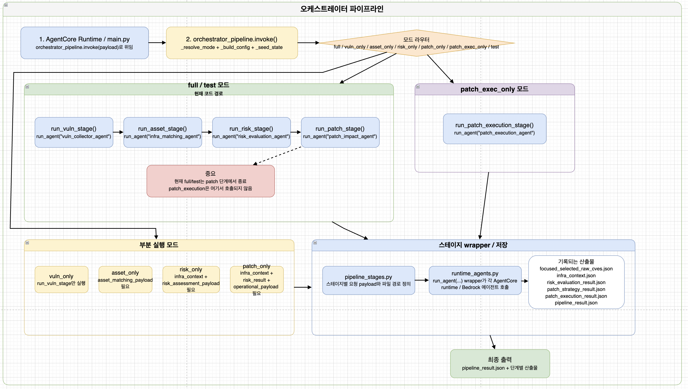

# 오케스트레이터 에이전트



취약점 자동 분석 및 대응 시스템의 **오케스트레이터 에이전트**입니다.

취약점 수집, 자산 매칭, 위험도 평가, 패치 전략 및 패치 실행 에이전트를 정해진 순서로 호출하고, 각 에이전트의 출력 데이터를 다음 단계의 입력 형식으로 연결합니다.

오케스트레이터는 직접 취약점을 분석하거나 패치 전략을 판단하지 않습니다.

대신 다음 작업을 담당합니다.

- 실행 모드 결정
- 각 단계의 실행 순서 제어
- AgentCore Runtime ARN 확인
- 이전 단계 결과를 다음 단계 Payload로 변환
- 부분 실행을 위한 입력 데이터 주입
- 단계별 JSON 산출물 저장
- 전체 파이프라인 결과 통합
- 오류 발생 시 파이프라인 중단 및 원인 전달

현재 기본 파이프라인은 다음 단계까지 실행됩니다.

```text
취약점 수집
→ 자산 매칭
→ 위험도 평가
→ 패치 전략
```

실제 서버 변경을 수행하는 패치 실행은 기본 파이프라인과 분리된 `patch_exec_only` 모드에서 호출합니다.


---

## 데이터 전달 관계

### 취약점 수집 → 자산 매칭

```text
asset_matching_payload
```

취약점과 관련된 제품, 버전, CPE 및 자산에서 확인해야 할 항목을 자산 매칭 에이전트에 전달합니다.

### 취약점 수집 + 자산 매칭 → 위험도 평가

```text
risk_assessment_payload
        +
infra_context
        ↓
위험도 평가 Agent
```

위험도 평가 에이전트는 취약점 기준 정보와 실제 자산 정보를 함께 사용합니다.

### 취약점 수집 + 자산 매칭 + 위험도 평가 → 패치 전략

```text
operational_payload
        +
infra_context
        +
risk_result
        ↓
패치 전략 Agent
```

패치 전략 에이전트는 세 가지 입력을 결합하여 자산별 최종 대응 전략을 결정합니다.

### 패치 전략 → 패치 실행

```text
patch_strategy_result
        ↓
패치 실행 Agent
```

현재 기본 `full` 모드에서는 패치 실행을 호출하지 않습니다.

패치 실행은 `patch_exec_only` 모드에서 별도로 수행합니다.

---

## 내부 Agent 이름

프로젝트 문서에서 사용하는 이름과 코드 내부 Registry Key는 일부 다릅니다.

| 문서상 이름 | 내부 Registry Key |
| --- | --- |
| 취약점 수집 에이전트 | `vuln_collector_agent` |
| 자산 매칭 에이전트 | `infra_matching_agent` |
| 위험도 평가 에이전트 | `risk_evaluation_agent` |
| 패치 전략 에이전트 | `patch_impact_agent` |
| 패치 실행 에이전트 | `patch_execution_agent` |

`patch_impact_agent`는 현재 프로젝트에서 사용하는 패치 전략 에이전트의 내부 명칭입니다.

---

## 에이전트 실행 구조

```text
AgentCore Runtime
        │
        ▼
main.py
        │
        │ orchestrator_pipeline.invoke(payload)
        ▼
orchestrator_pipeline.py
        │
        ├─ _resolve_mode()
        ├─ _build_config()
        ├─ _seed_state()
        └─ 실행 모드 라우팅
        │
        ▼
┌────────────────────────────────────┐
│ 실행 모드                          │
├────────────────────────────────────┤
│ full                               │
│ vuln_only                          │
│ asset_only                         │
│ risk_only                          │
│ patch_only                         │
│ patch_exec_only                    │
│ test                               │
└────────────────────────────────────┘
        │
        ▼
pipeline_stages.py
        │
        ├─ run_vuln_stage()
        ├─ run_asset_stage()
        ├─ run_risk_stage()
        ├─ run_patch_stage()
        └─ run_patch_execution_stage()
        │
        ▼
runtime_agents.py
        │
        └─ run_agent(agent_name, payload)
                │
                ▼
        AGENT_REGISTRY
                │
                ▼
        각 AgentCore Runtime 호출
                │
                ▼
        단계별 JSON 결과 저장
                │
                ▼
        pipeline_result.json
```

---

## 주요 구성요소

### 1. `main.py`

Amazon Bedrock AgentCore Runtime의 진입점입니다.

```python
from bedrock_agentcore import BedrockAgentCoreApp

from orchestrator_pipeline import invoke as orchestrator_invoke


app = BedrockAgentCoreApp()


@app.entrypoint
def invoke(payload: dict | None) -> dict:
    return orchestrator_invoke(payload or {})
```

`main.py`에는 파이프라인 로직을 직접 작성하지 않고, 입력 Payload를 `orchestrator_pipeline.invoke()`에 전달합니다.

---

### 2. `orchestrator_pipeline.py`

전체 실행 모드와 파이프라인 상태를 관리합니다.

주요 역할:

```text
실행 모드 정규화
Runtime 설정 생성
주입된 중간 결과 복원
단계별 실행 여부 결정
Stage 간 데이터 전달
최종 pipeline_result 생성
```

핵심 함수:

| 함수 | 설명 |
| --- | --- |
| `_resolve_mode()` | 사용자 입력 모드를 공식 모드명으로 정규화 |
| `_build_config()` | Region, Stack, Runtime ARN, Follow-up 설정 구성 |
| `_seed_state()` | 기존 중간 결과를 파이프라인 상태로 주입 |
| `run_orchestrator()` | `full` 및 `test` 모드 실행 |
| `run_vuln_only()` | 취약점 수집 단계만 실행 |
| `run_asset_only()` | 자산 매칭 단계만 실행 |
| `run_risk_only()` | 위험도 평가 단계만 실행 |
| `run_patch_only()` | 패치 전략 단계만 실행 |
| `run_patch_exec_only()` | 패치 실행 단계만 별도 실행 |
| `_build_pipeline_result()` | 전체 결과 통합 및 저장 |
| `invoke()` | 최종 모드 라우터 |

---

### 3. `pipeline_stages.py`

각 파이프라인 단계를 호출하기 위한 Wrapper입니다.

```text
run_vuln_stage()
        ↓
run_agent("vuln_collector_agent")

run_asset_stage()
        ↓
run_agent("infra_matching_agent")

run_risk_stage()
        ↓
run_agent("risk_evaluation_agent")

run_patch_stage()
        ↓
run_agent("patch_impact_agent")

run_patch_execution_stage()
        ↓
run_agent("patch_execution_agent")
```

Stage Wrapper는 각 에이전트가 요구하는 Payload를 구성하고 저장 경로를 전달합니다.

---

### 4. `runtime_agents.py`

각 AgentCore Runtime을 실제로 호출하는 계층입니다.

```text
Stage 요청
        ↓
Runtime ARN 결정
        ↓
Agent별 Payload 변환
        ↓
bedrock-agentcore InvokeAgentRuntime
        ↓
응답 JSON 파싱
        ↓
결과 파일 저장
        ↓
Stage 결과 반환
```

`runtime_agents.py`는 다음 Registry를 사용합니다.

```python
AGENT_REGISTRY = {
    "infra_matching_agent": run_infra_matching_agent,
    "vuln_collector_agent": run_vuln_collector_agent,
    "risk_evaluation_agent": run_risk_evaluation_agent,
    "patch_impact_agent": run_patch_impact_agent,
    "patch_execution_agent": run_patch_execution_agent,
}
```

---

## 실행 모드

지원 모드는 다음과 같습니다.

| 모드 | 설명 |
| --- | --- |
| `full` | 취약점 수집부터 패치 전략까지 순차 실행 |
| `vuln_only` | 취약점 수집 에이전트만 실행 |
| `asset_only` | 자산 매칭 에이전트만 실행 |
| `risk_only` | 위험도 평가 에이전트만 실행 |
| `patch_only` | 패치 전략 에이전트만 실행 |
| `patch_exec_only` | 패치 실행 에이전트만 별도 실행 |
| `test` | 중간 결과를 주입하여 특정 단계까지만 테스트 |

### 모드 별칭

다음 별칭도 사용할 수 있습니다.

| 입력값 | 변환되는 모드 |
| --- | --- |
| `default` | `full` |
| `pipeline` | `full` |
| `full_pipeline` | `full` |
| `vuln` | `vuln_only` |
| `vulnerability` | `vuln_only` |
| `asset` | `asset_only` |
| `risk` | `risk_only` |
| `patch` | `patch_only` |
| `stage_test` | `test` |
| `inject` | `test` |

---

## `full` 모드

전체 분석 파이프라인을 순차적으로 실행합니다.

```text
run_vuln_stage()
        ↓
run_asset_stage()
        ↓
run_risk_stage()
        ↓
run_patch_stage()
        ↓
pipeline_result.json
```

현재 `full` 모드는 패치 전략 생성 단계에서 종료합니다.

```text
full 모드 실행 범위

취약점 수집
→ 자산 매칭
→ 위험도 평가
→ 패치 전략
→ 종료
```

실제 패치 실행은 포함하지 않습니다.

### 입력 예시

```json
{
  "mode": "full",
  "region": "<AWS_REGION>",
  "stack_name": "<CLOUDFORMATION_STACK_NAME>",
  "cve_ids": [
    "CVE-2021-23017",
    "CVE-2021-44228"
  ],
  "allow_followup": true,
  "infra_matching_runtime_arn": "arn:aws:bedrock-agentcore:<AWS_REGION>:<AWS_ACCOUNT_ID>:runtime/<ASSET_MATCHING_AGENT_ID>",
  "patch_impact_runtime_arn": "arn:aws:bedrock-agentcore:<AWS_REGION>:<AWS_ACCOUNT_ID>:runtime/<PATCH_STRATEGY_AGENT_ID>"
}
```

취약점 수집, 위험도 평가 Runtime ARN은 Payload 또는 환경변수에서 가져옵니다.

---

## `vuln_only` 모드

취약점 수집 에이전트만 실행합니다.

```text
CVE ID
    ↓
Vulnerability Collector Agent
    ↓
focused_selected_raw_cves.json
risk_assessment_payloads.json
operational_impact_payloads.json
asset_matching_payload.json
```

### 입력 예시

```json
{
  "mode": "vuln_only",
  "region": "<AWS_REGION>",
  "cve_ids": [
    "CVE-2021-23017",
    "CVE-2021-44228"
  ]
}
```

`cve_ids`를 생략하면 취약점 수집 에이전트의 기본 설정을 사용합니다.

---

## `asset_only` 모드

기존 `asset_matching_payload`를 사용하여 자산 매칭 단계만 실행합니다.

필수 입력:

```text
asset_matching_payload
```

### 입력 예시

```json
{
  "mode": "asset_only",
  "region": "<AWS_REGION>",
  "stack_name": "<CLOUDFORMATION_STACK_NAME>",
  "infra_matching_runtime_arn": "arn:aws:bedrock-agentcore:<AWS_REGION>:<AWS_ACCOUNT_ID>:runtime/<ASSET_MATCHING_AGENT_ID>",
  "asset_matching_payload": {
    "records": [
      {
        "cve_id": "CVE-2021-23017",
        "product_name": "nginx",
        "affected_version_range": [
          ">=0.6.18 <1.20.1"
        ]
      }
    ]
  }
}
```

출력:

```text
infra_context.json
```

---

## `risk_only` 모드

취약점 평가 기준과 기존 자산 정보를 사용하여 위험도 평가 단계만 실행합니다.

필수 입력:

```text
infra_context
risk_assessment_payload
```

### 입력 예시

```json
{
  "mode": "risk_only",
  "region": "<AWS_REGION>",
  "infra_matching_runtime_arn": "arn:aws:bedrock-agentcore:<AWS_REGION>:<AWS_ACCOUNT_ID>:runtime/<ASSET_MATCHING_AGENT_ID>",
  "infra_context": {
    "assets": [
      {
        "asset_id": "<EC2_INSTANCE_ID>",
        "installed_software": [
          {
            "product": "nginx",
            "version": "1.20.0"
          }
        ]
      }
    ]
  },
  "risk_assessment_payload": {
    "records": [
      {
        "cve_id": "CVE-2021-23017",
        "title": "Nginx Resolver Off-by-One",
        "cvss": {
          "score": 7.7
        }
      }
    ]
  }
}
```

출력:

```text
risk_evaluation_result.json
```

---

## `patch_only` 모드

기존 자산 정보, 위험도 평가 결과 및 운영 영향 정보를 사용하여 패치 전략 단계만 실행합니다.

필수 입력:

```text
infra_context
risk_result
operational_payload
```

### 입력 예시

```json
{
  "mode": "patch_only",
  "region": "<AWS_REGION>",
  "allow_followup": true,
  "infra_matching_runtime_arn": "arn:aws:bedrock-agentcore:<AWS_REGION>:<AWS_ACCOUNT_ID>:runtime/<ASSET_MATCHING_AGENT_ID>",
  "patch_impact_runtime_arn": "arn:aws:bedrock-agentcore:<AWS_REGION>:<AWS_ACCOUNT_ID>:runtime/<PATCH_STRATEGY_AGENT_ID>",
  "infra_context": {
    "assets": []
  },
  "risk_result": [
    {
      "cve_id": "CVE-2021-44228",
      "impacted_assets": []
    }
  ],
  "operational_payload": {
    "records": []
  }
}
```

출력:

```text
patch_strategy_context.json
asset_fact_trace.json
patch_strategy_result.json
```

---

## `patch_exec_only` 모드

기존 패치 전략 결과를 사용하여 패치 실행 에이전트만 호출합니다.

필수 입력:

```text
patch_strategy_result
```

### 입력 예시

```json
{
  "mode": "patch_exec_only",
  "region": "<AWS_REGION>",
  "prompt": "승인된 패치 전략에 따라 대상 자산의 패치를 실행하십시오.",
  "patch_strategy_result": {
    "records": [
      {
        "asset_id": "<EC2_INSTANCE_ID>",
        "cve_id": "CVE-2021-44228",
        "selected_action": "apply_patch_now",
        "confidence": "high"
      }
    ]
  }
}
```

실행 흐름:

```text
patch_strategy_result
        ↓
run_patch_execution_stage()
        ↓
run_agent("patch_execution_agent")
        ↓
Patch Execution AgentCore Runtime
        ↓
patch_execution_result.json
```

> 현재 기본 `full` 모드와 분리된 실행 경로입니다. 실제 서버 변경이 발생할 수 있으므로 승인, 대상 자산 검증 및 Rollback 준비 후 사용해야 합니다.

---

## `test` 모드

파이프라인 중간 결과를 직접 주입하여 특정 단계만 테스트합니다.

```text
기존 JSON 결과
        ↓
_seed_state()
        ↓
완료된 Stage는 건너뜀
        ↓
필요한 다음 Stage만 실행
```

입력은 최상위 Payload 또는 `test_inputs` 내부에 넣을 수 있습니다.

```json
{
  "mode": "test",
  "stop_stage": "risk",
  "test_inputs": {
    "infra_context": {},
    "risk_assessment_payload": {}
  }
}
```

### 지원 종료 단계

현재 기본 파이프라인에서 사용하는 `stop_stage`는 다음과 같습니다.

| 값 | 실행 종료 위치 |
| --- | --- |
| `vuln` | 취약점 수집 후 종료 |
| `asset` | 자산 매칭 후 종료 |
| `risk` | 위험도 평가 후 종료 |
| `patch` | 패치 전략 생성 후 종료 |

### 위험도 평가 단계 테스트

```json
{
  "mode": "test",
  "stop_stage": "risk",
  "region": "<AWS_REGION>",
  "infra_matching_runtime_arn": "arn:aws:bedrock-agentcore:<AWS_REGION>:<AWS_ACCOUNT_ID>:runtime/<ASSET_MATCHING_AGENT_ID>",
  "test_inputs": {
    "infra_context": {
      "assets": []
    },
    "risk_assessment_payload": {
      "records": []
    }
  }
}
```

이 경우 다음 단계는 실행하지 않습니다.

```text
취약점 수집
자산 매칭
```

주입된 데이터를 사용하여 위험도 평가부터 실행합니다.

### 패치 전략 단계 테스트

```json
{
  "mode": "test",
  "stop_stage": "patch",
  "region": "<AWS_REGION>",
  "allow_followup": true,
  "infra_matching_runtime_arn": "arn:aws:bedrock-agentcore:<AWS_REGION>:<AWS_ACCOUNT_ID>:runtime/<ASSET_MATCHING_AGENT_ID>",
  "patch_impact_runtime_arn": "arn:aws:bedrock-agentcore:<AWS_REGION>:<AWS_ACCOUNT_ID>:runtime/<PATCH_STRATEGY_AGENT_ID>",
  "test_inputs": {
    "infra_context": {
      "assets": []
    },
    "risk_result": [],
    "operational_payload": {
      "records": []
    }
  }
}
```

---

## Pipeline State

오케스트레이터는 실행 중인 결과를 `state` 객체로 관리합니다.

```python
state = {
    "vuln_stage": {},
    "asset_stage": {},
    "risk_stage": {},
    "patch_stage": {},
    "patch_execution_stage": {},
}
```

각 Stage가 이미 주입되어 있으면 해당 단계는 다시 실행하지 않습니다.

```text
state에 vuln_stage 존재
    → 취약점 수집 건너뜀

state에 asset_stage 존재
    → 자산 매칭 건너뜀

state에 risk_stage 존재
    → 위험도 평가 건너뜀

state에 patch_stage 존재
    → 패치 전략 생성 건너뜀
```

---

## 상태 주입

`_seed_state()`는 다양한 입력 형식을 내부 Stage 구조로 변환합니다.

### 취약점 수집 Stage 주입

사용 가능한 입력:

```text
vuln_stage
raw_result
raw_dataset
risk_assessment_payload
operational_payload
operational_impact_payload
asset_matching_payload
```

예시:

```json
{
  "mode": "test",
  "risk_assessment_payload": {},
  "operational_payload": {},
  "asset_matching_payload": {}
}
```

### 자산 Stage 주입

사용 가능한 입력:

```text
asset_stage
infra_context
```

### 위험도 Stage 주입

사용 가능한 입력:

```text
risk_stage
risk_result
```

### 패치 전략 Stage 주입

사용 가능한 입력:

```text
patch_stage
patch_result
patch_strategy_result
```

### 패치 실행 Stage 주입

사용 가능한 입력:

```text
patch_execution_stage
patch_execution_result
```

---

## Stage Wrapper

### 취약점 수집 Stage

```text
run_vuln_stage()
        ↓
action = collect_vulnerabilities
        ↓
vuln_collector_agent
```

전달되는 저장 경로:

```text
focused_selected_raw_cves.json
risk_assessment_payloads.json
operational_impact_payloads.json
asset_matching_payload.json
```

### 자산 매칭 Stage

```text
run_asset_stage()
        ↓
action = bootstrap_asset_context
        ↓
infra_matching_agent
```

주요 입력:

```text
stack_name
region
asset_matching_payload
infra_matching_runtime_arn
```

### 위험도 평가 Stage

```text
run_risk_stage()
        ↓
action = evaluate_risk
        ↓
risk_evaluation_agent
```

주요 입력:

```text
infra_context
risk_assessment_payload
infra_matching_runtime_arn
```

### 패치 전략 Stage

```text
run_patch_stage()
        ↓
action = run_patch_strategy
        ↓
patch_impact_agent
```

주요 입력:

```text
infra_context
risk_result
operational_payload
allow_followup
infra_matching_runtime_arn
patch_impact_runtime_arn
```

### 패치 실행 Stage

```text
run_patch_execution_stage()
        ↓
action = execute_patch
        ↓
patch_execution_agent
```

주요 입력:

```text
impact_data
prompt
patch_execution_runtime_arn
```

---

## Runtime ARN 결정

각 AgentCore Runtime ARN은 다음 순서로 결정합니다.

```text
1. 요청 Payload에 전달된 Runtime ARN
2. 환경변수
3. Runtime 시작 시 계산된 기본값
4. 모두 없으면 오류
```

### 자산 매칭 Runtime

지원 환경변수:

```text
INFRA_MATCHING_AGENTCORE_ARN
ASSET_MATCHING_AGENTCORE_ARN
ASSET_MATCHING_ARN
```

### 취약점 수집 Runtime

```text
VULN_COLLECTOR_AGENTCORE_ARN
VULN_COLLECTOR_ARN
```

### 위험도 평가 Runtime

```text
RISK_EVAL_AGENTCORE_ARN
RISK_EVAL_ARN
RISK_EVALUATION_AGENTCORE_ARN
RISK_EVALUATION_ARN
```

### 패치 전략 Runtime

```text
PATCH_IMPACT_AGENTCORE_ARN
PATCH_IMPACT_ARN
PATCH_STRATEGY_AGENTCORE_ARN
PATCH_STRATEGY_ARN
```

### 패치 실행 Runtime

```text
PATCH_EXECUTION_AGENTCORE_ARN
PATCH_EXECUTION_ARN
PATCH_EXEC_AGENTCORE_ARN
PATCH_EXEC_ARN
```

---

## Runtime 호출

각 하위 에이전트는 `bedrock-agentcore` Boto3 Client를 사용하여 호출합니다.

```python
response = client.invoke_agent_runtime(
    agentRuntimeArn=runtime_arn,
    payload=json.dumps(request_payload).encode("utf-8"),
)
```

기본 Timeout:

| 설정 | 기본값 |
| --- | ---: |
| 연결 Timeout | 10초 |
| 응답 읽기 Timeout | 900초 |

관련 환경변수:

```text
AGENTCORE_CONNECT_TIMEOUT
AGENTCORE_READ_TIMEOUT
```

장시간 실행될 수 있는 자산 수집, 위험도 평가 및 패치 전략 호출을 고려하여 읽기 Timeout을 길게 설정합니다.

---

## 산출물 저장 구조

AgentCore Runtime 내부 기본 저장 루트:

```text
/tmp/multiai
```

환경변수로 변경할 수 있습니다.

```text
MULTIAI_RUNTIME_ROOT
```

전체 구조:

```text
<RUNTIME_ROOT>/
└─ OutputResult/
   ├─ VulAgent/
   │  ├─ focused_selected_raw_cves.json
   │  ├─ risk_assessment_payloads.json
   │  ├─ operational_impact_payloads.json
   │  └─ asset_matching_payload.json
   │
   ├─ AssetAgent/
   │  └─ infra_context.json
   │
   ├─ RiskevalAgent/
   │  ├─ risk_evaluation_result.json
   │  └─ risk_evaluation_raw_response.json
   │
   ├─ PatchImAgent/
   │  ├─ patch_strategy_context.json
   │  ├─ asset_fact_trace.json
   │  └─ patch_strategy_result.json
   │
   ├─ PatchExecAgent/
   │  └─ patch_execution_result.json
   │
   └─ SwarmAgent/
      └─ pipeline_result.json
```

---

## 최종 Pipeline 결과

오케스트레이터의 최종 결과는 `pipeline_result.json`에 저장됩니다.

```json
{
  "agent": "orchestrator_agent",
  "mode": "full",
  "orchestration_style": "direct_pipeline",
  "generated_at": "2026-01-01T00:00:00+00:00",
  "stack_name": "<CLOUDFORMATION_STACK_NAME>",
  "region": "<AWS_REGION>",
  "pipeline": [
    "vuln_collector_agent",
    "infra_matching_agent",
    "risk_evaluation_agent",
    "patch_impact_agent"
  ],
  "handoff_summary": {
    "vuln_to_asset": [
      "asset_matching_payload"
    ],
    "asset_to_risk": [
      "infra_context"
    ],
    "vuln_to_risk": [
      "risk_assessment_payload"
    ],
    "asset_to_patch": [
      "infra_context"
    ],
    "vuln_to_patch": [
      "operational_impact_payload"
    ],
    "risk_to_patch": [
      "risk_evaluation_result"
    ],
    "patch_to_execution": [
      "patch_stage.result"
    ]
  },
  "agent_message": "full/test 모드 실행 완료",
  "vuln_stage": {},
  "asset_stage": {},
  "risk_stage": {},
  "patch_stage": {},
  "patch_execution_stage": null,
  "artifacts": {
    "patch_context_path": "<PATCH_CONTEXT_PATH>",
    "patch_asset_fact_trace_path": "<ASSET_FACT_TRACE_PATH>",
    "patch_result_path": "<PATCH_RESULT_PATH>",
    "patch_execution_path": "<PATCH_EXECUTION_RESULT_PATH>",
    "pipeline_result_path": "<PIPELINE_RESULT_PATH>"
  },
  "test_interface": {
    "stop_stage": null,
    "injected_state": []
  }
}
```

---

## 주요 반환 필드

| 필드 | 설명 |
| --- | --- |
| `agent` | 결과를 생성한 오케스트레이터 |
| `mode` | 실행한 파이프라인 모드 |
| `orchestration_style` | 현재 실행 방식인 `direct_pipeline` |
| `generated_at` | 결과 생성 시각 |
| `stack_name` | 대상 CloudFormation Stack |
| `region` | 실행 AWS Region |
| `pipeline` | 실제 실행 또는 주입된 에이전트 순서 |
| `handoff_summary` | Agent 간 데이터 전달 관계 |
| `agent_message` | 실행 완료 메시지 |
| `vuln_stage` | 취약점 수집 단계 결과 |
| `asset_stage` | 자산 매칭 단계 결과 |
| `risk_stage` | 위험도 평가 단계 결과 |
| `patch_stage` | 패치 전략 단계 결과 |
| `patch_execution_stage` | 패치 실행 단계 결과 |
| `artifacts` | 주요 산출물 경로 |
| `test_interface` | 테스트 종료 단계와 주입 상태 |

---

## 오류 처리

### 지원하지 않는 모드

```text
mode는 full | vuln_only | asset_only | risk_only |
patch_only | test | patch_exec_only 중 하나여야 합니다.
```

### 잘못된 Payload 형식

```text
payload는 JSON object 형태여야 합니다.
```

### `asset_only` 입력 누락

```text
asset_only 모드는 asset_matching_payload가 필요합니다.
```

### `risk_only` 입력 누락

```text
infra_context가 필요합니다.
```

```text
risk_only 모드는 risk_assessment_payload가 필요합니다.
```

### `patch_only` 입력 누락

```text
patch_only 모드는 risk_result가 필요합니다.
```

```text
patch_only 모드는 operational_payload가 필요합니다.
```

### `patch_exec_only` 입력 누락

```text
patch_exec_only 모드에서는 patch_strategy_result가 필요합니다.
```

### Runtime ARN 누락

```text
<agent> runtime ARN 설정이 필요합니다.
Payload 또는 환경변수에 값을 넣어야 합니다.
```

### 하위 에이전트 오류

```text
AgentCore 호출 실패
```

```text
<agent> 호출 실패
```

하위 AgentCore Runtime이 `error` 필드를 반환하면 오케스트레이터는 해당 단계를 실패로 처리합니다.

---

## 환경변수

### 공통 설정

| 환경변수 | 기본값 | 설명 |
| --- | --- | --- |
| `AWS_REGION` | — | AWS SDK 호출 Region |
| `AWS_DEFAULT_REGION` | — | 기본 AWS Region |
| `CF_STACK_NAME` | `megathon` | 기본 CloudFormation Stack 이름 |
| `MULTIAI_RUNTIME_ROOT` | `/tmp/multiai` | AgentCore 내부 산출물 저장 위치 |
| `AGENTCORE_READ_TIMEOUT` | `900` | 하위 Runtime 응답 읽기 Timeout |
| `AGENTCORE_CONNECT_TIMEOUT` | `10` | 하위 Runtime 연결 Timeout |

### Runtime ARN

```env
INFRA_MATCHING_AGENTCORE_ARN=arn:aws:bedrock-agentcore:<AWS_REGION>:<AWS_ACCOUNT_ID>:runtime/<ASSET_MATCHING_AGENT_ID>

VULN_COLLECTOR_AGENTCORE_ARN=arn:aws:bedrock-agentcore:<AWS_REGION>:<AWS_ACCOUNT_ID>:runtime/<VULN_COLLECTOR_AGENT_ID>

RISK_EVAL_AGENTCORE_ARN=arn:aws:bedrock-agentcore:<AWS_REGION>:<AWS_ACCOUNT_ID>:runtime/<RISK_EVALUATION_AGENT_ID>

PATCH_STRATEGY_AGENTCORE_ARN=arn:aws:bedrock-agentcore:<AWS_REGION>:<AWS_ACCOUNT_ID>:runtime/<PATCH_STRATEGY_AGENT_ID>

PATCH_EXECUTION_AGENTCORE_ARN=arn:aws:bedrock-agentcore:<AWS_REGION>:<AWS_ACCOUNT_ID>:runtime/<PATCH_EXECUTION_AGENT_ID>
```

실제 AWS 계정 ID와 Runtime ARN은 README 또는 소스코드에 직접 기록하지 않습니다.

---

## 로컬 실행 클라이언트

저장소의 다음 파일을 통해 AgentCore에 배포된 오케스트레이터를 대화형으로 호출할 수 있습니다.

```text
MultiAIagent/run_orchestrator_runtime.py
```

실행:

```powershell
python MultiAIagent/run_orchestrator_runtime.py
```

로컬 호출 클라이언트가 사용하는 오케스트레이터 Runtime 환경변수:

```text
ORCHESTRATOR_AGENTCORE_ARN
ORCHESTRATOR_ARN
ORCHESTRATOR_RUNTIME_ARN
```

예시:

```env
ORCHESTRATOR_AGENTCORE_ARN=arn:aws:bedrock-agentcore:<AWS_REGION>:<AWS_ACCOUNT_ID>:runtime/<ORCHESTRATOR_AGENT_ID>
AWS_DEFAULT_REGION=<AWS_REGION>
CF_STACK_NAME=<CLOUDFORMATION_STACK_NAME>
```

로컬 클라이언트 결과는 다음 경로에 저장될 수 있습니다.

```text
MultiAIagent/OchestraResult/
MultiAIagent/Conversationlog/
```

해당 디렉터리에는 실제 AWS 자산 정보, Runtime ARN, IP 주소 및 Agent 간 질의 내용이 포함될 수 있으므로 Git에 커밋하지 않습니다.

---

## AgentCore App 로컬 실행

오케스트레이터 디렉터리로 이동합니다.

```powershell
cd "MultiAIagent/OchestratorAgent(AWS)"
```

패키지 설치:

```powershell
python -m pip install -r requirements.txt
```

실행:

```powershell
python main.py
```

`main.py`는 `BedrockAgentCoreApp`을 시작합니다.

---

## Python 직접 호출

AWS Runtime 호출 없이 오케스트레이터 함수 구조를 테스트하려면 `orchestrator_pipeline.invoke()`를 직접 호출할 수 있습니다.

```python
import json

from orchestrator_pipeline import invoke


payload = {
    "mode": "vuln_only",
    "region": "<AWS_REGION>",
    "cve_ids": [
        "CVE-2021-23017",
        "CVE-2021-44228",
    ],
}

result = invoke(payload)

print(
    json.dumps(
        result,
        ensure_ascii=False,
        indent=2,
    )
)
```

실제 Stage를 실행하면 하위 AgentCore Runtime이 호출되므로 AWS 인증정보와 Runtime ARN이 필요합니다.

---

## Python 패키지

`requirements.txt`:

```text
bedrock-agentcore
boto3
```

설치:

```powershell
python -m pip install -r requirements.txt
```

---

## IAM 요구사항

오케스트레이터 Runtime은 하위 AgentCore Runtime을 호출할 수 있어야 합니다.

필요 권한:

```text
bedrock-agentcore:InvokeAgentRuntime
```

운영 환경에서는 모든 Runtime에 대한 Wildcard 권한을 부여하지 않고, 실제로 사용하는 Runtime ARN만 허용해야 합니다.

권한 예시:

```json
{
  "Version": "2012-10-17",
  "Statement": [
    {
      "Effect": "Allow",
      "Action": [
        "bedrock-agentcore:InvokeAgentRuntime"
      ],
      "Resource": [
        "arn:aws:bedrock-agentcore:<AWS_REGION>:<AWS_ACCOUNT_ID>:runtime/<VULN_COLLECTOR_AGENT_ID>",
        "arn:aws:bedrock-agentcore:<AWS_REGION>:<AWS_ACCOUNT_ID>:runtime/<ASSET_MATCHING_AGENT_ID>",
        "arn:aws:bedrock-agentcore:<AWS_REGION>:<AWS_ACCOUNT_ID>:runtime/<RISK_EVALUATION_AGENT_ID>",
        "arn:aws:bedrock-agentcore:<AWS_REGION>:<AWS_ACCOUNT_ID>:runtime/<PATCH_STRATEGY_AGENT_ID>",
        "arn:aws:bedrock-agentcore:<AWS_REGION>:<AWS_ACCOUNT_ID>:runtime/<PATCH_EXECUTION_AGENT_ID>"
      ]
    }
  ]
}
```

오케스트레이터는 SSM 명령이나 EC2 자산 조사를 직접 수행하지 않습니다.

해당 권한은 실제 작업을 수행하는 하위 에이전트의 IAM Role에 분리하여 부여합니다.

---

## 트러블슈팅

| 증상 | 확인 사항 |
| --- | --- |
| 지원하지 않는 모드 오류 | `mode` 값과 별칭 확인 |
| 하위 Runtime ARN 오류 | Payload 또는 환경변수 확인 |
| 취약점 수집 실패 | OpenCVE 설정, 취약점 수집 Runtime 및 IAM 확인 |
| 자산 매칭 실패 | Stack 이름, 자산 매칭 Runtime 및 SSM 상태 확인 |
| 위험도 평가 실패 | `infra_context`, `risk_assessment_payload` 확인 |
| 패치 전략 실패 | `infra_context`, `risk_result`, `operational_payload` 확인 |
| 패치 실행 실패 | `patch_strategy_result`, 승인 상태 및 실행 Runtime 확인 |
| 결과 파일이 없음 | `MULTIAI_RUNTIME_ROOT`와 쓰기 권한 확인 |
| AgentCore Timeout | `AGENTCORE_READ_TIMEOUT` 증가 |
| 결과 JSON 파싱 실패 | 하위 Runtime 원본 응답 확인 |
| 테스트 단계가 다시 실행됨 | `_seed_state()`에서 인식 가능한 필드명인지 확인 |
| 예상하지 않은 단계가 건너뜀 | 주입된 `state`와 `test_inputs` 확인 |

---

## 현재 구현상 주의사항

### `full` 모드의 실행 범위

현재 AgentCore 오케스트레이터의 `full` 모드는 다음 단계에서 종료됩니다.

```text
vuln
→ asset
→ risk
→ patch
```

패치 실행은 자동으로 이어지지 않습니다.

```text
patch_exec_only
```

모드로 별도 호출해야 합니다.

이는 분석과 실제 변경 실행 사이에 승인 및 검증 경계를 두기 위한 구조로 사용할 수 있습니다.

### `test` 모드의 패치 실행

현재 `run_orchestrator()`는 `patch` 단계까지만 직접 호출합니다.

따라서 테스트 과정에서 실제 패치 실행을 검증하려면 `patch_exec_only` 모드를 별도로 사용해야 합니다.

### Patch Execution Runtime ARN

`patch_exec_only`를 실행할 때는 오케스트레이터 Runtime 환경에 다음 중 하나가 설정되어 있어야 합니다.

```text
PATCH_EXECUTION_AGENTCORE_ARN
PATCH_EXECUTION_ARN
PATCH_EXEC_AGENTCORE_ARN
PATCH_EXEC_ARN
```

### Stack 기반 자산 탐색

현재 `run_asset_stage()`는 주로 CloudFormation `stack_name`을 기준으로 자산 매칭 에이전트를 호출합니다.

VPC ID 직접 주입 방식이 필요하면 Stage Wrapper가 `vpc_id`를 전달하도록 확장해야 합니다.

---

## 보안 주의사항

- 실제 AWS Account ID와 Runtime ARN을 Git에 기록하지 않습니다.
- AgentCore Runtime ARN은 환경변수 또는 배포 설정에서 관리합니다.
- 오케스트레이터 IAM Role에는 필요한 Runtime 호출 권한만 부여합니다.
- 하위 에이전트의 응답을 신뢰할 수 없는 입력으로 취급합니다.
- Stage 결과를 다음 Agent에 전달하기 전에 필요한 스키마 검증을 적용합니다.
- `infra_context`에는 내부 IP, Public IP, IAM Role 및 Security Group 정보가 포함될 수 있습니다.
- `asset_fact_trace`와 대화 로그에는 실제 서버 설정과 명령 결과가 포함될 수 있습니다.
- `OchestraResult`와 `Conversationlog`를 공개 저장소에 커밋하지 않습니다.
- 실제 패치 실행은 기본 분석 파이프라인과 분리합니다.
- `patch_exec_only` 실행 전 관리자 승인, 대상 자산 및 CVE 일치 여부를 검증합니다.
- AI가 생성한 명령을 검증 없이 SSM에 전달하지 않습니다.
- 오류 메시지에 전체 ARN, 인증정보 또는 민감한 Payload가 출력되지 않도록 주의합니다.
- `.env` 파일은 Git에 커밋하지 않습니다.

---

## 파일 설명

| 파일 | 설명 |
| --- | --- |
| `main.py` | AgentCore Runtime 진입점 |
| `orchestrator_pipeline.py` | 실행 모드, Pipeline State 및 단계 순서 관리 |
| `pipeline_stages.py` | 각 에이전트 호출 Payload를 구성하는 Stage Wrapper |
| `runtime_agents.py` | AgentCore Runtime ARN 확인 및 실제 하위 에이전트 호출 |
| `requirements.txt` | Python 패키지 의존성 |
| `.bedrock_agentcore.yaml` | 오케스트레이터 AgentCore 배포 설정 |
| `README.md` | 오케스트레이터 구조 및 실행 가이드 |

---

## 실행 전 체크리스트

```text
[ ] 실행할 mode를 확인했는가?
[ ] AWS Region이 올바른가?
[ ] CloudFormation Stack 이름이 올바른가?
[ ] 취약점 수집 Runtime ARN이 설정되어 있는가?
[ ] 자산 매칭 Runtime ARN이 설정되어 있는가?
[ ] 위험도 평가 Runtime ARN이 설정되어 있는가?
[ ] 패치 전략 Runtime ARN이 설정되어 있는가?
[ ] 패치 실행 시 Patch Execution Runtime ARN이 설정되어 있는가?
[ ] 오케스트레이터 IAM Role에 InvokeAgentRuntime 권한이 있는가?
[ ] 부분 실행에 필요한 JSON 입력이 준비되어 있는가?
[ ] 실제 AWS 식별정보가 Git에 포함되지 않았는가?
[ ] OchestraResult와 Conversationlog가 Git에서 제외되어 있는가?
[ ] 실제 패치 실행 전 승인 및 Rollback 계획이 준비되어 있는가?
```

---

## 요약

오케스트레이터 에이전트는 다음 질문에 답합니다.

```text
어떤 모드로 실행해야 하는가?
        ↓
어떤 단계가 이미 완료되었는가?
        ↓
다음에 어떤 에이전트를 호출해야 하는가?
        ↓
이전 단계의 어떤 결과를 전달해야 하는가?
        ↓
각 결과를 어디에 저장해야 하는가?
        ↓
최종 Pipeline 결과를 어떻게 통합해야 하는가?
```

핵심 역할은 다음과 같습니다.

```text
실행 모드
        +
Pipeline State
        +
AgentCore Runtime 호출
        +
단계별 데이터 Handoff
        +
JSON 산출물 관리
        ↓
멀티 에이전트 보안 분석 파이프라인
```

오케스트레이터는 각 보안 판단을 직접 수행하지 않습니다.

각 전문 에이전트가 자신의 역할에 집중할 수 있도록 실행 순서와 입력·출력 데이터의 연결을 관리하는 중앙 제어 계층입니다.