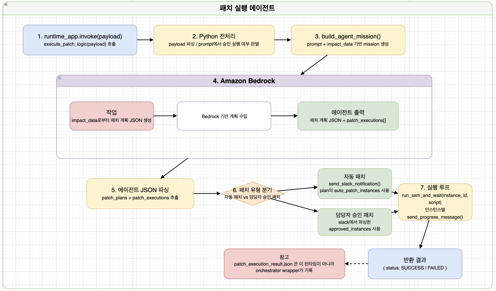

# Patch_exec_agent



`Patch_exec_agent`는 취약점 분석 결과를 바탕으로 AWS 환경에서 안전하게 패치를 실행하고, 그 과정을 실시간으로 모니터링할 수 있도록 돕는 자동화 에이전트입니다.

## 동작 프로세스 (Architecture)

본 에이전트는 선행 에이전트의 분석 직후 대상 서버 정보를 슬랙에 우선 출력하며, 설정에 따라 **자동 패치 프로세스** 또는 **관리자 승인 기반 프로세스**로 나뉘어 동작합니다.


### 프로세스 상세
1. **초기 슬랙 출력:** `Patch Strategy Agent`의 동작이 끝나면, 어떤 서버를 패치할 것인지에 대한 요약 정보가 슬랙에 즉시 출력됩니다.
2. **실행 분기:**
   * **자동 패치:** 초기 알림 후 즉시 `Patch_exec_agent`가 실행됩니다.
   * **관리자 승인:** 슬랙에 활성화된 승인 버튼을 관리자가 클릭하면, API Gateway와 Lambda를 거쳐 대기 중이던 에이전트가 실행됩니다.
3. **패치 및 실시간 모니터링:** 에이전트가 AWS Systems Manager(SSM)를 통해 대상 서버에 패치 명령을 내리며, 실행될 때마다 실시간으로 슬랙에 진행 상황이 출력됩니다.
4. **완료 알림:** 모든 패치 작업이 종료되면 최종 패치 완료 메시지가 슬랙에 전송됩니다.

## 주요 컴포넌트 및 설계 의도

### 연결 방식 및 Lambda 사용 목적
* **연결 구조:** Slack Webhook URL -> API Gateway -> AWS Lambda -> Patch Exec Agent
* **Lambda 도입 이유:** 관리자 승인 프로세스에서 대기 중인 **동작이 끝난 에이전트를 다시 깨우기 위한 용도(Wake-up)**로 Lambda를 사용했습니다. 이를 통해 에이전트를 항시 구동할 필요 없이 이벤트 기반으로만 동작하게 하여 리소스 효율성을 극대화했습니다.

각 컴포넌트가 어떻게 데이터를 주고받으며 자동화 파이프라인을 구성하는지, 구체적인 설정값과 연결 방식을 설명합니다.

### 1. Slack App 설정 (Interactivity)
관리자가 슬랙 리포트 메시지에서 [승인] 버튼을 클릭했을 때 이벤트를 발생시키기 위한 설정입니다.
* **설정 위치:** Slack API Dashboard > Features > **Interactivity & Shortcuts**
* **Interactivity 활성화 (On):** 해당 기능을 켜면 버튼 클릭 이벤트를 받을 곳을 지정할 수 있습니다.
* **Request URL 설정:** 이곳에 하단에서 생성한 **API Gateway의 Invoke URL**을 입력합니다.
* **동작 원리:** 관리자가 버튼을 누르면, Slack은 이 URL을 향해 버튼 액션 정보, 사용자 정보 등이 담긴 데이터를 `POST` 방식으로 전송합니다.

### 2. AWS API Gateway 설정 (Webhook 수신 엔드포인트)
Slack이 보내는 POST 요청을 안전하게 받아내어 백엔드로 넘기는 대문 역할을 합니다.
* **API 구성:** HTTP API (또는 REST API) 형태로 생성하여 `POST` 메서드를 오픈합니다.
* **통합(Integration) 설정:** 수신한 요청을 처리할 타겟으로 **AWS Lambda 함수**를 지정합니다. (Lambda 프록시 통합 사용)
* **데이터 흐름:** Slack은 데이터를 `application/x-www-form-urlencoded` 형식의 `payload`라는 파라미터에 JSON을 담아 보냅니다. API Gateway는 이 데이터를 그대로 Lambda에게 넘겨주는 라우팅 역할을 수행합니다.

### 3. AWS Lambda 설정 (Agent Wake-up 및 승인 처리)
API Gateway로부터 데이터를 넘겨받아 실제 로직을 수행하고 에이전트를 깨우는 핵심 브릿지입니다.
* **Payload 파싱:** URL 인코딩된 Slack의 데이터를 디코딩하여 JSON 객체로 변환한 뒤, 클릭된 버튼의 Value를 추출합니다.
* **Agent Wake-up (실행 트리거):** 버튼 클릭이 확인되면, Lambda는 대기 상태에 있는 `Patch_exec_agent`를 실행시킵니다. 
* **Timeout 설정 변경:** 안정적인 에이전트 트리거 및 연동 처리를 위해 Lambda 함수의 기본 실행 제한 시간(Timeout)을 3초에서 1분으로 연장하여 설정했습니다.

### 4. Patch Exec Agent (SSM 패치 실행)
* Lambda에 의해 깨어난(Wake-up) 에이전트는 사전에 전달받은 분석 결과(대상 서버 ID, 취약점 정보)를 바탕으로 **AWS Systems Manager (SSM)**의 `Send-Command`를 호출합니다.
* 패치를 수행하는 동안 내부 코드에 작성된 Webhook URL(`https://hooks.slack.com/services/...`)을 통해 실시간 진행 로그를 슬랙 스레드에 스트리밍합니다.

### 5. 에이전트 내부 Slack 연동 코드 설정 (Bot Token & Webhook)

`Patch_exec_agent`의 파이썬 코드 내부에서는 알림의 성격과 목적에 따라 두 가지 슬랙 통신 방식을 분리하여 사용합니다.

* **종합 리포트 발송 함수 (`send_slack_notification`):**
  * **사용 API:** `https://slack.com/api/chat.postMessage`
  * **인증 방식:** Slack Bot Token (`xoxb-...`) 사용
  * **역할 및 특징:** 초기 패치 계획과 취약점 요약을 보여주는 대시보드 형태의 리포트를 발송합니다. Slack의 `Block Kit`(`header`, `section`, `divider` 등)을 활용해 UI를 구성하며, 관리자가 상호작용할 수 있는 [승인] 버튼을 함께 렌더링합니다.

* **실시간 진행 상황 알림 함수 (`send_progress_message`):**
  * **사용 API:** Slack Incoming Webhook URL (`https://hooks.slack.com/services/...`)
  * **인증 방식:** Webhook URL 자체로 엔드포인트 인증
  * **역할 및 특징:** 에이전트가 SSM으로 패치를 수행하는 동안, 각 단계별 성공 여부와 로그를 실시간 텍스트로 스트리밍합니다. 패치 본연의 로직에 지연을 주지 않기 위해 `timeout=5`로 짧게 설정하고 예외 처리(`try-except`)를 적용하여 안정성을 높였습니다.

### 슬랙 메시지 화면 구성
슬랙 인터페이스는 단계별로 명확한 정보를 제공하도록 구성되었습니다.
* **초기 정보 메시지:** 패치 대상 서버의 인스턴스 정보와 적용될 패치 내역을 요약하여 보여줍니다.
* **Interactive 버튼:** 수동 프로세스의 경우 메시지 하단에 승인버튼이 노출됩니다.
* **실시간 로그 스레드:** 패치가 시작되면, 진행 상황이 실시간으로 업데이트됩니다.
* **최종 완료 메시지:** 전체 프로세스의 성공/실패 여부를 알리는 알림이 발송됩니다.

## 트러블슈팅 (Troubleshooting)

패치 실패 시, 에이전트가 AWS SSM에 어떤 내용으로 명령어를 전송했는지 직접 확인하여 디버깅할 수 있습니다.

1. AWS 콘솔에서 **Systems Manager** 서비스로 이동합니다.
2. 좌측 메뉴에서 **명령 실행 (Run Command)** 탭으로 진입합니다.
3. **명령 기록 (Command history)** 탭을 클릭하여 실패한 세션을 찾습니다.
4. 해당 인스턴스의 ID를 클릭하여 **출력(Output)**을 확인하면, 에이전트가 대상 서버에 실제로 주입하려 했던 명령어 페이로드와 실패 사유를 상세히 볼 수 있습니다.

## 패치 검증 및 정상 동작 확인 (Verification)

에이전트를 통해 패치 작업이 완료된 후, 대상 서버에서 아래 명령어들을 통해 새로운 버전이 파일 시스템에 적용되었을 뿐만 아니라 실제 메모리에 로드되어 정상 동작하고 있는지 검증할 수 있습니다.

### 1. Nginx 서비스 패치 검증

```bash
/usr/local/nginx/sbin/nginx -v
ps -eo user,pid,lstart,cmd | grep nginx | grep -v grep
```

* **버전 확인 (`nginx -v`):** 교체된 Nginx 바이너리의 버전을 출력하여, 취약점이 해결된 타겟 버전으로 정확히 업데이트되었는지 확인합니다.
* **프로세스 재시작 확인 (`ps`):** 실행 중인 Nginx 프로세스의 구동 시작 시간(`lstart`)을 확인합니다. 패치 적용 후 프로세스가 구버전을 캐싱하고 있지 않고, 최신 버전으로 완전히 재시작되어 서비스 중임을 증명합니다.

### 2. Java / Log4j 라이브러리 패치 검증

```bash
ls -l /app/lib/log4j-core-*.jar
sudo lsof | grep java | grep log4j
```

* **파일 시스템 교체 확인 (`ls -l`):** 애플리케이션 라이브러리 경로에 기존 취약한 구버전 `.jar` 파일이 삭제되고, 안전한 새 버전(`log4j-core-2.17.1.jar`)으로 물리적 교체가 명확하게 완료되었는지 확인합니다.
* **메모리 로드 확인 (`lsof`):** 현재 실행 중인 Java 프로세스가 실제로 새 버전의 Log4j 파일을 메모리에 로드하여 사용 중인지 확인합니다. 기존 PID를 안전하게 종료하고 OS가 포트를 반환한 뒤, 완벽하게 패치된 환경 위에서 재시작되었음을 보장하는 최종 검증 단계입니다.

## 한계점 및 프롬프트 제어 (Limitation)

본 프로젝트의 `Patch_exec_agent`는 100% 자율적인 판단만으로 명령어를 생성하고 실행하지 않습니다. 

현재 구축된 취약한 인프라 환경의 보호 및 원활한 시연을 위해, 에이전트 프롬프트에 **실행 가능한 명령어의 범위와 가이드라인을 어느 정도 부여하여 통제**하고 있습니다. 
지정된 패치 플레이북 내에서만 에이전트가 동작하도록 설계되었습니다.
