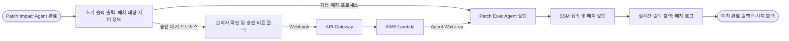

# Patch_exec_agent

`Patch_exec_agent`는 취약점 분석 결과를 바탕으로 AWS 환경에서 안전하게 패치를 실행하고, 그 과정을 실시간으로 모니터링할 수 있도록 돕는 자동화 에이전트입니다.

## 동작 프로세스 (Architecture)

본 에이전트는 선행 에이전트의 분석 직후 대상 서버 정보를 슬랙에 우선 출력하며, 설정에 따라 **자동 패치 프로세스** 또는 **관리자 승인 기반 프로세스**로 나뉘어 동작합니다.

### 프로세스 상세
1. **초기 슬랙 출력:** `Patch Impact Agent`의 동작이 끝나면, 어떤 서버를 패치할 것인지에 대한 요약 정보가 슬랙에 즉시 출력됩니다.
2. **실행 분기:**
   * **자동 패치:** 초기 알림 후 즉시 `Patch_exec_agent`가 실행됩니다.
   * **관리자 승인:** 슬랙에 활성화된 승인 버튼을 관리자가 클릭하면, API Gateway와 Lambda를 거쳐 대기 중이던 에이전트가 실행됩니다.
3. **패치 및 실시간 모니터링:** 에이전트가 AWS Systems Manager(SSM)를 통해 대상 서버에 패치 명령을 내리며, 실행될 때마다 실시간으로 슬랙에 진행 상황이 출력됩니다.
4. **완료 알림:** 모든 패치 작업이 종료되면 최종 패치 완료 메시지가 슬랙에 전송됩니다.

## 주요 컴포넌트 및 설계 의도

### 연결 방식 및 Lambda 사용 목적
* **연결 구조:** Slack Webhook URL -> API Gateway -> AWS Lambda -> Patch Exec Agent
* **Lambda 도입 이유:** 관리자 승인 프로세스에서 대기 중인 **동작이 끝난 에이전트를 다시 깨우기 위한 용도(Wake-up)**로 Lambda를 사용했습니다. 이를 통해 에이전트를 항시 구동할 필요 없이 이벤트 기반으로만 동작하게 하여 리소스 효율성을 극대화했습니다.

### 슬랙 메시지 화면 구성
슬랙 인터페이스는 단계별로 명확한 정보를 제공하도록 구성되었습니다.
* **초기 정보 메시지:** 패치 대상 서버의 인스턴스 정보와 적용될 패치 내역을 요약하여 보여줍니다.
* **Interactive 버튼:** 수동 프로세스의 경우 메시지 하단에 승인버튼이 노출됩니다.
* **실시간 로그 스레드:** 패치가 시작되면, 진행 상황이 실시간으로 업데이트됩니다.
* **최종 완료 메시지:** 전체 프로세스의 성공/실패 여부를 알리는 알림이 발송됩니다.

## 트러블슈팅 (Troubleshooting)

패치 실패 시, 에이전트가 AWS SSM에 어떤 내용으로 명령어를 전송했는지 직접 확인하여 디버깅할 수 있습니다.

1. AWS 콘솔에서 **Systems Manager** 서비스로 이동합니다.
2. 좌측 메뉴에서 **명령 실행 (Run Command)** 탭으로 진입합니다.
3. **명령 기록 (Command history)** 탭을 클릭하여 실패한 세션을 찾습니다.
4. 해당 인스턴스의 ID를 클릭하여 **출력(Output)**을 확인하면, 에이전트가 대상 서버에 실제로 주입하려 했던 명령어 페이로드와 실패 사유를 상세히 볼 수 있습니다.

## 한계점 및 프롬프트 제어 (Limitation)

본 프로젝트의 `Patch_exec_agent`는 100% 자율적인 판단만으로 명령어를 생성하고 실행하지 않습니다. 

현재 구축된 취약한 인프라 환경의 보호 및 원활한 시연을 위해, 에이전트 프롬프트에 **실행 가능한 명령어의 범위와 가이드라인을 어느 정도 부여하여 통제**하고 있습니다. 이는 의도치 않은 시스템 손상이나 잘못된 명령어 주입(RCE 등 2차 피해)을 방지하기 위한 안전장치이며, 지정된 패치 플레이북 내에서만 에이전트가 동작하도록 설계되었습니다.
