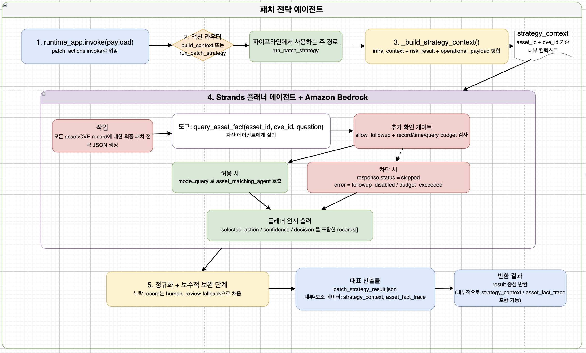

# 패치 전략 에이전트



취약점 자동 분석 및 패치 의사결정 시스템의 **패치 전략 에이전트**입니다.

앞 단계에서 생성된 위험도 평가 결과, 인프라 자산 정보, 운영 영향 정보를 통합하고, 각 `asset_id × cve_id` 조합에 대해 최종 대응 전략을 결정합니다.

단순히 위험도가 높다는 이유만으로 즉시 패치를 선택하지 않습니다. 실제 자산의 소프트웨어 버전, 배포 방식, 서비스 재시작 여부, 운영 영향, 임시 완화 가능성 및 불확실성을 함께 검토하여 다음 중 하나를 선택합니다.

- 즉시 정식 패치
- 계획된 일정에 정식 패치
- 임시 완화 조치 우선 적용
- 사람 검토

기본 입력만으로 판단 근거가 부족한 경우에는 `query_asset_fact` 도구를 통해 자산 매칭 에이전트에 추가 기술 사실을 질의합니다.

---

## 전체 팀 아키텍처

```text
[취약점 수집 Agent]
        │
        ├─ asset_matching_payload
        │          │
        │          ▼
        │   [자산 매칭 Agent]
        │          │
        │          └─ infra_context ───────────────┐
        │                                          │
        ├─ risk_assessment_payload ─────────────┐  │
        │                                       ▼  ▼
        │                              [위험도 평가 Agent]
        │                                       │
        │                                       └─ risk_result ──────────────┐
        │                                                                    │
        └─ operational_payload ────────────────────────────────────────┐     │
                                                                       ▼      ▼
                                                                 [패치 전략 Agent]
                                                                      │
                                                                      └─ patch_strategy_result
                                                                                │
                                                                                ▼
                                                                     [패치 실행 Agent]
```

패치 전략 에이전트는 다음 세 가지 주요 입력을 결합합니다.

```text
infra_context
    자산의 소프트웨어, 네트워크, 보안, 배포 정보

risk_result
    자산별 취약점 위험도와 위험도 조정 근거

operational_payload
    패치 방법, 의존성, 운영 영향, 완화책, 검증 항목
```

---

## 에이전트 실행 구조

```text
runtime_app.invoke(payload)
        │
        ▼
patch_actions.invoke(payload)
        │
        ▼
┌─────────────────────────────────────┐
│            액션 라우터              │
├─────────────────────────────────────┤
│ build_context                       │
│ build_patch_strategy_context        │
│                                     │
│ run_patch_strategy                  │
│ patch                               │
│ pipeline                            │
│ query_patch_strategy                │
│ query                               │
└─────────────────────────────────────┘
        │
        ▼
_build_strategy_context()
        │
        │ infra_context
        │ risk_result
        │ operational_payload
        ▼
strategy_context
        │
        ▼
Strands Agent + Amazon Bedrock
        │
        ├─ 기존 근거만으로 전략 판단
        │
        └─ 근거 부족 시 query_asset_fact 호출
                    │
                    ▼
          자산 매칭 AgentCore Runtime
                    │
                    ▼
              추가 기술 사실
        │
        ▼
플래너 원시 결과
        │
        ▼
정규화 및 보수적 Fallback
        │
        ▼
patch_strategy_result
```

---

## 주요 처리 단계

### 1. Runtime 진입

AgentCore Runtime 또는 상위 오케스트레이터가 `runtime_app.invoke(payload)`를 호출합니다.

`runtime_app.py`는 전달받은 payload를 패치 전략 로직의 진입점인 `patch_actions.invoke()`로 위임합니다.

```python
def invoke(payload: dict | None) -> dict:
    from patch_runtime.patch_actions import invoke as patch_strategy_invoke

    return patch_strategy_invoke(payload or {})
```

### 2. 액션 라우팅

입력 payload의 `action` 값에 따라 실행 경로를 선택합니다.

| Action | 동작 |
| --- | --- |
| `build_context` | 입력 데이터를 병합하여 `strategy_context`만 생성 |
| `build_patch_strategy_context` | `build_context`와 동일한 컨텍스트 생성 경로 |
| `run_patch_strategy` | 컨텍스트 생성부터 최종 전략 판단까지 전체 실행 |
| `patch` | `run_patch_strategy` 별칭 |
| `pipeline` | `run_patch_strategy` 별칭 |
| `query_patch_strategy` | `run_patch_strategy` 별칭 |
| `query` | `run_patch_strategy` 별칭 |

`action`을 생략하면 기본값은 다음과 같습니다.

```text
run_patch_strategy
```

### 3. 전략 컨텍스트 생성

`_build_strategy_context()`는 다음 입력을 하나의 내부 컨텍스트로 병합합니다.

```text
risk_result
infra_context
operational_payload
additional_asset_response
```

처리 기준은 다음과 같습니다.

```text
CVE 기준
    risk_result ↔ operational_payload

Asset ID 기준
    risk_result.impacted_assets ↔ infra_context.assets

Asset ID + CVE ID 기준
    기존 추가 질의 결과 연결
```

최종적으로 각 자산과 취약점 조합이 하나의 record가 됩니다.

```text
asset_id × cve_id = 하나의 패치 전략 판단 단위
```

예시:

```json
{
  "asset_id": "<EC2_INSTANCE_ID>",
  "cve_id": "CVE-2021-44228",
  "title": "Apache Log4j2 JNDI Injection",
  "risk_level": "critical",
  "risk_reference": {
    "base_cvss": 10.0,
    "calculated_risk": "CRITICAL",
    "exposure_level": "Private",
    "risk_adjustment_reason": "..."
  },
  "infra_asset": {
    "tier": "app",
    "metadata": {},
    "network_context": {},
    "security_context": {},
    "installed_software": [],
    "services": [],
    "config_findings": [],
    "file_findings": [],
    "container_images": [],
    "deployment_context": {}
  },
  "operational_context": {
    "primary_remediation": {},
    "dependency_checks": [],
    "fallback_mitigations": [],
    "validation_checks": [],
    "operational_risk": {},
    "rollout_guidance": {}
  },
  "prior_asset_findings": []
}
```

---

## 실행 모드

### 모드 1 — 전략 컨텍스트만 생성

Bedrock 플래너를 호출하지 않고, 입력 데이터가 올바르게 결합되는지만 확인할 때 사용합니다.

```json
{
  "action": "build_context",
  "risk_result": {},
  "infra_context": {},
  "operational_payload": {},
  "context_save_path": "./output/strategy_context.json"
}
```

반환 예시:

```json
{
  "action": "build_context",
  "generated_at": "2026-01-01T00:00:00+00:00",
  "result": {
    "planner_intent": "risk-driven patch strategy planner",
    "allow_followup": true,
    "record_count": 2,
    "records": []
  }
}
```

### 모드 2 — 전체 패치 전략 실행

컨텍스트 생성, Bedrock 판단, 추가 자산 질의, 결과 정규화까지 전체 과정을 실행합니다.

```json
{
  "action": "run_patch_strategy",
  "region": "<AWS_REGION>",
  "allow_followup": true,
  "infra_matching_runtime_arn": "arn:aws:bedrock-agentcore:<AWS_REGION>:<AWS_ACCOUNT_ID>:runtime/<ASSET_MATCHING_AGENT_ID>",
  "risk_result": {},
  "infra_context": {},
  "operational_payload": {},
  "context_save_path": "./output/strategy_context.json",
  "asset_fact_trace_path": "./output/asset_fact_trace.json",
  "save_path": "./output/patch_strategy_result.json"
}
```

---

## 입력 Payload

### 전체 입력 예시

```json
{
  "action": "run_patch_strategy",
  "region": "<AWS_REGION>",
  "allow_followup": true,
  "infra_matching_runtime_arn": "arn:aws:bedrock-agentcore:<AWS_REGION>:<AWS_ACCOUNT_ID>:runtime/<ASSET_MATCHING_AGENT_ID>",
  "risk_result": {
    "result": [
      {
        "cve_id": "CVE-2021-44228",
        "title": "Apache Log4j2 JNDI Injection",
        "impacted_assets": [
          {
            "instance_id": "<EC2_INSTANCE_ID>",
            "base_cvss": 10.0,
            "calculated_risk": "CRITICAL",
            "exposure_level": "Private",
            "risk_adjustment_reason": "취약 버전이 실행 중이며 외부 입력이 로그에 도달함"
          }
        ]
      }
    ]
  },
  "infra_context": {
    "assets": [
      {
        "asset_id": "<EC2_INSTANCE_ID>",
        "tier": "app",
        "metadata": {
          "environment": "production",
          "business_criticality": "high"
        },
        "network_context": {
          "is_internet_facing": false,
          "listening_ports": [8080]
        },
        "security_context": {
          "running_as_root": ["java"],
          "imds_v2_enforced": true
        },
        "installed_software": [
          {
            "product": "log4j",
            "version": "2.14.1",
            "source_path": "/app/lib/log4j-core-2.14.1.jar"
          }
        ]
      }
    ]
  },
  "operational_payload": {
    "records": [
      {
        "cve_id": "CVE-2021-44228",
        "title": "Apache Log4j2 JNDI Injection",
        "primary_remediation": {
          "target_version": "2.17.1"
        },
        "dependency_checks": [
          "Java 버전 호환성 확인",
          "애플리케이션 의존성 충돌 확인"
        ],
        "fallback_mitigations": [
          "JndiLookup.class 제거"
        ],
        "validation_checks": [
          "교체 후 Log4j 버전 확인",
          "서비스 재시작 후 오류 로그 확인"
        ],
        "operational_risk": {
          "service_restart_required": true
        },
        "rollout_guidance": {
          "strategy": "단계적 배포"
        }
      }
    ]
  },
  "context_save_path": "./output/strategy_context.json",
  "asset_fact_trace_path": "./output/asset_fact_trace.json",
  "save_path": "./output/patch_strategy_result.json"
}
```

### 입력 필드

| 필드 | 필수 여부 | 설명 |
| --- | --- | --- |
| `action` | 선택 | 실행할 액션. 생략 시 `run_patch_strategy` |
| `region` | 선택 | AgentCore 및 Bedrock 호출 리전 |
| `allow_followup` | 선택 | 자산 매칭 에이전트 추가 질의 허용 여부 |
| `infra_matching_runtime_arn` | 조건부 | 추가 자산 질의에 사용할 AgentCore Runtime ARN |
| `asset_matching_runtime_arn` | 조건부 | `infra_matching_runtime_arn`의 대체 필드 |
| `risk_result` | 필수 | 위험도 평가 에이전트 결과 |
| `infra_context` | 필수 | 자산 매칭 에이전트 결과 |
| `operational_payload` | 필수 | 취약점 수집 단계의 운영 영향 정보 |
| `additional_asset_response` | 선택 | 앞 단계에서 이미 수집한 추가 자산 질의 결과 |
| `context_save_path` | 선택 | 내부 전략 컨텍스트 저장 경로 |
| `asset_fact_trace_path` | 선택 | 추가 자산 질의 추적 결과 저장 경로 |
| `save_path` | 선택 | 최종 전략 결과 저장 경로 |

---

## AI Planner 내부 동작

Strands Agent는 Amazon Bedrock 모델을 사용하여 각 record의 최종 패치 전략을 판단합니다.

플래너가 사용하는 근거는 다음과 같습니다.

```text
1. Risk evaluation context
2. Infrastructure context
3. Operational impact context
4. Prior asset fact findings
5. 필요 시 추가 자산 질의 결과
```

플래너는 각 record에 대해 다음 질문을 수행합니다.

```text
현재 버전이 실제 취약 버전인가?
목표 패치 버전이 명확한가?
패치는 OS 패키지, 의존성, 바이너리, 설정 중 무엇을 변경하는가?
서비스 재시작, 재배포 또는 호스트 재부팅이 필요한가?
현재 운영 환경에서 정식 패치가 가능한가?
정식 패치가 어렵다면 임시 완화책이 존재하는가?
근거가 부족한 필드는 무엇인가?
```

플래너의 출력은 반드시 구조화된 JSON 형식을 사용합니다.

---

## 추가 자산 사실 질의

### `query_asset_fact`

기본 입력만으로 기술적 사실을 확정할 수 없는 경우 사용하는 Function Calling 도구입니다.

```text
query_asset_fact(
    asset_id,
    cve_id,
    question
)
```

도구는 내부적으로 자산 매칭 AgentCore Runtime에 다음 요청을 전달합니다.

```json
{
  "mode": "query",
  "region": "<AWS_REGION>",
  "instance_id": "<EC2_INSTANCE_ID>",
  "asset_info": {},
  "question": "현재 실행 중인 Java 프로세스의 classpath에 log4j-core-2.14.1.jar가 포함되어 있는가?"
}
```

질문은 다음 조건을 만족해야 합니다.

- 실제 명령, 파일, 설정 또는 프로세스 조회로 답할 수 있어야 합니다.
- 하나의 질문에는 하나의 구체적 사실만 포함하는 것을 권장합니다.
- 이미 `asset_info`에 존재하는 일반 정보를 반복해서 물어보지 않습니다.
- 추측이나 운영 정책이 아니라 직접 관측 가능한 기술 사실을 묻습니다.

좋은 질문 예시:

```text
실행 중인 Java 프로세스의 classpath에 log4j-core-2.14.1.jar가 포함되어 있는가?
```

```text
nginx가 패키지 관리자를 통해 설치되었는가, 직접 컴파일된 바이너리인가?
```

```text
현재 nginx master 프로세스가 참조하는 설정 파일 경로는 무엇인가?
```

```text
해당 JAR 파일을 교체한 뒤 애플리케이션 재배포가 필요한 구조인가?
```

피해야 할 질문:

```text
이 서버는 위험한가?
```

```text
패치를 해도 되는가?
```

```text
이 취약점을 어떻게 처리해야 하는가?
```

위 질문은 자산 매칭 에이전트가 직접 관측할 수 있는 기술 사실이 아니라 의사결정을 요구하기 때문입니다.

---

## Follow-up 질의 제한

추가 자산 질의는 무제한으로 실행되지 않습니다.

다음 조건을 모두 통과해야 질의가 허용됩니다.

```text
allow_followup = true
전체 실행 시간 제한 미초과
record별 실행 시간 제한 미초과
record별 최대 질의 수 미초과
```

기본 제한:

| 환경변수 | 기본값 | 설명 |
| --- | ---: | --- |
| `PATCH_MAX_FOLLOWUPS_PER_RECORD` | `8` | 하나의 asset/CVE record에서 허용할 최대 추가 질의 수 |
| `PATCH_MAX_RECORD_WALL_TIME_SECONDS` | `240` | 하나의 record에 사용할 최대 시간 |
| `PATCH_MAX_TOTAL_WALL_TIME_SECONDS` | `900` | 전체 전략 실행에 사용할 최대 시간 |

질의가 차단되면 다음과 같은 결과가 기록됩니다.

```json
{
  "asset_id": "<EC2_INSTANCE_ID>",
  "cve_id": "CVE-2021-44228",
  "question": "실행 중인 Java 프로세스가 취약 JAR를 사용 중인가?",
  "status": "skipped",
  "error": "record_query_budget_exceeded",
  "answer": "",
  "confidence": "none",
  "evidence": []
}
```

차단 사유:

| 오류 | 의미 |
| --- | --- |
| `followup_disabled` | 추가 질의가 비활성화됨 |
| `total_time_budget_exceeded` | 전체 실행 시간 제한 초과 |
| `record_time_budget_exceeded` | 해당 record 실행 시간 제한 초과 |
| `record_query_budget_exceeded` | 해당 record의 최대 질의 수 초과 |
| `asset_info_or_runtime_arn_missing` | 자산 정보 또는 AgentCore ARN 누락 |

---

## 출력 스키마

최종 결과는 `records` 배열로 반환됩니다.

```json
{
  "records": [
    {
      "asset_id": "<EC2_INSTANCE_ID>",
      "cve_id": "CVE-2021-44228",
      "risk_level": "critical",
      "affected_component": "log4j-core",
      "current_version": "2.14.1",
      "target_version": "2.17.1",
      "change_surface": "app_dependency",
      "deployment_requirement": "redeploy",
      "patch_feasible": "yes",
      "mitigation_available": "yes",
      "mitigation_summary": "JndiLookup.class 제거를 임시 완화책으로 적용할 수 있음",
      "selected_action": "apply_patch_planned",
      "decision": "호환성 검증 후 log4j-core를 2.17.1로 교체하고 애플리케이션을 재배포합니다.",
      "confidence": "high",
      "reason_summary": "현재 실행 중인 애플리케이션에서 log4j-core 2.14.1 사용이 확인되었으며, 라이브러리 교체 후 애플리케이션 재배포가 필요합니다.",
      "validation_checks": [
        "재배포 후 Log4j 버전 확인",
        "애플리케이션 기동 상태 확인",
        "오류 로그 확인",
        "취약 JAR 잔존 여부 확인"
      ],
      "remaining_unknowns": []
    }
  ]
}
```

---

## 출력 필드 설명

| 필드 | 설명 |
| --- | --- |
| `asset_id` | 패치 전략을 적용할 대상 자산 ID |
| `cve_id` | 대상 취약점 CVE ID |
| `risk_level` | 앞 단계에서 계산된 자산별 위험도 |
| `affected_component` | 실제 패치 또는 완화 대상 구성요소 |
| `current_version` | 현재 자산에서 확인된 버전 |
| `target_version` | 패치 후 적용할 목표 버전 |
| `change_surface` | 패치가 변경하는 기술 영역 |
| `deployment_requirement` | 조치 반영에 필요한 재시작·재배포 수준 |
| `patch_feasible` | 현재 근거 기준 정식 패치 가능 여부 |
| `mitigation_available` | 임시 완화책 사용 가능 여부 |
| `mitigation_summary` | 적용 가능한 임시 완화 조치 |
| `selected_action` | 최종 선택된 대응 방식 |
| `decision` | 사람이 이해할 수 있는 최종 실행 결론 |
| `confidence` | 최종 판단의 신뢰 수준 |
| `reason_summary` | 해당 전략을 선택한 근거 |
| `validation_checks` | 조치 완료 후 확인해야 할 검증 항목 |
| `remaining_unknowns` | 최종 단계까지 해결되지 않은 불확실성 |

---

## 선택형 필드

### `risk_level`

| 값 | 의미 |
| --- | --- |
| `critical` | 매우 시급한 위험 |
| `high` | 시급한 위험 |
| `medium` | 계획 패치가 기본인 중간 위험 |
| `low` | 상대적으로 낮은 위험 |

### `change_surface`

| 값 | 의미 |
| --- | --- |
| `os_package` | OS 패키지 업데이트 |
| `app_dependency` | 애플리케이션 의존성 버전 변경 |
| `binary_artifact` | JAR, DLL 또는 실행 바이너리 교체 |
| `container_image` | 컨테이너 이미지 재빌드 또는 재배포 |
| `configuration` | 설정 변경 중심 조치 |
| `source_code` | 소스 코드 수정 필요 |
| `unknown` | 변경 대상을 확정할 수 없음 |

### `deployment_requirement`

| 값 | 의미 |
| --- | --- |
| `none` | 별도 재시작 또는 재배포 불필요 |
| `service_restart` | 서비스 재시작 필요 |
| `redeploy` | 애플리케이션 또는 컨테이너 재배포 필요 |
| `host_reboot` | 호스트 재부팅 필요 |
| `unknown` | 반영 방식을 확정할 수 없음 |

### `patch_feasible`

| 값 | 의미 |
| --- | --- |
| `yes` | 현재 근거로 정식 패치 가능 |
| `no` | 현재 상태에서 즉시 패치하기 어려움 |
| `unknown` | 패치 가능 여부를 확정할 근거 부족 |

### `mitigation_available`

| 값 | 의미 |
| --- | --- |
| `yes` | 적용 가능한 임시 완화책 존재 |
| `no` | 실질적인 임시 완화책 없음 |
| `unknown` | 완화 가능 여부를 확정할 수 없음 |

### `selected_action`

| 값 | 의미 |
| --- | --- |
| `apply_patch_now` | 정식 패치를 즉시 적용 |
| `apply_patch_planned` | 정식 패치를 계획된 일정에 적용 |
| `apply_mitigation_now` | 정식 패치 전에 임시 완화책을 우선 적용 |
| `human_review` | 근거 부족 또는 운영 불확실성으로 사람 검토 필요 |

### `confidence`

| 값 | 의미 |
| --- | --- |
| `high` | 핵심 근거가 충분함 |
| `medium` | 일부 불확실성이 존재함 |
| `low` | 중요한 정보가 부족함 |

---

## 전략 일관성 규칙

플래너는 다음 규칙을 따라야 합니다.

```text
selected_action은 반드시 하나만 선택
decision은 selected_action과 일치
patch_feasible=no일 때 apply_patch_now 금지
mitigation_available=no일 때 apply_mitigation_now 금지
핵심 근거가 부족하면 confidence를 낮춤
패치 가능 여부가 불명확하면 human_review 우선
위험도가 높다는 사실만으로 즉시 패치를 결정하지 않음
```

예를 들어 위험도가 `critical`이더라도 다음 정보가 확인되지 않았다면 즉시 패치를 선택하지 않습니다.

```text
현재 설치 방식
실제 사용 중인 바이너리 또는 라이브러리 경로
목표 버전의 호환성
서비스 재시작 또는 재배포 필요 여부
운영 중단 영향
Rollback 가능 여부
```

이 경우 다음 전략이 더 적절할 수 있습니다.

```text
human_review
apply_mitigation_now
apply_patch_planned
```

---

## 정규화 및 보수적 Fallback

Bedrock 플래너의 원시 응답은 바로 최종 결과로 사용하지 않습니다.

다음 단계를 거칩니다.

```text
Bedrock 원시 문자열
        │
        ▼
JSON 영역 추출
        │
        ▼
JSON 파싱
        │
        ▼
허용 Enum 값 정규화
        │
        ▼
asset_id × cve_id 기준 입력 record와 대조
        │
        ▼
누락 record 탐지
        │
        ▼
human_review Fallback 생성
        │
        ▼
Pydantic 스키마 검증
```

플래너가 특정 record를 누락하거나 JSON 형식이 잘못된 경우 해당 record를 제거하지 않습니다.

대신 다음과 같은 보수적 결과를 생성합니다.

```json
{
  "selected_action": "human_review",
  "confidence": "low",
  "decision": "현재 근거가 부족하므로 담당자가 패치 가능성과 완화 가능성을 검토해야 합니다.",
  "remaining_unknowns": [
    "insufficient_evidence"
  ]
}
```

이 구조는 모델 응답 오류 때문에 위험 자산이 최종 결과에서 누락되는 문제를 방지합니다.

---

## 반환 결과

`run_patch_strategy` 실행 결과는 다음 구조입니다.

```json
{
  "action": "run_patch_strategy",
  "generated_at": "2026-01-01T00:00:00+00:00",
  "strategy_context": {},
  "asset_fact_trace": {
    "generated_at": "2026-01-01T00:00:00+00:00",
    "response_count": 0,
    "responses": []
  },
  "result": {
    "records": []
  }
}
```

### 주요 반환 필드

| 필드 | 설명 |
| --- | --- |
| `strategy_context` | 위험도, 자산, 운영 영향 정보를 병합한 내부 판단 컨텍스트 |
| `asset_fact_trace` | 자산 매칭 에이전트에 추가로 질의한 요청과 응답 기록 |
| `result` | 외부 파이프라인에 전달할 최종 패치 전략 |

---

## 대표 산출물

### `patch_strategy_result.json`

외부 파이프라인과 패치 실행 에이전트에 전달되는 최종 전략 결과입니다.

```text
patch_strategy_result.json
└─ records[]
   ├─ selected_action
   ├─ confidence
   ├─ decision
   ├─ validation_checks
   └─ remaining_unknowns
```

### `strategy_context.json`

플래너가 판단에 사용한 내부 통합 컨텍스트입니다.

```text
strategy_context.json
└─ records[]
   ├─ risk_reference
   ├─ infra_asset
   ├─ operational_context
   └─ prior_asset_findings
```

### `asset_fact_trace.json`

추가 자산 사실 질의의 전체 추적 기록입니다.

```text
asset_fact_trace.json
└─ responses[]
   ├─ asset_id
   ├─ cve_id
   ├─ question
   ├─ status
   ├─ answer
   ├─ confidence
   ├─ evidence
   └─ error
```

`strategy_context`와 `asset_fact_trace`에는 실제 AWS 자산 정보가 포함될 수 있으므로 공개 저장소에 커밋하지 않습니다.

---

## 파일 설명

| 파일 | 설명 |
| --- | --- |
| `runtime_app.py` | AgentCore Runtime 진입점. payload를 `patch_actions.invoke()`로 전달 |
| `patch_runtime/patch_actions.py` | 컨텍스트 병합, Bedrock 플래너 호출, 추가 자산 질의, 정규화 및 결과 생성 |
| `patch_runtime/bedrock_json.py` | Strands Agent를 사용할 수 없을 때 사용하는 Bedrock 텍스트 호출 Fallback |
| `requirements.txt` | Python 패키지 의존성 |
| `.bedrock_agentcore.yaml` | AgentCore 배포 설정 |

---

## 환경 요구사항

| 항목 | 내용 |
| --- | --- |
| Python | 3.12 이상 권장 |
| 필수 패키지 | `boto3`, `strands-agents`, `pydantic` |
| Bedrock 권한 | 선택한 Foundation Model에 대한 Invoke 권한 |
| AgentCore 권한 | 자산 매칭 Runtime에 대한 `InvokeAgentRuntime` 권한 |
| AWS 자격증명 | IAM Role, AWS CLI Profile 또는 환경변수 |
| 네트워크 | Bedrock 및 AgentCore API 호출 가능 환경 |

패키지 설치:

```powershell
cd "MultiAIagent/PatchStrategyAgent(AWS)"
python -m pip install -r requirements.txt
```

---

## 환경변수

### 모델 및 리전

| 환경변수 | 기본값 | 설명 |
| --- | --- | --- |
| `AWS_REGION` | `ap-northeast-2` | 기본 AWS 리전 |
| `AWS_DEFAULT_REGION` | — | Bedrock 모델 생성 시 사용할 대체 리전 |
| `PATCH_IMPACT_BEDROCK_MODEL_ID` | 내장 기본값 | 현재 코드에서 우선 참조하는 전용 Bedrock Model ID |
| `BEDROCK_MODEL_ID` | 내장 기본값 | 공통 Bedrock Model ID |

### AgentCore

| 환경변수 | 설명 |
| --- | --- |
| `INFRA_MATCHING_AGENTCORE_ARN` | 자산 매칭 에이전트 Runtime ARN |
| `ASSET_MATCHING_AGENTCORE_ARN` | 자산 매칭 Runtime ARN 대체 변수 |
| `ASSET_MATCHING_ARN` | 자산 매칭 Runtime ARN 대체 변수 |
| `AGENTCORE_READ_TIMEOUT` | AgentCore 응답 읽기 제한 시간. 기본값 `900`초 |
| `AGENTCORE_CONNECT_TIMEOUT` | AgentCore 연결 제한 시간. 기본값 `10`초 |

### Follow-up Budget

| 환경변수 | 기본값 |
| --- | ---: |
| `PATCH_MAX_FOLLOWUPS_PER_RECORD` | `8` |
| `PATCH_MAX_RECORD_WALL_TIME_SECONDS` | `240` |
| `PATCH_MAX_TOTAL_WALL_TIME_SECONDS` | `900` |

환경변수 예시:

```env
AWS_REGION=<AWS_REGION>
BEDROCK_MODEL_ID=<BEDROCK_MODEL_ID>
INFRA_MATCHING_AGENTCORE_ARN=arn:aws:bedrock-agentcore:<AWS_REGION>:<AWS_ACCOUNT_ID>:runtime/<ASSET_MATCHING_AGENT_ID>

PATCH_MAX_FOLLOWUPS_PER_RECORD=8
PATCH_MAX_RECORD_WALL_TIME_SECONDS=240
PATCH_MAX_TOTAL_WALL_TIME_SECONDS=900

AGENTCORE_READ_TIMEOUT=900
AGENTCORE_CONNECT_TIMEOUT=10
```

실제 AWS 계정 ID, Runtime ARN, Access Key 및 Secret Key는 README나 Git 저장소에 직접 작성하지 않습니다.

---

## 로컬 호출 예시

다음과 같이 간단한 테스트 스크립트를 작성하여 Runtime 진입점을 호출할 수 있습니다.

```python
import json

from runtime_app import invoke


with open("input_payload.json", encoding="utf-8") as file:
    payload = json.load(file)

result = invoke(payload)

print(
    json.dumps(
        result,
        ensure_ascii=False,
        indent=2,
    )
)
```

예시 파일명:

```text
local_test.py
input_payload.json
```

실행:

```powershell
cd "MultiAIagent/PatchStrategyAgent(AWS)"
python local_test.py
```

`local_test.py`, 테스트 결과 및 실제 인프라 payload는 공개 저장소에 커밋하지 않는 것을 권장합니다.

---

## AgentCore 연동

AgentCore Runtime에서는 다음 형태로 호출됩니다.

```text
상위 오케스트레이터
        │
        │ InvokeAgentRuntime
        ▼
Patch Strategy AgentCore Runtime
        │
        ▼
runtime_app.invoke(payload)
        │
        ▼
patch_actions.invoke(payload)
```

추가 자산 정보가 필요하면 패치 전략 Runtime이 다시 자산 매칭 Runtime을 호출합니다.

```text
Patch Strategy Runtime
        │
        │ query_asset_fact
        ▼
Asset Matching Runtime
        │
        │ mode=query
        ▼
EC2 기술 사실 확인
        │
        ▼
answer + confidence + evidence
```

AgentCore 실행 역할에는 최소한 다음 권한이 필요합니다.

```text
bedrock:InvokeModel
bedrock-agentcore:InvokeAgentRuntime
```

실제 운영 환경에서는 호출 대상 Runtime ARN을 특정 리소스로 제한해야 합니다.

---

## 판단 예시

### 즉시 패치

```json
{
  "patch_feasible": "yes",
  "mitigation_available": "yes",
  "selected_action": "apply_patch_now",
  "confidence": "high"
}
```

선택 조건 예시:

```text
취약 버전 사용이 명확히 확인됨
목표 버전이 확정됨
호환성 제약이 확인되지 않음
표준 패키지 업데이트로 적용 가능
서비스 재시작 영향이 허용 가능
검증 및 Rollback 절차가 존재함
```

### 계획 패치

```json
{
  "patch_feasible": "yes",
  "selected_action": "apply_patch_planned",
  "confidence": "high"
}
```

선택 조건 예시:

```text
정식 패치는 가능함
재배포 또는 점검 시간이 필요함
즉시 중단보다 변경 일정에 맞춘 적용이 안전함
단기적인 통제 또는 완화책이 존재함
```

### 임시 완화 우선

```json
{
  "patch_feasible": "no",
  "mitigation_available": "yes",
  "selected_action": "apply_mitigation_now",
  "confidence": "medium"
}
```

선택 조건 예시:

```text
정식 패치에 애플리케이션 수정이 필요함
즉시 재배포가 불가능함
설정 변경이나 기능 비활성화로 위험을 우선 낮출 수 있음
정식 패치는 별도 검증 후 진행해야 함
```

### 사람 검토

```json
{
  "patch_feasible": "unknown",
  "mitigation_available": "unknown",
  "selected_action": "human_review",
  "confidence": "low"
}
```

선택 조건 예시:

```text
현재 버전이 불명확함
실제 실행 중인 artifact를 특정하지 못함
목표 버전 호환성이 확인되지 않음
추가 자산 질의가 실패하거나 제한됨
운영 중단 영향을 판단할 수 없음
```

---

## 보안 및 운영 주의사항

- `.env` 파일은 Git에 커밋하지 않습니다.
- 실제 EC2 Instance ID, VPC ID, Subnet ID, Security Group ID 및 공인 IP를 예제 파일에 기록하지 않습니다.
- `strategy_context`, `asset_fact_trace`, 실행 결과 JSON에는 실제 인프라 정보가 포함될 수 있으므로 Git에서 제외합니다.
- AgentCore 호출 IAM 권한은 필요한 Runtime ARN으로 제한합니다.
- `allow_followup=true`는 자산 매칭 Runtime에 추가 호출을 발생시키므로 비용과 실행 시간을 고려해야 합니다.
- 모델의 판단 결과를 검증하지 않고 바로 운영 서버 변경 명령으로 사용하지 않습니다.
- `human_review` 결과는 오류가 아니라 근거 부족에 대한 보수적 안전 조치입니다.
- `selected_action=apply_patch_now`이더라도 실제 실행 전에 대상 자산, 승인 상태, Rollback 계획 및 검증 항목을 다시 확인해야 합니다.
- 패치 실행 에이전트는 패치 전략 결과를 신뢰 경계 밖의 입력으로 취급하고, 허용된 자산과 명령인지 별도로 검증해야 합니다.