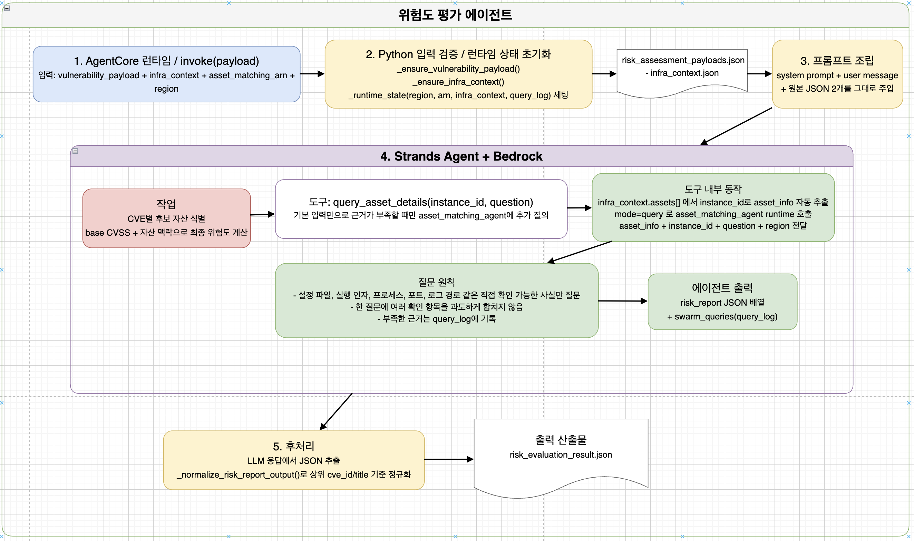

# 위험도 평가 에이전트



취약점 자동 분석 및 대응 시스템의 **위험도 평가 에이전트**입니다.

취약점 수집 에이전트가 생성한 취약점 기준 정보와 자산 매칭 에이전트가 수집한 실제 인프라 정보를 결합하여, 각 `CVE × 자산` 조합의 실질적인 위험도를 평가합니다.

단순히 Base CVSS 점수를 그대로 사용하지 않습니다. 실제 자산의 소프트웨어 버전, 네트워크 노출 수준, 프로세스 실행 상태, 공격자 입력 도달 가능성, 취약 기능 활성 여부 및 완화 조치 적용 여부를 함께 검토하여 최종 위험도를 결정합니다.

기본 입력만으로 판단 근거가 부족한 경우에는 `query_asset_details` 도구를 사용하여 자산 매칭 에이전트에 추가 기술 사실을 질의합니다.

최종 결과는 다음 두 가지 형태로 반환됩니다.

```text
risk_report
    자산별 최종 위험도와 판단 근거

swarm_queries
    자산 매칭 에이전트에 추가로 질의한 내역
```

---

## 전체 팀 아키텍처

```text
[취약점 수집 Agent]
        │
        ├─ asset_matching_payload
        │          │
        │          ▼
        │   [자산 매칭 Agent]
        │          │
        │          └─ infra_context ───────────────┐
        │                                          │
        ├─ risk_assessment_payload ─────────────┐  │
        │                                       ▼  ▼
        │                              [위험도 평가 Agent]
        │                                       │
        │                                       └─ risk_result 

```

위험도 평가 에이전트는 다음 두 가지 핵심 입력을 사용합니다.

```text
risk_assessment_payload
    CVE별 취약 제품, 영향 버전 범위, Base CVSS,
    공격 전제조건 및 자산에서 확인해야 할 항목

infra_context
    실제 자산의 설치 소프트웨어, 버전,
    네트워크 노출, 프로세스, 서비스 및 보안 설정
```

---

## 에이전트 실행 구조

```text
AgentCore Runtime
        │
        │ invoke(payload)
        ▼
입력 검증 및 Runtime 상태 초기화
        │
        ├─ vulnerability_payload 검증
        ├─ infra_context 검증
        ├─ asset_matching_arn 설정
        ├─ region 설정
        └─ query_log 초기화
        │
        ▼
Python 후보 자산 선별
        │
        ├─ 제품 키워드 추출
        ├─ 소프트웨어 Alias 매칭
        ├─ 영향 버전 범위 비교
        └─ 제외 버전 확인
        │
        ▼
candidate_assets_by_cve
        │
        ▼
위험도 평가 프롬프트 구성
        │
        ├─ risk_assessment_payload
        ├─ infra_context
        └─ candidate_assets_by_cve
        │
        ▼
Strands Agent + Amazon Bedrock
        │
        ├─ Base CVSS 확인
        ├─ 실제 취약 버전 확인
        ├─ 노출 수준 확인
        ├─ 공격 전제조건 확인
        ├─ 완화 조치 확인
        │
        └─ 근거 부족 시 query_asset_details 호출
                    │
                    ▼
          자산 매칭 AgentCore Runtime
                    │
                    │ mode=query
                    ▼
             추가 기술 사실 반환
        │
        ▼
LLM 원시 응답
        │
        ▼
JSON 추출 및 파싱
        │
        ▼
결과 정규화
        │
        ├─ 후보 외 자산 제거
        ├─ 누락 후보 자산 복원
        ├─ 필수 필드 고정
        └─ 보수적 Fallback 적용
        │
        ▼
risk_report + swarm_queries
```

---

## 주요 처리 단계

### 1. AgentCore Runtime 진입

위험도 평가 에이전트는 Amazon Bedrock AgentCore Runtime 위에서 동작합니다.

```python
@app.entrypoint
def invoke(payload):
    ...
```

AgentCore Runtime 또는 상위 오케스트레이터가 JSON Payload를 전달하면 위험도 평가 작업이 시작됩니다.

대표 입력 필드:

```text
vulnerability_payload
cve_payload
infra_context
asset_matching_arn
region
prompt
```

---

### 2. Runtime 상태 초기화

에이전트는 실행 시 다음 내부 상태를 초기화합니다.

```python
_runtime_state = {
    "infra_context": None,
    "asset_matching_arn": None,
    "region": DEFAULT_REGION,
    "query_log": [],
    "candidate_assets_by_cve": {},
}
```

각 필드의 역할:

| 필드 | 설명 |
| --- | --- |
| `infra_context` | 현재 평가에 사용하는 인프라 자산 정보 |
| `asset_matching_arn` | 추가 질의에 사용할 자산 매칭 Runtime ARN |
| `region` | AWS 및 AgentCore 호출 Region |
| `query_log` | 자산 매칭 에이전트에 전달한 추가 질문 기록 |
| `candidate_assets_by_cve` | CVE별 위험도 평가 대상 자산 |

---

### 3. 입력 검증

#### 취약점 Payload

다음 두 필드 중 하나를 사용할 수 있습니다.

```text
vulnerability_payload
cve_payload
```

입력 Payload는 반드시 `records` 배열을 포함해야 합니다.

```json
{
  "records": []
}
```

입력 조건을 충족하지 않으면 다음과 같은 오류를 반환합니다.

```text
vulnerability_payload 또는 cve_payload가 필요합니다.
```

#### 인프라 Context

`infra_context`는 반드시 `assets` 배열을 포함해야 합니다.

```json
{
  "assets": []
}
```

자산 정보가 없으면 위험도 평가를 수행할 수 없습니다.

```text
infra_context가 없습니다.
오케스트레이터가 자산 매칭 결과를 전달해야 합니다.
```

---

## 입력 데이터 전달 관계

취약점 수집 에이전트는 목적별로 다음 Payload를 생성합니다.

```text
asset_matching_payload
risk_assessment_payload
operational_payload
```

위험도 평가 에이전트는 이 중 `risk_assessment_payload`를 사용합니다.

```text
Vulnerability Collector
        │
        └─ risk_assessment_payload
                    │
                    ▼
             Orchestrator
                    │
                    ▼
       Risk Evaluation Agent
```

자산 매칭 에이전트가 생성한 `infra_context`도 함께 전달됩니다.

```text
Asset Matching Agent
        │
        └─ infra_context
                    │
                    ▼
       Risk Evaluation Agent
```

---

## 입력 Payload

### 전체 입력 예시

```json
{
  "region": "<AWS_REGION>",
  "asset_matching_arn": "arn:aws:bedrock-agentcore:<AWS_REGION>:<AWS_ACCOUNT_ID>:runtime/<ASSET_MATCHING_AGENT_ID>",
  "cve_payload": {
    "records": [
      {
        "cve_id": "CVE-2021-44228",
        "title": "Apache Log4j2 JNDI Injection",
        "cvss": {
          "score": 10.0,
          "severity": "CRITICAL"
        },
        "affected": "Apache Log4j2 2.0-beta9 이상 2.15.0 미만",
        "exploit_conditions": [
          "공격자 제어 문자열이 Log4j 로그 처리 경로에 도달해야 함",
          "JNDI Lookup 기능이 제거 또는 차단되지 않아야 함",
          "외부 JNDI Endpoint와 통신 가능한 경로가 존재해야 함"
        ],
        "asset_checks": [
          {
            "question": "실행 중인 Java 프로세스가 취약한 log4j-core JAR를 실제로 로드하고 있는가?"
          },
          {
            "question": "공격자 제어 입력이 취약한 로그 처리 경로까지 도달하는가?"
          },
          {
            "question": "JndiLookup.class 제거 또는 관련 완화 조치가 적용되어 있는가?"
          }
        ]
      }
    ]
  },
  "infra_context": {
    "region": "<AWS_REGION>",
    "assets": [
      {
        "asset_id": "<EC2_INSTANCE_ID>",
        "hostname": "<HOSTNAME>",
        "tier": "app",
        "public_ip": null,
        "metadata": {
          "environment": "production",
          "business_criticality": "high",
          "network_exposure": "private",
          "internet_route_via_igw": false,
          "internet_egress_via_nat": true
        },
        "network_context": {
          "is_internet_facing": false,
          "listening_ports": [
            8080
          ]
        },
        "security_context": {
          "running_as_root": [
            "java"
          ],
          "imds_v2_enforced": true
        },
        "installed_software": [
          {
            "vendor": "apache",
            "product": "log4j-core",
            "version": "2.14.1",
            "source_path": "/app/lib/log4j-core-2.14.1.jar"
          }
        ],
        "services": [],
        "config_findings": [],
        "file_findings": [],
        "deployment_context": {}
      }
    ]
  },
  "prompt": "위험도를 낮출 때는 직접 확인된 완화 근거가 있는 경우에만 적용하십시오."
}
```

---

## 입력 필드

| 필드 | 필수 여부 | 설명 |
| --- | --- | --- |
| `cve_payload` | 조건부 필수 | 취약점 수집 에이전트가 생성한 위험도 평가용 Payload |
| `vulnerability_payload` | 조건부 필수 | `cve_payload`의 대체 입력 필드 |
| `infra_context` | 필수 | 자산 매칭 에이전트가 생성한 실제 자산 정보 |
| `asset_matching_arn` | 조건부 | 추가 기술 사실 질의에 사용할 자산 매칭 Runtime ARN |
| `region` | 선택 | AgentCore Runtime을 호출할 AWS Region |
| `prompt` | 선택 | 기본 평가 지침에 추가할 운영자 지시사항 |

`cve_payload`와 `vulnerability_payload` 중 하나는 반드시 제공해야 합니다.

`asset_matching_arn`이 Payload에 없으면 환경변수 `ASSET_MATCHING_ARN`을 확인합니다.

---

## 취약점 Payload 구조

```json
{
  "records": [
    {
      "cve_id": "CVE-2021-23017",
      "title": "Nginx Resolver Off-by-One",
      "cvss": {
        "score": 7.7
      },
      "affected": "nginx 0.6.18 이상 1.20.1 미만",
      "exploit_conditions": [
        "nginx resolver 기능이 사용 중이어야 함",
        "공격자가 조작한 DNS 응답을 전달할 수 있어야 함"
      ],
      "asset_checks": [
        {
          "question": "nginx 설정에서 resolver 지시문이 사용 중인가?"
        },
        {
          "question": "실제 요청 처리 중 DNS 이름 해석이 발생하는가?"
        }
      ]
    }
  ]
}
```

### 주요 필드

| 필드 | 설명 |
| --- | --- |
| `cve_id` | 취약점 식별자 |
| `title` | 취약점 명칭 |
| `cvss.score` | 취약점 기준 Base CVSS |
| `affected` | 영향받는 제품과 버전 범위 |
| `exploit_conditions` | 취약점 악용에 필요한 조건 |
| `asset_checks` | 실제 자산에서 확인해야 할 기술 사실 |

---

## 인프라 Context 구조

```json
{
  "assets": [
    {
      "asset_id": "<EC2_INSTANCE_ID>",
      "hostname": "<HOSTNAME>",
      "tier": "web",
      "public_ip": "<PUBLIC_IP>",
      "metadata": {
        "network_exposure": "public",
        "business_criticality": "high",
        "internet_route_via_igw": true,
        "internet_egress_via_nat": false
      },
      "installed_software": [
        {
          "vendor": "f5",
          "product": "nginx",
          "version": "1.20.0",
          "cpe": "cpe:2.3:a:f5:nginx:1.20.0:*:*:*:*:*:*:*"
        }
      ],
      "network_context": {
        "is_internet_facing": true,
        "listening_ports": [
          80,
          443
        ]
      },
      "security_context": {
        "running_as_root": [
          "nginx"
        ]
      }
    }
  ]
}
```

위험도 평가에는 주로 다음 정보가 사용됩니다.

```text
asset_id
hostname
tier
public_ip
metadata.network_exposure
metadata.internet_route_via_igw
metadata.internet_egress_via_nat
installed_software
network_context
security_context
services
config_findings
file_findings
deployment_context
```

---

## Python 후보 자산 선별

위험도 평가 대상 자산을 LLM이 임의로 선택하도록 하지 않습니다.

Python 코드가 먼저 취약점 Payload와 `infra_context.assets[]`를 비교하여 CVE별 후보 자산을 선별합니다.

```text
risk_assessment_payload.records[]
        │
        ├─ 제품 키워드 추출
        ├─ 취약 버전 범위 추출
        └─ 제외 버전 추출
        │
        ▼
infra_context.assets[].installed_software
        │
        ├─ 제품명과 Alias 비교
        └─ 설치 버전 비교
        │
        ▼
candidate_assets_by_cve
```

후보 자산 선정 기준:

```text
제품이 일치하는가?
        +
설치 버전이 영향 범위에 포함되는가?
        +
보안 릴리즈 또는 제외 버전이 아닌가?
```

---

## 제품 Alias 매칭

현재 구현은 제품명, Vendor, CPE 정보를 정규화하여 소프트웨어 Alias를 생성합니다.

예시:

```text
nginx
    nginx

Log4j
    log4j
    log4j-core
    log4j2
```

제품 Alias는 다음 입력에서 생성됩니다.

```text
vendor
product
cpe
```

---

## 버전 범위 처리

다음과 같은 표현에서 취약 버전의 하한과 상한을 추출합니다.

```text
>=2.0.1 <2.15.0
```

```text
2.0.1 이상 2.15.0 미만
```

버전 비교 조건:

```text
현재 설치 버전 >= 하한 버전
현재 설치 버전 < 상한 버전
```

일부 Pre-release 표현도 처리합니다.

```text
alpha
beta
rc
```

예시:

```text
2.0-beta9
1.0-rc1
```

---

## 제외 버전 처리

취약점 설명에 특정 보안 릴리즈나 제외 버전이 명시되어 있으면 후보 자산에서 제외합니다.

예시:

```text
1.20.0, 1.20.1 보안 릴리즈 제외
```

---

## 후보 자산의 권위성

Python에서 계산한 `candidate_assets_by_cve`는 위험도 평가 대상의 기준 목록입니다.

Strands Agent는 다음 규칙을 따라야 합니다.

- 후보 목록에 없는 자산을 새로 추가하지 않습니다.
- 후보 목록에 있는 자산을 임의로 제외하지 않습니다.
- 후보 자산을 결과에 정확히 한 번씩 포함합니다.
- 후보 선정과 위험도 계산을 분리합니다.

```text
Python
    어떤 자산을 평가할지 결정

Strands Agent
    후보 자산의 실제 위험도를 판단
```

---

## Candidate Asset 예시

```json
{
  "CVE-2021-23017": [
    {
      "instance_id": "<WEB_INSTANCE_ID>",
      "hostname": "<WEB_HOSTNAME>",
      "tier": "web",
      "public_ip": "<PUBLIC_IP>",
      "installed_software": [
        {
          "product": "nginx",
          "version": "1.20.0"
        }
      ]
    }
  ],
  "CVE-2021-44228": [
    {
      "instance_id": "<APP_INSTANCE_ID>",
      "hostname": "<APP_HOSTNAME>",
      "tier": "app",
      "public_ip": null,
      "installed_software": [
        {
          "product": "log4j-core",
          "version": "2.14.1"
        }
      ]
    }
  ]
}
```

---

## Strands Agent 내부 동작

Strands Agent는 Amazon Bedrock 모델을 사용하여 각 후보 자산의 위험도를 판단합니다.

초기 평가 근거:

```text
risk_assessment_payload
infra_context
candidate_assets_by_cve
```

처리 과정:

```text
1. CVE별 후보 자산 확인
2. Base CVSS 확인
3. 취약 제품 및 버전 확인
4. 자산 노출 수준 확인
5. 취약 프로세스 실행 여부 확인
6. 공격 전제조건 충족 여부 확인
7. 공격자 입력 도달 가능성 확인
8. 취약 기능 활성 여부 확인
9. 완화 조치 적용 여부 확인
10. 근거 부족 시 추가 자산 질의
11. calculated_risk 결정
12. risk_adjustment_reason 작성
```

---

## 위험도 판단 원칙

### Base CVSS

`base_cvss`는 취약점 Payload의 `cvss.score`를 사용합니다.

```text
cvss.score가 존재함
    → 해당 값을 그대로 사용

cvss.score가 없음
    → null
```

Base CVSS는 취약점 자체의 일반적인 심각도입니다.

자산별 최종 위험도인 `calculated_risk`는 실제 자산 조건을 반영하여 별도로 결정합니다.

---

### 노출 수준

`exposure_level`은 다음 중 하나를 사용합니다.

```text
Public
Internal
```

Public 여부 판단 시 다음 필드를 함께 검토합니다.

```text
public_ip
metadata.network_exposure
metadata.subnet_route_type
metadata.internet_route_via_igw
network_context.is_internet_facing
```

공인 IP가 있거나 인터넷 Gateway를 통한 경로가 확인되면 Public으로 판단할 수 있습니다.

---

### Internal 자산 판단

Internal 자산이라는 이유만으로 위험도를 자동으로 낮추지 않습니다.

다음 조건이 존재하면 외부 공격 또는 후속 통신 가능성을 함께 검토합니다.

```text
metadata.internet_egress_via_nat = true
외부 Proxy 또는 Egress 경로 존재
다른 Tier에서 공격자 입력 전달 가능
내부 서비스 간 요청 전달 경로 존재
외부 DNS, LDAP 또는 HTTP Endpoint와 통신 가능
```

---

### 위험 유지 또는 상향 근거

다음 항목은 위험도를 유지하거나 높이는 근거입니다.

- 취약 버전이 실제로 설치되어 있음
- 취약 컴포넌트가 현재 실행 중임
- 공인 IP 또는 인터넷 노출
- 공격자 제어 입력이 취약 처리 경로까지 도달함
- 취약 기능이나 설정이 활성화되어 있음
- 프로세스가 Root 또는 높은 권한으로 실행됨
- 외부 Endpoint와 통신 가능한 경로가 존재함
- 완화 조치가 적용되지 않음
- 다른 우회 악용 경로가 존재함
- 비즈니스 중요도가 높은 운영 자산임

---

### 위험 하향 근거

다음과 같은 명시적인 사실이 확인된 경우 위험도를 낮출 수 있습니다.

- 취약 버전이 설치되어 있지 않음
- 취약 컴포넌트가 실행 중인 프로세스에서 사용되지 않음
- 공격자 입력이 취약 처리 경로에 도달하지 않음
- 취약 기능이 명시적으로 비활성화됨
- 취약 클래스 또는 모듈이 제거됨
- 안전한 대체 동작으로 제한됨
- 네트워크 통제가 악용에 필요한 통신을 차단함
- 공식 완화 설정이 적용되고 검증됨

다음과 같은 추정만으로는 위험도를 낮추지 않습니다.

```text
내부망 자산이다.
공인 IP가 없다.
설정 파일에서 키워드가 보이지 않는다.
취약 기능 사용 여부를 알 수 없다.
```

---

## 최종 위험도

`calculated_risk`는 다음 중 하나만 사용합니다.

| 값 | 의미 |
| --- | --- |
| `CRITICAL` | 즉시 대응이 필요한 매우 높은 위험 |
| `HIGH` | 우선순위가 높은 위험 |
| `MEDIUM` | 계획된 대응이 필요한 중간 위험 |
| `LOW` | 상대적으로 낮은 위험 |

위험도 평가 구조:

```text
Base CVSS
    +
실제 취약 버전 존재
    +
네트워크 노출 수준
    +
공격자 입력 도달 가능성
    +
공격 전제조건
    +
프로세스 실행 권한
    +
외부 통신 가능성
    +
완화 조치
    +
불확실성
    ↓
Calculated Risk
```

---

## 추가 자산 사실 질의

### `query_asset_details`

기본 입력만으로 위험도 판단 근거가 부족한 경우 사용하는 Strands Tool입니다.

```text
query_asset_details(
    instance_id,
    question
)
```

도구는 먼저 `infra_context.assets[]`에서 대상 자산을 찾습니다.

```text
instance_id
        ↓
infra_context.assets[]
        ↓
일치하는 asset_info 추출
```

이후 자산 매칭 AgentCore Runtime을 호출합니다.

```json
{
  "mode": "query",
  "asset_info": {},
  "instance_id": "<EC2_INSTANCE_ID>",
  "question": "실행 중인 Java 프로세스가 취약한 log4j-core JAR를 실제로 로드하고 있는가?",
  "region": "<AWS_REGION>"
}
```

---

## 자산 매칭 에이전트 응답

```json
{
  "answer": "실행 중인 Java 프로세스의 classpath에서 log4j-core-2.14.1.jar가 확인되었습니다.",
  "confidence": "high",
  "evidence": [
    "ps -ef 출력",
    "Java classpath",
    "lsof 결과"
  ]
}
```

위험도 평가 도구는 이를 다음 형태로 Strands Agent에 전달합니다.

```text
[answer]     확인된 사실
[confidence] 신뢰 수준
[evidence]   명령 또는 파일 근거
```

---

## 추가 질문 작성 원칙

질문은 자산에서 직접 확인 가능한 기술 사실만 다뤄야 합니다.

### 적절한 질문

```text
현재 실행 중인 Java 프로세스의 classpath에
log4j-core-2.14.1.jar가 포함되어 있는가?
```

```text
nginx 설정 파일에서 resolver 지시문이 사용 중이며,
실제 요청 처리 과정에서 DNS Resolution이 발생하는가?
```

```text
JndiLookup.class가 현재 배포된 log4j-core JAR 안에 존재하는가?
```

```text
애플리케이션 로그에 HTTP 요청 Header 값이 기록되는가?
```

```text
대상 프로세스가 Root 권한으로 실행 중인가?
```

```text
해당 인스턴스에서 외부 LDAP Endpoint로
Outbound 연결이 가능한가?
```

### 피해야 할 질문

```text
이 취약점은 위험한가?
```

```text
이 서버를 즉시 패치해야 하는가?
```

```text
이 자산의 최종 위험도를 계산해 달라.
```

```text
어떤 대응 전략을 선택해야 하는가?
```

위 질문들은 기술 사실 확인이 아니라 위험도 판단 또는 패치 전략 결정을 요구하기 때문입니다.

---

## 질문 작성 규칙

- 설정 파일, 실행 인자, 프로세스, 포트, 파일 및 로그처럼 직접 확인 가능한 사실을 묻습니다.
- 여러 사실을 하나의 질문에 과도하게 묶지 않습니다.
- 보안 고유 표현과 원래 기술 용어를 유지합니다.
- 필요한 경우 기술 용어의 의미를 쉬운 설명과 함께 작성합니다.
- 해당 사실이 위험도 판단에 중요한 이유를 포함할 수 있습니다.
- 입력 자료에 이미 존재하는 사실을 반복해서 묻지 않습니다.
- 확인되지 않은 사실을 추정하지 않습니다.

---

## Query Log

`query_asset_details` 호출 내역은 내부 `query_log`에 기록됩니다.

기본 기록:

```json
{
  "instance_id": "<EC2_INSTANCE_ID>",
  "question": "실행 중인 Java 프로세스가 취약 JAR를 사용하고 있는가?"
}
```

성공한 경우:

```json
{
  "instance_id": "<EC2_INSTANCE_ID>",
  "question": "실행 중인 Java 프로세스가 취약 JAR를 사용하고 있는가?",
  "answer": "실행 중인 프로세스에서 취약 JAR가 확인되었습니다.",
  "confidence": "high"
}
```

실패한 경우:

```json
{
  "instance_id": "<EC2_INSTANCE_ID>",
  "question": "실행 중인 Java 프로세스가 취약 JAR를 사용하고 있는가?",
  "error": "AgentCore 호출 오류",
  "confidence": "none"
}
```

최종 응답에서는 다음 필드로 반환됩니다.

```text
swarm_queries
```

---

## 프롬프트 구성

### System Prompt

System Prompt에는 다음 내용이 포함됩니다.

```text
위험도 평가 에이전트 역할
입력 데이터 의미
후보 자산 사용 규칙
추가 자산 질의 조건
질문 작성 원칙
위험도 판단 기준
출력 JSON 스키마
```

### User Message

User Message에는 원본 입력 데이터를 그대로 포함합니다.

```text
[risk assessment payload context]
    risk_assessment_payload 원본

[infrastructure context]
    infra_context 원본

[candidate_assets_by_cve]
    Python에서 계산한 CVE별 후보 자산
```

사용자가 추가 `prompt`를 전달한 경우 다음 영역에 추가됩니다.

```text
[additional operator instruction]
```

---

## 출력 스키마

최종 반환 형식:

```json
{
  "risk_report": [
    {
      "cve_id": "CVE-2021-44228",
      "title": "Apache Log4j2 JNDI Injection",
      "impacted_assets": [
        {
          "instance_id": "<EC2_INSTANCE_ID>",
          "base_cvss": 10.0,
          "calculated_risk": "CRITICAL",
          "exposure_level": "Internal",
          "risk_adjustment_reason": "취약한 log4j-core 2.14.1이 실행 중인 Java 프로세스의 classpath에서 확인되었습니다. 자산은 직접 인터넷에 노출되지 않았지만 NAT를 통한 외부 통신이 가능하고, 공격자 제어 입력이 로그 처리 경로에 도달하며 JndiLookup 제거 근거가 확인되지 않아 CRITICAL로 평가했습니다."
        }
      ]
    }
  ],
  "swarm_queries": [
    {
      "instance_id": "<EC2_INSTANCE_ID>",
      "question": "실행 중인 Java 프로세스가 취약한 Log4j JAR를 실제로 로드하고 있는가?",
      "answer": "Java classpath에서 log4j-core-2.14.1.jar가 확인되었습니다.",
      "confidence": "high"
    }
  ]
}
```

---

## 출력 필드

### `risk_report`

CVE별 자산 위험도 평가 결과입니다.

| 필드 | 설명 |
| --- | --- |
| `cve_id` | 평가 대상 CVE |
| `title` | 취약점 명칭 |
| `impacted_assets` | 해당 CVE의 영향 후보 자산 |

### `impacted_assets`

| 필드 | 설명 |
| --- | --- |
| `instance_id` | 평가 대상 EC2 Instance ID |
| `base_cvss` | 취약점 자체의 Base CVSS |
| `calculated_risk` | 자산 맥락을 반영한 최종 위험도 |
| `exposure_level` | `Public` 또는 `Internal` |
| `risk_adjustment_reason` | 위험도를 결정한 기술적 근거 |

### `swarm_queries`

| 필드 | 설명 |
| --- | --- |
| `instance_id` | 추가 질의 대상 자산 |
| `question` | 자산 매칭 에이전트에 전달한 질문 |
| `answer` | 확인된 기술 사실 |
| `confidence` | 응답 신뢰 수준 |
| `error` | 질의 실패 시 오류 정보 |

---

## `risk_adjustment_reason` 작성 원칙

다음과 같은 단순 설명은 사용하지 않습니다.

```text
CVSS 점수가 높아 위험합니다.
```

다음 정보를 구체적으로 포함해야 합니다.

- 어떤 취약 버전이 확인되었는가
- 취약 컴포넌트가 실제 실행 중인가
- 자산이 Public인지 Internal인지
- 공격자 입력이 취약 처리 경로에 도달하는가
- 취약 기능이 사용 또는 활성화되어 있는가
- 프로세스가 어떤 권한으로 실행되는가
- 외부 통신 경로가 존재하는가
- 완화 조치가 적용되어 있는가
- 확인되지 않은 핵심 사실은 무엇인가
- 해당 근거가 위험도를 어떻게 조정했는가

예시:

```text
nginx 1.20.0이 실행 중이며 인터넷에 노출된 80 포트에서
요청을 처리하고 있습니다. resolver 지시문과 실제 DNS Resolution
경로가 확인되었고 취약 기능 비활성화 근거가 없어,
Base CVSS 7.7에서 최종 위험도를 HIGH로 유지했습니다.
```

---

## 응답 후처리

Bedrock의 원시 응답은 바로 최종 결과로 사용하지 않습니다.

```text
LLM 원시 응답
        │
        ▼
Text Block 추출
        │
        ▼
Markdown Code Fence 제거
        │
        ▼
JSON 파싱
        │
        ▼
결과 정규화
        │
        ▼
최종 risk_report
```

---

## 결과 정규화

결과 정규화 단계에서는 다음 작업을 수행합니다.

### 후보 외 자산 제거

LLM이 `candidate_assets_by_cve`에 없는 자산을 추가한 경우 제거합니다.

```text
LLM 결과 Instance ID
        ↓
후보 목록 확인
        ↓
후보가 아니면 제외
```

### 입력 CVE 순서 유지

최종 결과는 취약점 Payload의 `records` 순서를 유지합니다.

### 자산 순서 유지

각 CVE의 Candidate Asset 순서에 따라 `impacted_assets`를 정렬합니다.

### 필수 필드 고정

최종 자산 결과를 다음 필드로 정규화합니다.

```text
instance_id
base_cvss
calculated_risk
exposure_level
risk_adjustment_reason
```

---

## 보수적 Fallback

Python에서 후보로 선별된 자산이 LLM 결과에서 누락되더라도 최종 결과에서 제거하지 않습니다.

누락된 자산은 코드가 다시 결과에 추가합니다.

Fallback 판단에는 다음 정보를 사용합니다.

```text
Base CVSS
Public 또는 Internal 노출 수준
```

### Fallback 기준

| Base CVSS | Public | Internal |
| ---: | --- | --- |
| 9.0 이상 | `CRITICAL` | `HIGH` |
| 7.0 이상 | `HIGH` | `MEDIUM` |
| 4.0 이상 | `MEDIUM` | `LOW` |
| 4.0 미만 | `LOW` | `LOW` |

Fallback 결과 예시:

```json
{
  "instance_id": "<EC2_INSTANCE_ID>",
  "base_cvss": 10.0,
  "calculated_risk": "HIGH",
  "exposure_level": "Internal",
  "risk_adjustment_reason": "코드 기반 후보 자산 선정에서는 영향 대상으로 탐지되었지만 LLM 응답에서 누락되어, Base CVSS와 자산 노출 수준을 기준으로 보수적 Fallback 위험도를 적용했습니다."
}
```

Fallback은 모델 응답 누락을 방지하기 위한 안전장치입니다.

충분한 자산 근거를 기반으로 한 최종 위험도 분석을 대체하지 않습니다.

---

## 최종 반환 형식

위험도 평가 AgentCore Runtime은 다음 형태의 JSON 문자열을 반환합니다.

```json
{
  "risk_report": [],
  "swarm_queries": []
}
```

오케스트레이터는 응답을 파싱한 뒤 최종 위험도 결과와 원본 응답을 저장합니다.

```text
risk_evaluation_result.json
risk_evaluation_raw_response.json
```

---

## 대표 산출물

### `risk_evaluation_result.json`

패치 전략 에이전트에 전달되는 최종 위험도 평가 결과입니다.

```text
risk_evaluation_result.json
└─ records[]
   ├─ cve_id
   ├─ title
   └─ impacted_assets[]
      ├─ instance_id
      ├─ base_cvss
      ├─ calculated_risk
      ├─ exposure_level
      └─ risk_adjustment_reason
```

### `risk_evaluation_raw_response.json`

AgentCore Runtime이 반환한 전체 응답입니다.

```text
risk_evaluation_raw_response.json
├─ risk_report
└─ swarm_queries
```

---

## 패치 전략 에이전트 연동

위험도 평가 결과는 다음 단계인 패치 전략 에이전트에 전달됩니다.

```text
risk_result
        +
infra_context
        +
operational_payload
        ↓
Patch Strategy Agent
```

패치 전략 에이전트는 주로 다음 필드를 사용합니다.

```text
cve_id
instance_id
base_cvss
calculated_risk
exposure_level
risk_adjustment_reason
```

위험도 평가 에이전트는 다음 작업을 수행하지 않습니다.

- 즉시 패치 여부 결정
- 계획 패치 일정 결정
- 임시 완화책 선택
- 서비스 재시작 여부 결정
- 재배포 방식 결정
- 관리자 승인 필요 여부 결정
- 실제 패치 실행

해당 결정은 패치 전략 및 패치 실행 에이전트가 담당합니다.

---

## 사용 모델

Bedrock Model ID는 다음 순서로 결정됩니다.

| 우선순위 | 설정 |
| ---: | --- |
| 1 | `RISK_BEDROCK_MODEL_ID` |
| 2 | `BEDROCK_MODEL_ID` |
| 3 | 코드 내 기본 Model ID |

Model 설정:

```python
BedrockModel(
    region_name=region,
    model_id=BEDROCK_MODEL_ID,
    temperature=0,
)
```

`temperature=0`을 사용하여 동일한 입력에서 가능한 한 일관된 구조화 결과를 생성합니다.

---

## 환경변수

### Bedrock

| 환경변수 | 설명 |
| --- | --- |
| `RISK_BEDROCK_MODEL_ID` | 위험도 평가 에이전트 전용 Model ID |
| `BEDROCK_MODEL_ID` | 전체 에이전트 공통 Model ID |
| `AWS_REGION` | Bedrock 호출 Region |
| `AWS_DEFAULT_REGION` | 기본 AWS Region |
| `DEFAULT_REGION` | 위험도 평가 Runtime 기본 Region |

### AgentCore

| 환경변수 | 설명 |
| --- | --- |
| `ASSET_MATCHING_ARN` | 추가 자산 질의에 사용할 자산 매칭 Runtime ARN |

환경변수 예시:

```env
AWS_REGION=<AWS_REGION>
RISK_BEDROCK_MODEL_ID=<BEDROCK_MODEL_ID>
ASSET_MATCHING_ARN=arn:aws:bedrock-agentcore:<AWS_REGION>:<AWS_ACCOUNT_ID>:runtime/<ASSET_MATCHING_AGENT_ID>
```

실제 AWS Account ID와 Runtime ARN은 README 또는 소스코드에 직접 기록하지 않습니다.

---

## 환경 요구사항

| 항목 | 내용 |
| --- | --- |
| Runtime | Amazon Bedrock AgentCore |
| Agent Framework | Strands Agents |
| LLM | Amazon Bedrock |
| AWS SDK | boto3 |
| 입력 형식 | JSON |
| 출력 형식 | JSON |
| 추가 자산 질의 | 자산 매칭 AgentCore Runtime |

---

## Python 패키지

`requirements.txt`:

```text
bedrock-agentcore
boto3
strands-agents
pydantic
typing-extensions
opentelemetry-api
opentelemetry-sdk
opentelemetry-semantic-conventions
opentelemetry-instrumentation
opentelemetry-instrumentation-threading
opentelemetry-instrumentation-logging
watchdog
```

설치:

```powershell
cd "MultiAIagent/Risk_evaluation_agent(AWS)"
python -m pip install -r requirements.txt
```

---

## IAM 요구사항

위험도 평가 에이전트에는 다음 권한이 필요합니다.

### Bedrock 모델 호출

```text
bedrock:InvokeModel
```

### 자산 매칭 Runtime 호출

```text
bedrock-agentcore:InvokeAgentRuntime
```

운영 환경에서는 자산 매칭 Runtime 호출 권한을 실제 사용하는 Runtime ARN으로 제한해야 합니다.

예시:

```json
{
  "Version": "2012-10-17",
  "Statement": [
    {
      "Effect": "Allow",
      "Action": [
        "bedrock:InvokeModel"
      ],
      "Resource": "<BEDROCK_MODEL_RESOURCE>"
    },
    {
      "Effect": "Allow",
      "Action": [
        "bedrock-agentcore:InvokeAgentRuntime"
      ],
      "Resource": "arn:aws:bedrock-agentcore:<AWS_REGION>:<AWS_ACCOUNT_ID>:runtime/<ASSET_MATCHING_AGENT_ID>"
    }
  ]
}
```

---

## 로컬 실행

디렉터리 이동:

```powershell
cd "MultiAIagent/Risk_evaluation_agent(AWS)"
```

패키지 설치:

```powershell
python -m pip install -r requirements.txt
```

AgentCore App 실행:

```powershell
python main.py
```

---

## Python 직접 호출

```python
import json

from main import invoke


with open("risk_input.json", encoding="utf-8") as file:
    payload = json.load(file)

result = invoke(payload)

if isinstance(result, str):
    try:
        result = json.loads(result)
    except json.JSONDecodeError:
        pass

print(
    json.dumps(
        result,
        ensure_ascii=False,
        indent=2,
    )
)
```

실행:

```powershell
python local_test.py
```

실제 실행 결과에는 AWS 자산 정보가 포함될 수 있으므로 공개 저장소에 커밋하지 않습니다.

---

## 평가 예시 1 — Nginx Resolver 취약점

### 입력 근거

```text
CVE: CVE-2021-23017
Base CVSS: 7.7
설치 버전: nginx 1.20.0
네트워크 노출: Public
실행 권한: Root Master Process
resolver 지시문: 사용 중
DNS Resolution 경로: 확인됨
완화 조치: 확인되지 않음
```

### 평가 결과

```json
{
  "instance_id": "<WEB_INSTANCE_ID>",
  "base_cvss": 7.7,
  "calculated_risk": "HIGH",
  "exposure_level": "Public",
  "risk_adjustment_reason": "인터넷에 노출된 nginx 1.20.0에서 resolver 지시문과 실제 DNS Resolution 경로가 확인되었습니다. Master Process가 Root 권한으로 실행되고 취약 기능 비활성화 근거가 확인되지 않아 HIGH로 평가했습니다."
}
```

---

## 평가 예시 2 — Log4Shell

### 입력 근거

```text
CVE: CVE-2021-44228
Base CVSS: 10.0
설치 버전: log4j-core 2.14.1
네트워크 노출: Internal
공격자 입력 로그 기록: 확인됨
JndiLookup 제거: 확인되지 않음
외부 LDAP Egress: NAT를 통해 가능
실행 권한: 높은 권한
```

### 평가 결과

```json
{
  "instance_id": "<APP_INSTANCE_ID>",
  "base_cvss": 10.0,
  "calculated_risk": "CRITICAL",
  "exposure_level": "Internal",
  "risk_adjustment_reason": "자산은 직접 인터넷에 노출되지 않았지만 취약한 log4j-core 2.14.1이 실행 중인 Java 프로세스에서 확인되었습니다. 공격자 제어 입력이 로그 처리 경로에 도달하고 NAT를 통한 외부 LDAP 통신이 가능하며 JndiLookup 제거 근거가 없어 CRITICAL로 평가했습니다."
}
```

Internal 자산이라는 이유만으로 위험도를 자동 하향하지 않습니다.

---

## 오류 처리

### 취약점 Payload 오류

```json
{
  "error": "vulnerability_payload (또는 cve_payload) 가 필요합니다."
}
```

### 인프라 Context 오류

```json
{
  "error": "infra_context 가 없습니다. 오케스트레이터가 asset_matching 결과를 전달해야 합니다."
}
```

### JSON 파싱 오류

```text
JSON 파싱 실패. 원본 데이터: ...
```

### 자산 질의 오류

```text
[ERROR] infra_context 없음
```

```text
[ERROR] 대상 자산 미존재
```

```text
[ERROR] asset_matching query failed
```

---

## 트러블슈팅

| 증상 | 확인 사항 |
| --- | --- |
| `vulnerability_payload` 오류 | `cve_payload.records`가 배열인지 확인 |
| `infra_context` 오류 | `infra_context.assets` 존재 여부 확인 |
| 후보 자산이 없음 | 제품명, 버전 범위 및 `installed_software` 확인 |
| 특정 제품이 매칭되지 않음 | 제품 Alias와 키워드 추출 로직 확인 |
| 추가 질의 실패 | `ASSET_MATCHING_ARN`, Region 및 IAM 권한 확인 |
| Bedrock 호출 실패 | Model ID, Region 및 `bedrock:InvokeModel` 확인 |
| JSON 파싱 실패 | Bedrock 원시 응답 및 출력 스키마 확인 |
| 후보 자산이 결과에서 누락됨 | Fallback 결과 생성 여부 확인 |
| 위험도가 예상보다 낮음 | 입력 도달성, 실행 권한, Egress 및 완화 근거 확인 |
| Internal 자산이 과도하게 낮게 평가됨 | NAT, Proxy 및 Tier 간 통신 경로 확인 |

---

## 현재 구현 범위와 한계

### 제품 매칭 범위

현재 제품 키워드 및 Alias 로직은 다음 데모 제품을 중심으로 구현되어 있습니다.

```text
nginx
Log4j
```

새로운 제품을 지원하려면 다음 로직을 확장해야 합니다.

```text
_extract_product_keywords()
_software_aliases()
```

### 버전 비교

현재 비교기는 일반적인 숫자 기반 버전과 일부 Pre-release 표현을 처리합니다.

```text
1.20.0
2.14.1
2.0-beta9
1.0-rc1
```

다음과 같은 Vendor 전용 버전 규칙은 별도 처리가 필요할 수 있습니다.

- Epoch
- 배포판 Release 번호
- Backport Security Patch
- Vendor Security Revision
- Git Commit 기반 버전
- 날짜 기반 버전

### LLM 판단 의존성

최종 `calculated_risk`와 `risk_adjustment_reason`은 Bedrock 모델의 판단을 포함합니다.

이를 보완하기 위해 다음 통제를 적용합니다.

```text
후보 자산 Python 선별
후보 외 자산 제거
누락 자산 Fallback
필수 출력 필드 정규화
실제 근거 기반 Prompt
추가 자산 기술 사실 질의
```

### Query 제한

현재 구현에는 명시적인 자산별 질의 횟수 제한이 없습니다.

운영 환경에서는 다음 제한을 추가하는 것이 적절합니다.

- CVE별 최대 질문 횟수
- 자산별 최대 질문 횟수
- 전체 AgentCore 호출 시간 제한
- 동일 질문 중복 방지
- 자산 질의 결과 Cache
- 최대 응답 크기 제한

---

## 보안 주의사항

- 실제 AWS Account ID와 Runtime ARN을 README에 기록하지 않습니다.
- 실제 EC2 Instance ID, Public IP 및 VPC ID를 예제에 사용하지 않습니다.
- AWS Access Key와 Secret Key를 소스코드에 작성하지 않습니다.
- 자산 매칭 Runtime ARN은 환경변수 또는 배포 설정에서 관리합니다.
- `infra_context`에는 내부 인프라 정보가 포함될 수 있습니다.
- `swarm_queries`에는 실제 서버 설정과 명령 결과가 포함될 수 있습니다.
- 위험도 평가 결과와 원본 응답을 공개 저장소에 커밋하지 않습니다.
- `bedrock-agentcore:InvokeAgentRuntime` 권한은 특정 Runtime으로 제한합니다.
- 오류 메시지에 전체 ARN이나 민감한 Payload를 출력하지 않도록 주의합니다.
- LLM이 생성한 위험도를 검증 없이 패치 실행 승인으로 사용하지 않습니다.
- 위험도 평가 권한과 실제 패치 실행 권한을 분리합니다.

---

## 파일 설명

| 파일 | 설명 |
| --- | --- |
| `main.py` | AgentCore Entrypoint, 후보 자산 선별, 위험도 평가, 추가 자산 질의 및 결과 정규화 |
| `requirements.txt` | Python 패키지 의존성 |
| `.bedrock_agentcore.yaml` | AgentCore Runtime 배포 설정 |
| `README.md` | 위험도 평가 에이전트 구조와 실행 가이드 |

---

## 실행 전 체크리스트

```text
[ ] risk_assessment_payload의 records가 존재하는가?
[ ] 각 record에 cve_id가 존재하는가?
[ ] cvss.score가 올바르게 전달되었는가?
[ ] infra_context.assets가 존재하는가?
[ ] 각 자산에 asset_id가 존재하는가?
[ ] installed_software에 제품과 버전이 기록되어 있는가?
[ ] 자산 매칭 Runtime ARN이 설정되어 있는가?
[ ] 위험도 평가 Runtime IAM Role에 Bedrock Invoke 권한이 있는가?
[ ] 자산 매칭 Runtime 호출 권한이 있는가?
[ ] 실제 AWS 식별정보가 Git에 포함되지 않았는가?
[ ] 위험도 평가 결과 파일이 Git에서 제외되어 있는가?
```

---

## 요약

위험도 평가 에이전트는 다음 질문에 답합니다.

```text
이 CVE의 Base CVSS는 얼마인가?
        ↓
실제 환경에서 어떤 자산이 영향 후보인가?
        ↓
해당 자산에 취약 버전이 실제로 존재하는가?
        ↓
취약 컴포넌트가 실제 실행 중인가?
        ↓
공격자 입력이 취약 처리 경로까지 도달하는가?
        ↓
외부 노출 또는 외부 통신 경로가 존재하는가?
        ↓
완화 조치가 적용되어 있는가?
        ↓
이 자산에서의 최종 위험도는 어느 수준인가?
```

핵심 역할:

```text
취약점 기준 정보
        +
실제 인프라 자산 정보
        +
필요한 추가 기술 사실
        ↓
자산별 최종 위험도와 판단 근거
```

위험도 평가 에이전트는 패치를 직접 결정하거나 실행하지 않습니다.

실제 환경에서 각 취약점이 얼마나 위험한지를 근거와 함께 계산하고, 그 결과를 패치 전략 에이전트에 전달하는 역할을 담당합니다.