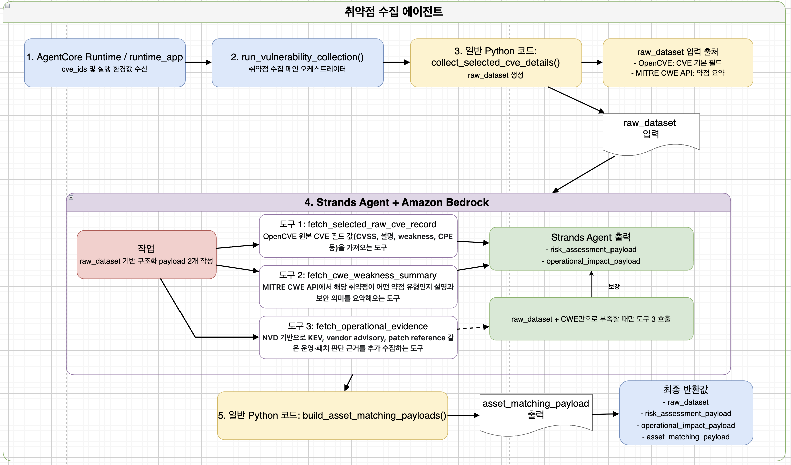

# Vuln Collector Agent

취약점 수집 에이전트는 파이프라인의 첫 단계에서 `CVE ID`를 받아, 이후 에이전트들이 바로 사용할 수 있는 형태로 취약점 정보를 정리하는 역할을 합니다.

## 역할

이 에이전트는 단순히 CVE 원문을 저장하는 단계가 아닙니다. 하나의 취약점 정보를 가져와서, 뒤에 오는 자산 매칭, 위험도 평가, 패치 전략 에이전트가 각각 자기 목적에 맞게 바로 사용할 수 있도록 구조화된 payload로 바꿔주는 역할을 합니다.

즉 이 단계는 전체 파이프라인에서 다음 역할을 맡습니다.

- 취약점 원문 수집
- 약점 유형 보강
- 운영 및 패치 판단에 필요한 참고 정보 정리
- downstream 에이전트용 입력 payload 생성

## 입력

- `cve_ids`
- 선택적 `BEDROCK_MODEL_ID`
- 선택적 `region`

## 사전 준비

- `OPENCVE_API_KEY`
  - 런타임에서 OpenCVE 조회에 사용하는 환경변수입니다.
- Bedrock 모델 접근 권한
  - `BEDROCK_MODEL_ID`에 해당하는 모델을 호출할 수 있어야 합니다.

## 전체 흐름

이미지 기준으로 보면 이 에이전트는 크게 다섯 단계로 동작합니다.

### 1. AgentCore Runtime / `runtime_app`

가장 앞단에서는 AgentCore Runtime이 외부 입력을 받습니다. 여기서 받는 핵심 값은 `cve_ids`이며, 필요하면 OpenCVE API 키나 Bedrock 모델 ID 같은 실행 환경값도 함께 들어올 수 있습니다.

`runtime_app`의 역할은 복잡한 판단을 하는 것이 아니라, 들어온 payload를 정리해서 내부 Python 수집 로직으로 넘기는 것입니다.

### 2. `run_vulnerability_collection()`

그다음 `run_vulnerability_collection()`이 취약점 수집 전체를 조율하는 메인 함수로 동작합니다. 이 함수는 크게 두 가지를 담당합니다.

- 원본 취약점 데이터를 수집해서 `raw_dataset` 생성
- 그 원본 데이터를 downstream 단계용 payload들로 변환

즉, 이 함수가 취약점 수집 단계의 메인 오케스트레이터 역할을 한다고 보면 됩니다.

### 3. 일반 Python 수집 로직

이미지의 3번 단계에서는 일반 Python 코드가 먼저 `raw_dataset`을 만듭니다. 이 단계에서는 외부 취약점 데이터 소스를 조회해서, CVE별 기본 정보를 모읍니다.

주로 수집하는 정보는 다음과 같습니다.

- CVE 기본 설명
- CVSS 점수
- weakness 정보
- 영향받는 제품과 버전 범위
- 필요 시 CWE 세부 정보

이 단계의 결과인 `raw_dataset`은 이후 모든 payload 생성의 출발점이 됩니다.

### 4. Strands Agent + Amazon Bedrock

그다음 단계부터는 Strands Agent가 Amazon Bedrock 모델을 사용해, `raw_dataset`을 목적별 payload로 정리합니다.

여기서 중요한 점은 모든 결과를 하나의 공통 포맷으로만 만드는 것이 아니라, 목적에 따라 서로 다른 두 개의 핵심 payload를 만든다는 점입니다.

#### `risk_assessment_payload`

이 payload는 위험도 평가 에이전트가 사용합니다.  
주요 목적은 “이 취약점을 자산 기준으로 평가하려면 무엇을 확인해야 하는가”를 정리하는 것입니다.

예를 들면 다음과 같은 정보가 포함됩니다.

- 어떤 제품과 버전이 영향 대상인지
- exploit이 성립하려면 어떤 조건이 필요한지
- 자산에서 무엇을 확인해야 하는지

즉, 최종 위험도 결과를 만드는 것이 아니라, 위험도 평가 에이전트가 참고할 기준 데이터를 만드는 단계입니다.

#### `operational_impact_payload`

이 payload는 패치 전략 에이전트가 사용합니다.  
주요 목적은 “이 취약점을 실제 운영 환경에서 어떻게 다룰 것인가”를 정리하는 것입니다.

예를 들면 다음과 같은 정보가 포함됩니다.

- 우선 적용해야 하는 정식 조치
- 패치 시 발생할 수 있는 운영 영향
- 사전에 확인해야 하는 의존성
- 즉시 패치가 어려울 때의 완화 조치
- 적용 후 검증 항목

즉, 이 payload는 보안 심각도 계산용이 아니라 운영적 패치 판단용 데이터입니다.

#### Strands 도구 사용 방식

이미지에 나온 것처럼 Strands Agent는 필요한 경우 도구를 호출해 정보를 보강합니다.

- `fetch_selected_raw_cve_record`
  - OpenCVE 기반 원문 CVE 정보 조회
- `fetch_cwe_weakness_summary`
  - MITRE CWE 기반 약점 유형 요약 조회
- `fetch_operational_evidence`
  - 운영 판단에 필요한 추가 근거 보강

정리하면, Python 코드가 먼저 원본 dataset을 만들고, Strands Agent는 그 원본을 읽어 목적별 payload를 만드는 역할을 합니다.

### 5. `build_asset_matching_payloads()`

마지막 단계에서는 일반 Python 코드가 `asset_matching_payload`를 생성합니다.

이 payload는 자산 매칭 에이전트가 사용할 seed 데이터로, 복잡한 설명보다는 아래 같은 최소 기준을 전달하는 데 집중합니다.

- 어떤 제품을 찾아야 하는지
- 어떤 버전 범위를 확인해야 하는지

즉, 자산 매칭 단계가 실제 AWS 자산에서 무엇을 찾아야 하는지 빠르게 파악할 수 있게 해주는 입력입니다.

## 출력

이 에이전트는 최종적으로 아래 4개 결과를 생성합니다.

- `raw_dataset`
  - 원본 취약점 데이터 모음
- `risk_assessment_payload`
  - 위험도 평가 에이전트용 기준 정보
- `operational_impact_payload`
  - 패치 전략 에이전트용 운영 영향도 및 완화 정보
- `asset_matching_payload`
  - 자산 매칭 에이전트용 seed payload

## downstream 연결 방식

이 에이전트에서 만든 결과는 이후 단계로 이렇게 전달됩니다.

- `asset_matching_payload` -> 자산 매칭 에이전트
- `risk_assessment_payload` -> 위험도 평가 에이전트
- `operational_impact_payload` -> 패치 전략 에이전트
- `raw_dataset` -> 원본 근거 보존 및 참고용

즉 취약점 수집 에이전트는 파이프라인의 맨 앞에서, 하나의 CVE를 여러 후속 단계가 읽기 좋은 여러 형태의 입력으로 번역하는 역할을 합니다.

## 현재 구현 기준

- 모델 경로는 Amazon Bedrock 기준입니다.
- 구조화 payload 생성은 Strands Agent가 담당합니다.
- 실행 결과 저장과 다음 단계 연결은 오케스트레이터가 담당합니다.

## 한 줄 요약

이 에이전트는 `CVE -> downstream 에이전트용 구조화 payload` 변환을 담당하는 시작점입니다.
