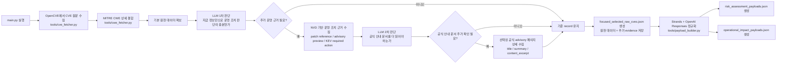

# Vulnerability Collector Agent

이 프로젝트는 소수의 고정된 CVE를 수집한 뒤, LLM 기반으로 `risk_assessment` 와 `operational_impact` JSON을 생성하는 작은 취약점 수집 파이프라인입니다.

현재 범위는 의도적으로 아래 두 취약점에 맞춰져 있습니다.

- `CVE-2021-23017`: nginx resolver off-by-one
- `CVE-2021-44228`: Apache Log4j2 JNDI RCE

즉, 범용 취약점 플랫폼이 아니라 "정해진 CVE를 안정적으로 수집하고 운영/분석용 JSON으로 정규화하는 파이프라인"에 가깝습니다.

## 참고하는 자료 출처

이 프로젝트는 한 군데 정보만 믿지 않고, 역할이 다른 출처들을 나눠서 참고합니다.

- `OpenCVE`
  - 기본 CVE 제목, 설명, CVSS, weakness 같은 원본 취약점 정보를 가져오는 출발점입니다.
  - 가장 먼저 "무슨 취약점인가"를 잡기 위해 씁니다.
- `MITRE CWE`
  - CWE 이름, 설명, 공통 결과, 완화 방향 같은 약점 분류 정보를 보강합니다.
  - CVE 문장만으로는 부족한 "이 취약점이 어떤 유형의 실수인가"를 이해하기 위해 씁니다.
- `NVD`
  - CPE, reference, patch/release-note 링크, KEV required action 같은 운영 판단용 근거를 보강합니다.
  - 특히 영향 버전, 수정 방향, 운영 배포 고려사항을 더 분명히 하기 위해 씁니다.
- `Vendor / Project Advisory`
  - 원래 라이브러리나 프로젝트를 만든 쪽의 공식 보안 공지나 패치 안내를 봅니다.
  - 업스트림 공식 안내를 통해 fixed version, build instruction, 주의사항을 더 정확히 반영하기 위해 씁니다.
- `CISA KEV required action`
  - KEV에 등재된 경우 실제 대응 문구에 가까운 조치 우선순위를 참고합니다.
  - "가능하면 빨리 업데이트해야 하는가", "임시 완화보다 업데이트가 우선인가" 같은 판단을 보강하기 위해 씁니다.

즉, 자료 출처를 나눠서 보는 이유는 간단합니다.

- OpenCVE는 기본 취약점 설명을 위해
- MITRE CWE는 취약점 유형 이해를 위해
- NVD는 제품/버전/패치 근거를 위해
- 공식 advisory는 실제 조치 문맥을 위해
- KEV는 대응 우선순위를 위해

이렇게 역할을 나눠 참고해야 최종 `risk_assessment` 와 `operational_impact` 가 둘 다 너무 추상적이지 않게 나옵니다.

## 현재 흐름

`main.py` 를 실행하면 아래 순서로 동작합니다.

1. OpenCVE에서 대상 CVE raw record를 조회합니다.
   - 담당 파일: `tools/cve_fetcher.py`
   - 역할: OpenCVE API에서 CVE 원문을 가져오고, 프로젝트에서 필요한 필드만 추립니다.
2. MITRE CWE API에서 CWE 상세를 붙입니다.
   - 담당 파일: `tools/cwe_fetcher.py`
   - 역할: CWE 이름, 설명, 공통 결과, 완화 방향 같은 보강 정보를 붙입니다.
3. LLM이 "지금 정보만으로 운영 조치 판단이 충분한가"를 먼저 판단합니다.
   - 담당 파일: `tools/payload_builder.py`
   - 역할: 현재 CVE 설명, CWE, 버전 범위만으로도 충분히 판단 가능한지 먼저 가늠합니다.
4. 부족하다고 판단되면, 패치와 배포 판단에 도움이 되는 추가 근거를 더 수집합니다.
   - 담당 파일: `tools/evidence_fetcher.py`
   - 역할: NVD reference, 패치 링크, 릴리즈 노트 성격의 링크, KEV 대응 문구처럼 운영 조치에 직접 도움이 되는 근거를 더 모읍니다.
5. 그래도 추가 확인이 필요하면, LLM이 공식 벤더/프로젝트 문서를 더 볼지 한 번 더 판단합니다.
   - 담당 파일: `tools/payload_builder.py`
   - 역할: 취약한 라이브러리나 프로젝트를 만든 쪽에서 따로 제공한 보안 공지나 패치 안내를 더 읽어야 하는 상황인지 판단합니다.
6. 필요하면 선택된 공식 안내 페이지를 더 깊게 읽습니다.
   - 담당 파일: `tools/evidence_fetcher.py`
   - 역할: 위 단계에서 고른 공식 advisory URL만 더 읽고, 제목, 요약, 본문 일부를 추출합니다.
7. Strands + OpenAI Responses 모델이 최종 `risk_assessment` 와 `operational_impact` payload를 만듭니다.
   - 담당 파일: `tools/payload_builder.py`
   - 역할: 지금까지 모인 evidence 전체를 읽고, 최종 structured JSON payload 2종을 생성합니다.
8. 결과 JSON을 `data/` 아래에 저장합니다.
   - 담당 파일: `tools/output_writer.py`
   - 역할: raw dataset과 최종 payload 파일들을 JSON으로 저장합니다.

생성되는 파일은 아래 3개입니다.

- `focused_selected_raw_cves.json`
- `risk_assessment_payloads.json`
- `operational_impact_payloads.json`

## 처리 흐름도



## 생성 파일 설명

### `focused_selected_raw_cves.json`

최종 payload의 기준이 되는 원본 데이터셋입니다.

이 파일은 쉽게 말해 **원본 취약점 정보와 추가 근거를 한데 모아둔 기준 파일**입니다.

처음 읽을 때는 아래 순서로 보면 이해가 쉽습니다.

1. `cve_id`, `title`, `description`
   - 어떤 취약점인지 기본 내용을 먼저 봅니다.
2. `cvss`, `weaknesses`, `cwe_details`
   - 위험도와 약점 유형이 어떤지 확인합니다.
3. `nvd_cpe_configurations`
   - 어떤 제품과 버전 범위가 영향받는지 봅니다.
4. `operational_evidence_decision`, `operational_evidence`
   - 운영 조치 판단을 위해 추가 근거를 더 모았는지 확인합니다.
5. `vendor_followup_decision`, `vendor_followup_evidence`
   - 공식 안내 문서를 더 읽었는지, 읽었다면 어떤 내용을 가져왔는지 확인합니다.

즉, 최종 payload를 만들기 전에 필요한 **원천 데이터와 추가 evidence가 모두 모이는 파일**입니다.

### `risk_assessment_payloads.json`

보안 위험도 평가용 결과물입니다.

이 파일은 아래 질문에 답하기 좋습니다.

- 얼마나 위험한가
- 원격 악용이 가능한가
- 권한이나 사용자 상호작용이 필요한가
- 어떤 근거를 참고해서 그렇게 판단했는가

처음 읽을 때는 아래 필드만 먼저 보면 됩니다.

- `severity`
  - 위험도를 한 단계로 요약한 값입니다.
- `security_domain`
  - 이 취약점이 어떤 보안 범주인지 정리한 값입니다.
- `risk_signals`
  - 악용 조건을 빠르게 보여주는 핵심 신호입니다.
- `analyst_summary`
  - 사람이 읽기 쉬운 한두 문장 요약입니다.
- `sources_used`, `evidence_summary`
  - 이 판단이 어떤 근거를 바탕으로 나왔는지 보여줍니다.

그다음 필요하면 `common_consequences`, `weaknesses`, `cwe_names` 까지 내려가서 자세히 보면 됩니다.

### `operational_impact_payloads.json`

운영 조치와 배포 영향 분석용 결과물입니다.

이 파일은 **실제로 패치하거나 배포할 때 무엇을 조심해야 하는지** 를 보기 위한 결과물입니다.

처음 읽을 때는 아래 순서가 가장 이해하기 쉽습니다.

1. `product_name`, `affected_components`, `affected_version_range`
   - 무엇이, 어느 범위까지 영향받는지 먼저 확인합니다.
2. `fixed_version`, `patch_type`
   - 어떤 식의 조치가 필요한지 봅니다.
3. `rollout_considerations`, `validation_focus`
   - 배포할 때 무엇을 조심하고 무엇을 검증해야 하는지 봅니다.
4. `mitigation_summaries`
   - 운영팀이 바로 참고할 수 있는 짧은 조치 요약을 봅니다.
5. `vendor_specific_guidance`
   - 공식 안내 문서를 더 본 경우에만, vendor-specific 차이를 따로 확인합니다.
6. `sources_used`, `evidence_summary`
   - 위 판단이 어떤 추가 근거를 바탕으로 나왔는지 확인합니다.

자주 보는 필드 의미:

- `fixed_version`
  - 현재 근거 기준으로 가장 신뢰할 수 있는 수정 버전입니다.
- `patch_type`
  - 서비스 업그레이드인지, 라이브러리 교체인지, 설정 변경인지 같은 조치 유형입니다.
- `rollout_considerations`
  - 배포 순서, 우선순위, staged rollout 같은 운영 배포 고려사항입니다.
- `validation_focus`
  - 배포 전후로 우선 확인해야 할 검증 포인트입니다.
- `vendor_specific_guidance`
  - 공식 벤더/프로젝트 안내를 바탕으로 추가로 알아둘 조치 포인트입니다.

즉 이 파일은 "얼마나 위험한가"보다는 **어떻게 안전하게 조치할 것인가** 에 더 가깝습니다.

## 추가 수집이 의미하는 것

이 프로젝트에서 "추가 수집"은 단순히 링크를 더 붙이는 과정이 아니라,
**운영 조치에 필요한 근거를 단계적으로 보강하는 과정**입니다.

기본 CVE/CWE 정보만으로도 위험도 평가는 꽤 잘 나오는 경우가 많지만,
운영 배포 관점에서는 아래 같은 정보가 부족할 수 있습니다.

- 정확한 수정 방향이 원래 라이브러리 기준인지, 그 라이브러리를 포함한 벤더 제품 기준인지
- branch별 고정 버전이 다른지
- patch, release note, advisory 중 무엇을 우선 봐야 하는지
- 라이브러리를 포함한 다른 벤더 제품이 원래 라이브러리와 다른 일정으로 패치되는지
- 임시 완화책이 가능한지, 아니면 업데이트가 사실상 유일한 대응인지

그래서 추가 수집은 **risk를 더 자극적으로 만들기 위한 단계가 아니라,
operational_impact를 더 실무적으로 만들기 위한 단계**에 가깝습니다.

### 1. `operational_evidence`

첫 번째 추가 수집 단계입니다.

LLM이 "현재 CVE 설명, CWE, 제품/버전 정보만으로는 실제 운영 조치 판단이 부족하다"고 보면
여기서 **패치와 배포 결정에 직접 도움이 되는 근거**를 더 붙입니다.

쉽게 말하면, 이 단계는 아래 질문에 답하기 위해 존재합니다.

- 수정 버전을 어디까지 믿을 수 있나
- 패치 링크나 릴리즈 노트가 따로 있나
- 운영팀이 참고할 공식 대응 문구가 있나
- 임시 완화보다 업데이트를 우선해야 하는 상황인가

이때 더 모으는 대표 근거는 이런 것들입니다.

- NVD가 제공하는 추가 맥락 (`nvd_context`)
  - reference 링크, 상태, 수정 이력, KEV required action 같은 정보입니다.
- 벤더나 프로젝트 공식 안내 미리보기 (`vendor_advisories`)
  - NVD reference 안에 잡힌 공식 advisory 후보를 짧게 미리 봅니다.
- 패치나 릴리즈 노트 성격의 링크 (`patch_references`)
  - 실제 수정 방향을 짐작할 수 있는 patch / release note 류 링크입니다.
- KEV 대응 문구 (`kev.required_action`)
  - CISA KEV에 등재된 경우, 실제 대응 문구에 가까운 guidance입니다.

이 단계의 목적은 한마디로:
**운영자가 "무엇을 기준으로 조치 결정을 내려야 하는지"를 더 분명하게 만드는 것**입니다.

그래서 여기서 수집한 값들은 최종 `operational_impact_payloads.json` 에 raw evidence 덩어리로 복사되기보다,
아래 같은 운영 판단 필드로 해석되어 반영됩니다.

- `fixed_version`
  - 현재 기준으로 가장 신뢰할 수 있는 수정 버전
- `rollout_considerations`
  - 배포 순서, 우선순위, staged rollout 같은 운영 고려사항
- `validation_focus`
  - 배포 전후 우선 검증 포인트
- `mitigation_summaries`
  - 운영팀이 바로 참고할 수 있는 짧은 대응 요약
- `notes`
  - 운영상 참고해야 할 짧은 메모
- `sources_used`, `evidence_summary`
  - 어떤 근거를 참고했고 왜 추가 조사를 했는지 보여주는 필드

### 2. `vendor_followup`

두 번째 추가 수집 단계입니다.

`operational_evidence`까지 붙였는데도 LLM이
"원래 라이브러리나 프로젝트를 만든 쪽의 공식 안내를 조금 더 깊게 봐야 운영 가이드가 제대로 나온다"
고 판단하면 vendor follow-up이 실행됩니다.

이 단계에서는 아무 웹페이지나 막 찾는 게 아니라,
**이미 수집된 vendor advisory 후보 중에서 LLM이 골라준 URL만 더 깊게 읽습니다.**

현재 단계에서는 그 라이브러리를 원래 만든 쪽의 공식 안내를 우선 봅니다.
즉, **원 제작자/프로젝트 공식 문서를 먼저 보고**, 그 라이브러리를 가져다 제품에 포함한 다른 벤더 제품 조사는 나중에 별도 운영 조치 요청이 들어올 때 분기하는 쪽으로 두고 있습니다.

추가로 수집하는 값:

- 선택된 vendor advisory URL
- 해당 페이지의 `title`
- `summary`
- `content_excerpt`
- `domain`

왜 이런 값을 더 읽느냐면, preview 수준 정보만으로는 아래 같은 판단이 여전히 애매할 수 있기 때문입니다.

- 공식 문서가 실제로 어떤 수정 버전이나 브랜치를 기준으로 설명하는지
- 소스 패치를 직접 적용해야 하는 상황인지
- build instruction이나 버전별 주의사항이 있는지
- "업데이트가 유일한 대응인지", "임시 완화가 잠시 허용되는지" 같은 운영 문맥이 있는지

즉 이 단계는 단순히 링크를 더 붙이는 게 아니라,
**공식 문서의 실제 문맥을 조금 더 읽어서 운영팀이 오해하지 않게 만드는 단계**라고 보면 됩니다.

이 단계의 목적은:

- 원래 라이브러리나 프로젝트를 만든 쪽이 제공한 공식 보안/패치 가이드 보강
- 사용 중인 버전 라인에 따라 업그레이드 대상이나 패치 방식이 달라질 수 있는 점 반영
- 최종 `vendor_specific_guidance` 생성 근거 확보
- preview만 봐서는 애매했던 문장을 실제 운영 지침 수준으로 구체화

### 3. 결과물에 어떻게 반영되는가

추가 수집된 근거는 최종적으로 두 가지 방식으로 보입니다.

- `focused_selected_raw_cves.json`
  - 원천 evidence가 그대로 남습니다.
  - `operational_evidence`, `vendor_followup_evidence` 에 실제 수집 결과가 들어갑니다.
- 최종 payload
  - `sources_used`
  - `evidence_summary`
  - `vendor_specific_guidance`
  같은 필드로 요약 반영됩니다.

즉,

1. 원천 evidence는 raw dataset에 남고
2. 최종 payload는 사람이 바로 읽기 좋은 operational guidance로 압축됩니다.

조금 더 현실적으로 말하면:

- raw dataset은 "왜 이런 판단을 했는지 추적할 수 있는 근거 저장소" 역할을 합니다.
- 최종 payload는 "그래서 운영팀이 무엇을 해야 하는가"만 빠르게 읽을 수 있게 압축된 결과물입니다.

예를 들어 vendor follow-up에서 공식 문서에
"특정 브랜치에서는 별도 build instruction을 따르라"는 문장이 있었다면,
그 문장 자체는 raw dataset 쪽 `content_excerpt` 에 남고,
최종 payload에서는 `vendor_specific_guidance` 나 `mitigation_summaries` 안에
"해당 버전 라인의 공식 build instruction을 따르라"처럼 더 짧고 실행 가능한 문장으로 반영됩니다.

즉 raw 쪽은 **근거 보관용**, payload 쪽은 **실행 판단용**으로 역할이 다릅니다.

### 4. 언제 추가 수집을 안 하는가

항상 추가 수집을 하는 건 아닙니다.

예를 들어:

- 제품과 버전 범위가 이미 명확하고
- fixed version도 비교적 분명하고
- 운영 영향이 CVE/CPE만으로 충분히 설명되면

LLM은 `operational_evidence` 자체를 `false`로 둘 수 있습니다.

예를 들면 nginx처럼:

- 영향 제품이 분명하고
- 수정 버전 경계가 명확하고
- 운영 조치가 사실상 "서비스 업그레이드 + 재시작/검증" 수준으로 정리되면

추가 수집을 안 해도 충분할 수 있습니다.

반대로 Log4j처럼:

- 라이브러리 취약점이고
- branch별 fix line이 다르고
- 번들, transitive dependency, vendor packaging 차이가 중요하면

추가 수집을 타는 편이 더 자연스럽습니다.

즉 추가 수집은 "항상 더 많이 모은다"가 아니라,
**필요할 때만 evidence를 넓혀서 과도한 노이즈를 줄이고, 정말 애매한 부분만 더 분명하게 만드는 방식**입니다.

## 주요 파일

- `main.py`
  실행 진입점입니다. CVE 수집, CWE 결합, evidence gate, vendor follow-up, payload 저장까지 전체 오케스트레이션을 담당합니다.

- `tools/cve_fetcher.py`
  OpenCVE에서 CVE raw record를 조회하고 프로젝트에 필요한 형태로 추립니다.

- `tools/cwe_fetcher.py`
  MITRE CWE API에서 CWE 상세를 가져옵니다.

- `tools/evidence_fetcher.py`
  운영 조치용 evidence와 vendor follow-up evidence를 수집합니다. NVD context, vendor advisory preview, patch reference, advisory page excerpt 수집 로직이 들어 있습니다.

- `tools/payload_builder.py`
  Strands Agent와 OpenAI Responses 모델을 사용해 evidence gate 판단과 최종 structured payload 생성을 담당합니다.

- `tools/output_writer.py`
  JSON 파일 저장 담당입니다.

- `tools/tooling.py`
  `strands.tool` import를 감싸는 얇은 호환성 shim입니다. Strands가 없는 인터프리터에서도 import 자체가 덜 깨지게 해줍니다.

## 디렉터리 구조

```text
vuln_collector_agent/
  main.py
  README.md
  __init__.py
  data/
  prompts/
    evidence_gate_system_prompt.txt
    normalizer_system_prompt.txt
    vendor_followup_system_prompt.txt
  tools/
    __init__.py
    cve_fetcher.py
    cwe_fetcher.py
    evidence_fetcher.py
    output_writer.py
    payload_builder.py
    tooling.py
```

## 환경 설정

프로젝트 루트의 `.env` 에 아래 값이 필요합니다.

```env
OPENCVE_API_KEY=your_key_here
OPENAI_API_KEY=your_openai_key_here
```

또는:

```env
OPENCVE_API_TOKEN=your_token_here
OPENAI_API_KEY=your_openai_key_here
```

선택 설정:

```env
OPENAI_MODEL=gpt-5.4
OPENAI_REASONING_EFFORT=low
OPENAI_TIMEOUT_SECONDS=60
```

## 실행 방법

Strands가 설치된 Python 3.13 가상환경 기준 예시는 아래와 같습니다.

```bash
../.venv/bin/python vuln_collector_agent/main.py
```

옵션:

- `--evidence-mode auto`
  기본값입니다. LLM이 운영 evidence와 vendor follow-up 필요 여부를 판단합니다.
- `--evidence-mode on`
  operational evidence는 항상 수집합니다. vendor follow-up은 그 뒤 gate가 별도로 판단합니다.
- `--evidence-mode off`
  추가 evidence 수집 없이 기본 CVE/CWE 정보만으로 payload를 만듭니다.
- `--with-evidence`
  `--evidence-mode on` 의 alias 입니다.

예시:

```bash
../.venv/bin/python vuln_collector_agent/main.py --evidence-mode auto
```

```bash
../.venv/bin/python vuln_collector_agent/main.py --evidence-mode off
```

```bash
../.venv/bin/python vuln_collector_agent/main.py --cve-id CVE-2021-23017 --cve-id CVE-2021-44228
```

## 현재 전제

- 현재 프로젝트는 위 두 CVE를 중심으로 설명되어 있습니다.
- 목적은 범용 취약점 DB가 아니라 분석용 JSON 산출 파이프라인입니다.
- `asset_matching_payloads.json` 경로는 제거되었고, 현재 최종 payload는 2종입니다.
- 최종 결과에서 근거 추적성을 위해 `sources_used` 와 `evidence_summary` 를 같이 남깁니다.

## 추천 읽기 순서

처음 볼 때는 아래 순서가 가장 이해하기 쉽습니다.

1. `data/focused_selected_raw_cves.json`
2. `data/risk_assessment_payloads.json`
3. `data/operational_impact_payloads.json`

이 순서가 실제 파이프라인의 처리 순서와 거의 같습니다.
