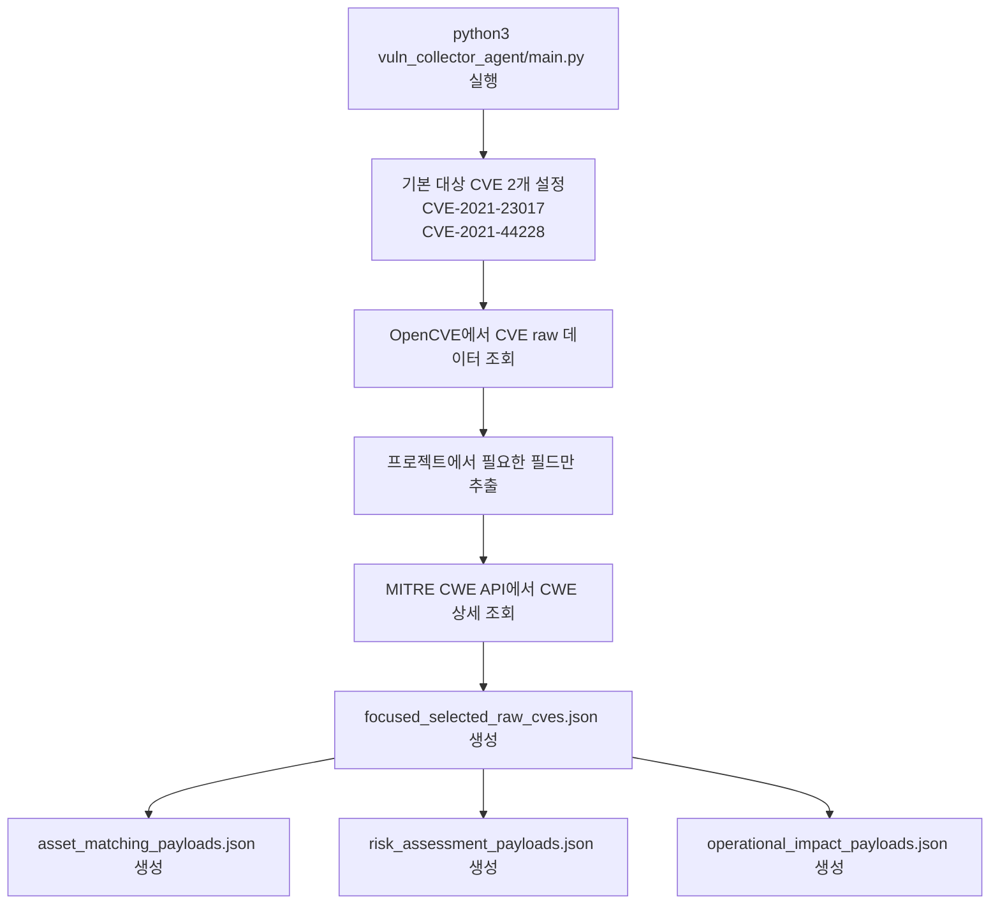

# Vulnerability Collector Agent

이 프로젝트는 소수의 고정된 CVE를 수집하고, 이를 에이전트별 JSON payload 형태로 가공하는 작은 취약점 수집 파이프라인입니다.

현재 범위는 의도적으로 아래 두 취약점에만 맞춰져 있습니다.

- `CVE-2021-23017`: NGINX resolver off-by-one 취약점
- `CVE-2021-44228`: Apache Log4j2 JNDI 원격 코드 실행 취약점(Log4Shell)

즉, 전체 취약점 카탈로그를 수집하는 프로젝트가 아니라, 이 두 CVE를 안정적으로 수집하고 후속 분석용 JSON을 만드는 데 초점을 둔 구조입니다.

## 핵심 동작

`vuln_collector_agent/main.py`를 한 번 실행하면 아래 작업이 순서대로 수행됩니다.

1. OpenCVE에서 대상 CVE 2건을 조회합니다.
2. 프로젝트에서 필요한 raw 필드만 추립니다.
3. MITRE CWE API에서 관련 CWE 상세를 가져옵니다.
4. 운영 목적에 맞는 3개의 payload를 생성합니다.
5. 결과 JSON들을 `vuln_collector_agent/data/` 아래에 저장합니다.

기본 실행 시 생성되는 파일은 아래 4개입니다.

- `focused_selected_raw_cves.json`
- `asset_matching_payloads.json`
- `risk_assessment_payloads.json`
- `operational_impact_payloads.json`

## 처리 흐름도



위 흐름에서 핵심은 `focused_selected_raw_cves.json`이 기준 데이터셋 역할을 하고, 나머지 3개 payload가 이 파일을 바탕으로 만들어진다는 점입니다.

## 생성 파일 설명

### `focused_selected_raw_cves.json`

이 파일은 나머지 모든 payload의 기반이 되는 원본 데이터셋입니다.

포함 내용:

- 선택된 CVE ID 목록
- 취약점 제목과 설명
- CVSS 요약
- 추출된 CWE/weakness 정보
- 관련 NVD CPE configuration
- `cwe_details`

쉽게 말하면 "가공 전 원천 데이터 + CWE 상세가 붙은 기준 데이터셋"입니다.

### `asset_matching_payloads.json`

이 파일은 자산/제품 매칭 관점의 payload입니다.

주요 내용:

- 제품명
- 영향받는 버전 범위
- 수정 버전
- CPE criteria

이 파일은 아래 질문에 답하기 좋습니다.

- 어떤 제품이 영향받는가?
- 어떤 버전이 취약한가?
- 어디까지 올려야 안전한가?

### `risk_assessment_payloads.json`

이 파일은 위험도 평가 관점의 payload입니다.

주요 내용:

- CVSS 정보
- severity bucket
- security domain
- weaknesses 및 CWE 이름
- 네트워크 노출, 권한 필요 여부, 사용자 상호작용 같은 risk signal
- common consequences

이 파일은 아래 질문에 적합합니다.

- 이 취약점은 얼마나 위험한가?
- 원격 악용이 가능한가?
- 권한이나 사용자 상호작용이 필요한가?

### `operational_impact_payloads.json`

이 파일은 운영 대응 관점의 payload입니다.

주요 내용:

- 영향받는 컴포넌트
- 영향 버전 범위
- 수정 버전
- patch type
- security domain
- operational impacts
- mitigation summaries
- notes

이 파일은 "운영팀이 실제로 뭘 해야 하는가?"를 보기 위한 결과물에 가장 가깝습니다.

중요 필드:

- `patch_type`
  - `service_upgrade`: 서비스/서버 자체 업그레이드
  - `library_upgrade`: 애플리케이션 내부 라이브러리 업그레이드
- `operational_impacts`
  - 크래시, 메모리 손상, 코드 실행, 데이터 노출, 자원 고갈 같은 운영상 영향
- `mitigation_summaries`
  - 첫 번째 항목은 보통 가장 직접적인 대응책입니다. 예: 안전 버전으로 업그레이드
  - 그 뒤 항목들은 주로 CWE 기반의 일반 완화 가이드이므로, 제품 특화 대응보다 더 넓은 보안 원칙이 섞일 수 있습니다

## 디렉터리 구조

```text
vuln_collector_agent/
  main.py
  data/
  prompts/
  tools/
    cve_fetcher.py
    cwe_fetcher.py
    output_writer.py
    payload_builder.py
    tooling.py
```

## 주요 파일 설명

- `vuln_collector_agent/main.py`
  - 실행 진입점
  - 기본 대상 CVE 2건 수집
  - CWE 상세 결합
  - 4개 JSON 파일 생성 및 저장

- `vuln_collector_agent/tools/cve_fetcher.py`
  - OpenCVE에서 CVE 데이터 조회
  - 프로젝트에서 필요한 raw 필드만 추출

- `vuln_collector_agent/tools/cwe_fetcher.py`
  - MITRE CWE API에서 CWE 상세 조회
  - 필요한 필드만 요약

- `vuln_collector_agent/tools/payload_builder.py`
  - 기준 데이터셋을 아래 3개 payload로 변환
  - asset matching
  - risk assessment
  - operational impact

- `vuln_collector_agent/tools/output_writer.py`
  - JSON 파일 저장 담당

- `vuln_collector_agent/tools/tooling.py`
  - `strands`가 로컬에 없더라도 `tool` 데코레이터 형태를 유지할 수 있게 해주는 fallback

## 환경 설정

프로젝트 루트 `.env` 파일에 아래 둘 중 하나를 넣어야 합니다.

```env
OPENCVE_API_KEY=your_key_here
```

또는

```env
OPENCVE_API_TOKEN=your_token_here
```

참고:

- OpenCVE 조회에는 네트워크 연결과 유효한 API credential이 필요합니다.
- CWE 상세 조회도 MITRE CWE API 네트워크 접근이 필요합니다.

## 실행 방법

프로젝트 루트에서 아래 명령을 실행하면 됩니다.

```bash
python3 vuln_collector_agent/main.py
```

실행 후 `vuln_collector_agent/data/` 아래에 4개 JSON이 생성됩니다.

필요하면 `--cve-id`를 반복해서 다른 CVE를 넣을 수도 있지만, 현재 프로젝트의 기본 의도와 설명은 위 두 CVE 기준입니다.

```bash
python3 vuln_collector_agent/main.py --cve-id CVE-2021-23017 --cve-id CVE-2021-44228
```

## 현재 범위와 전제

- 현재 프로젝트는 두 취약점만을 대상으로 합니다.
- 목적은 범용 취약점 플랫폼이 아니라, 분석용 JSON 산출 파이프라인을 만드는 것입니다.
- 예전에 있던 NGINX 전체 취약점 수집 경로는 제거해서 흐름을 좁고 예측 가능하게 유지했습니다.

## 추천 읽기 순서

처음 프로젝트를 볼 때는 아래 순서로 읽으면 이해가 가장 쉽습니다.

1. `focused_selected_raw_cves.json`
2. `asset_matching_payloads.json`
3. `risk_assessment_payloads.json`
4. `operational_impact_payloads.json`

이 순서는 데이터가 raw 형태에서 점점 목적별 payload로 가공되는 흐름과 동일합니다.
