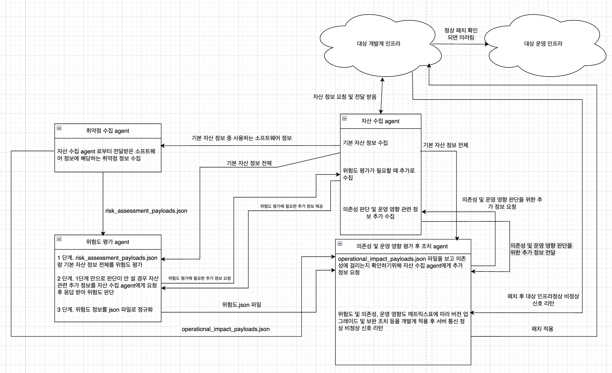

# PacherAgents

PacherAgents는 여러 AI 에이전트가 협업해 실시간으로 취약점 데이터를 수집하고, 위험도를 평가하며, 패치시 대상 인프라의 운영 및 영향도까지 확인하여 안전하게 취약점을 보완해주는 ai 기반 보안 솔루션 시스템입니다.

현재는 취약점 수집용 에이전트 하나가 먼저 들어와 있고, 저장소 구조는 이후 에이전트 추가와 점검 대상 인프라 코드 적재를 염두에 두고 정리되어 있습니다.

## 전체 구조도




## 저장소 구조

```text
PacherAgents/
  MultiAIagent/
    vuln_collector_agent/
  InfraSubjectTo Vulnerability Inspection/
  image/
    MultiAiagentStructure.png
  README.md
```

### `MultiAIagent/`

여기는 여러 역할을 가진 AI 에이전트들을 모아두는 상위 폴더입니다.

- 현재 포함된 에이전트:
  - 취약점 수집 에이전트(vuln_collector_agent)
- 앞으로 추가될 수 있는 예시:
  - 자산 수집 에이전트
  - 위험도 평가 에이전트
  - 운영 및 영향도 점검 후 조치 에이전트

즉, `MultiAIagent/`는 "에이전트 구현체들이 들어가는 영역"이라고 보면 됩니다.

### `InfraSubjectTo Vulnerability Inspection/`

여기는 취약점 점검 대상이 되는 인프라 코드들을 올려두는 폴더입니다.
즉, 이 폴더는 "분석 대상 인프라 자산이 들어가는 영역"입니다.

## 현재 구현된 에이전트

현재는 `MultiAIagent/vuln_collector_agent/`가 먼저 구현되어 있습니다.

이 에이전트는 소수의 고정된 CVE를 수집하고, 후속 분석에 바로 사용할 수 있는 JSON payload를 생성합니다.

상세 설명은 [`MultiAIagent/vuln_collector_agent/README.md`](MultiAIagent/vuln_collector_agent/README.md)에서 볼 수 있습니다.


## 협업 기준

저장소를 확장할 때는 아래 기준을 유지하면 구조가 덜 흔들립니다.

- 새 에이전트는 `MultiAIagent/` 아래에 독립 폴더로 추가
- 점검 대상 코드와 에이전트 코드는 분리 유지
- 에이전트별 입구 문서는 각 폴더 내부 `README.md`에 작성
- 루트 `README.md`는 저장소 전체 구조와 역할 설명 중심으로 유지

## 현재 상태 메모

- 루트는 멀티 에이전트 저장소의 입구 역할을 합니다.
- 실제 구현은 현재 `vuln_collector_agent`부터 시작되어 있습니다.
- 인프라 점검 대상 폴더는 앞으로 실제 IaC 및 운영 코드가 채워질 예정입니다.
