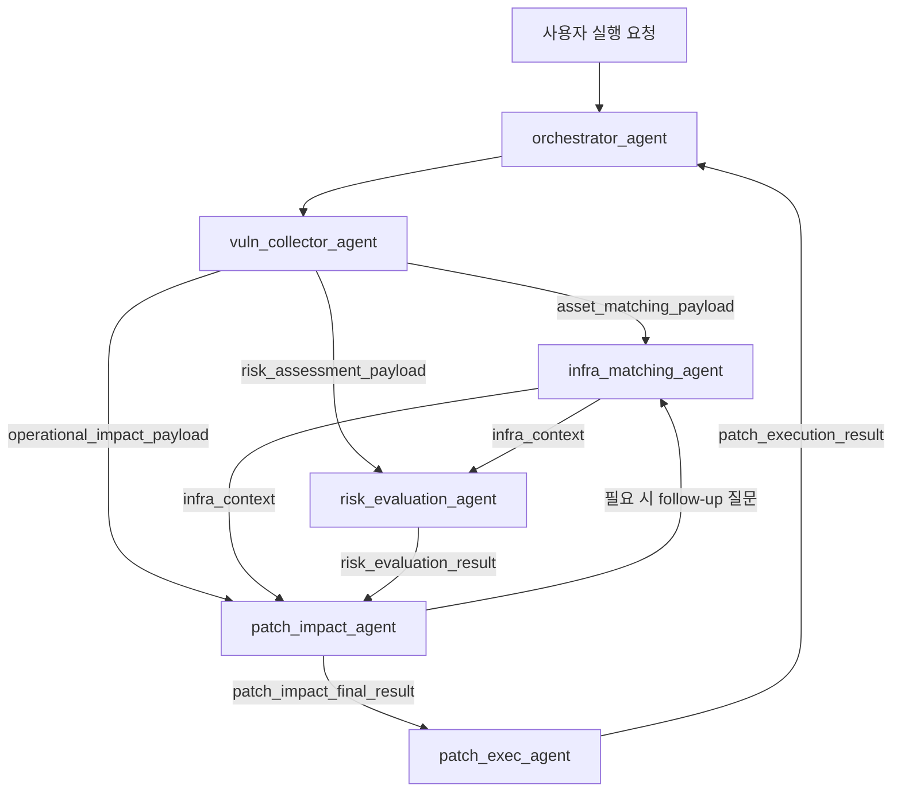

# PacherAgents

AWS Bedrock AgentCore 위에서 여러 보안 에이전트를 연결해, 취약점 수집부터 자산 조사, 위험도 평가, 패치 영향도 판단, 최종 패치 실행까지 이어지는 멀티 에이전트 파이프라인입니다.

현재 저장소의 중심은 [`/Users/jms/Desktop/project/PacherAgents/MultiAIagent`](/Users/jms/Desktop/project/PacherAgents/MultiAIagent) 이고, 실제 실행은 보통 [`/Users/jms/Desktop/project/PacherAgents/MultiAIagent/run_orchestrator_runtime.py`](/Users/jms/Desktop/project/PacherAgents/MultiAIagent/run_orchestrator_runtime.py) 로 시작합니다.

## 전체 흐름


```mermaid
flowchart TD
    U["사용자 실행 요청"] --> O["orchestrator_agent"]
    O --> V["vuln_collector_agent"]
    V -->|asset_matching_payload| A["infra_matching_agent"]
    V -->|risk_assessment_payload| R["risk_evaluation_agent"]
    V -->|operational_impact_payload| P["patch_impact_agent"]
    A -->|infra_context| R
    A -->|infra_context| P
    R -->|risk_evaluation_result| P
    P -->|필요 시 follow-up 질문| A
    P -->|patch_impact_final_result| X["patch_exec_agent"]
    X -->|patch_execution_result| O
```

### 한 줄 요약

- `vuln_collector_agent`: 어떤 CVE를 볼지 정리하고 후속 단계용 payload 생성
- `infra_matching_agent`: 실제 스택/인스턴스를 찾아 운영 정보와 설치 상태 조사
- `risk_evaluation_agent`: 취약점 + 자산 컨텍스트를 합쳐 위험도 평가
- `patch_impact_agent`: 패치 영향도와 임시 완화 가능성 판단, 필요 시 자산 재질문
- `patch_exec_agent`: 최종 패치 결론을 받아 실행 계획 또는 실제 실행 결과 생성
- `orchestrator_agent`: 위 단계를 순차 호출하고 결과를 저장

## 저장소 구조

```text
PacherAgents/
├── MultiAIagent/
│   ├── OchestratorAgent(AWS)/
│   ├── VulnCollectorAgent(AWS)/
│   ├── Infra_matchingAgent/
│   ├── risk_evaluation_agent/
│   ├── PatchImpactAgent(AWS)/
│   ├── PatchExecAgent(AWS)/
│   ├── OchestraResult/
│   ├── Conversationlog/
│   ├── scripts/
│   └── run_orchestrator_runtime.py
├── InfraSubjectTo Vulnerability Inspection/
├── image/
└── README.md
```

### 주요 폴더

- [`/Users/jms/Desktop/project/PacherAgents/MultiAIagent`](/Users/jms/Desktop/project/PacherAgents/MultiAIagent)
  실제 멀티 에이전트 구현과 실행기, 결과 저장 폴더가 들어 있습니다.
- [`/Users/jms/Desktop/project/PacherAgents/InfraSubjectTo Vulnerability Inspection`](/Users/jms/Desktop/project/PacherAgents/InfraSubjectTo%20Vulnerability%20Inspection)
  실습용 인프라 템플릿과 점검 대상 코드/리소스를 두는 영역입니다.
- [`/Users/jms/Desktop/project/PacherAgents/image`](/Users/jms/Desktop/project/PacherAgents/image)
  구조도 등 문서용 이미지 리소스입니다.

## 에이전트별 역할과 전달 데이터

| 에이전트 | 주 역할 | 주 입력 | 주 출력 |
| --- | --- | --- | --- |
| `vuln_collector_agent` | CVE 수집, 후속 단계용 payload 생성 | `cve_ids` 또는 기본 CVE 세트 | `focused_selected_raw_cves.json`, `risk_assessment_payloads.json`, `operational_impact_payloads.json`, `asset_matching_payload.json` |
| `infra_matching_agent` | 스택 자산 식별, EC2/네트워크/소프트웨어 조사 | `stack_name`, `region`, `asset_matching_payload` | `infra_context.json` |
| `risk_evaluation_agent` | 취약점과 자산 컨텍스트를 합쳐 위험도 계산 | `risk_assessment_payload`, `infra_context` | `risk_evaluation_result.json`, 필요 시 `swarm_queries` |
| `patch_impact_agent` | 운영 영향도, 완화 전략, 패치 우선순위 판단 | `operational_payload`, `risk_result`, `infra_context` | `patch_impact_prejudge_result.json`, `additional_asset_response.json`, `patch_impact_final_result.json` |
| `patch_exec_agent` | 최종 패치 실행 로직 수행 | `patch_final_result` | `patch_execution_result.json` |
| `orchestrator_agent` | 각 AgentCore runtime 호출, 단계 연결, 결과 저장 | `mode`, `region`, 각 단계 입력 payload | `pipeline_result`, 단계별 wrapper 결과 |

## 단계별 파일 handoff

실제 파이프라인은 파일로도 쉽게 따라갈 수 있습니다.

1. `vuln_collector_agent`
   - 생성:
     - [`risk_assessment_payloads.json`](/Users/jms/Desktop/project/PacherAgents/MultiAIagent/OchestraResult/vuln_collector_agent/latest/risk_assessment_payloads.json)
     - [`operational_impact_payloads.json`](/Users/jms/Desktop/project/PacherAgents/MultiAIagent/OchestraResult/vuln_collector_agent/latest/operational_impact_payloads.json)
     - [`asset_matching_payload.json`](/Users/jms/Desktop/project/PacherAgents/MultiAIagent/OchestraResult/vuln_collector_agent/latest/asset_matching_payload.json)
2. `infra_matching_agent`
   - 입력: `asset_matching_payload.json`
   - 생성:
     - [`infra_context.json`](/Users/jms/Desktop/project/PacherAgents/MultiAIagent/OchestraResult/asset_matching_agent/latest/infra_context.json)
3. `risk_evaluation_agent`
   - 입력:
     - `risk_assessment_payloads.json`
     - `infra_context.json`
   - 생성:
     - [`risk_evaluation_result.json`](/Users/jms/Desktop/project/PacherAgents/MultiAIagent/OchestraResult/risk_evaluation_agent/latest/risk_evaluation_result.json)
4. `patch_impact_agent`
   - 입력:
     - `operational_impact_payloads.json`
     - `infra_context.json`
     - `risk_evaluation_result.json`
   - 생성:
     - [`patch_impact_prejudge_result.json`](/Users/jms/Desktop/project/PacherAgents/MultiAIagent/OchestraResult/patch_impact_agent/latest/patch_impact_prejudge_result.json)
     - [`additional_asset_response.json`](/Users/jms/Desktop/project/PacherAgents/MultiAIagent/OchestraResult/patch_impact_agent/latest/additional_asset_response.json)
     - [`patch_impact_final_result.json`](/Users/jms/Desktop/project/PacherAgents/MultiAIagent/OchestraResult/patch_impact_agent/latest/patch_impact_final_result.json)
5. `patch_exec_agent`
   - 입력: `patch_impact_final_result.json`
   - 생성:
     - [`patch_execution_result.json`](/Users/jms/Desktop/project/PacherAgents/MultiAIagent/OchestraResult/patch_execution_agent/latest/patch_execution_result.json)

## 각 파일이 담는 내용

### `risk_assessment_payloads.json`

위험도 평가용 취약점 구조화 데이터입니다.

예시 의미:
- `cve_id`: 어떤 취약점인지
- `severity`, `cvss`: 기술적 심각도
- `attack_vector`, `privileges_required`: 악용 조건
- `risk_signals`, `common_consequences`: 운영 위험 힌트

### `operational_impact_payloads.json`

패치 영향도 판단용 취약점 데이터입니다.

예시 의미:
- 재시작 필요 가능성
- 운영 중단 리스크
- 임시 완화 가능성 판단에 필요한 요약

### `asset_matching_payload.json`

어떤 자산을 먼저 조사해야 하는지 알려주는 힌트입니다.

예시 의미:
- `nginx`, `log4j` 같은 조사 대상 소프트웨어 키워드
- 어떤 계층의 자산을 우선 볼지에 대한 단서

### `infra_context.json`

실제 인프라 상태를 모은 자산 컨텍스트입니다.

예시 의미:
- `asset_id`, `instance_id`
- `tier` (`web`, `app`, `db`)
- `private_ip`, `public_ip`
- 설치 소프트웨어와 버전
- 네트워크 노출, 중요도, 운영 메타데이터

### `risk_evaluation_result.json`

각 자산 또는 자산군에 대해 위험도를 정리한 결과입니다.

예시 의미:
- 어떤 CVE가 어떤 자산에 얼마나 위험한지
- 노출 여부와 운영 맥락을 반영한 최종 risk level

### `patch_impact_final_result.json`

패치를 지금 해야 하는지, 완화를 먼저 해야 하는지, 수동 검토가 필요한지 정리한 최종 판단입니다.

예시 의미:
- `decision`: `patch_now`, `mitigate_then_patch`, `manual_review`
- `reason`: 왜 그런 결론이 나왔는지
- `action`: 실제 운영자가 해야 할 다음 행동
- `remaining_unknowns`: 아직 확인 못 한 항목

### `patch_execution_result.json`

패치 실행 단계의 결과입니다.

예시 의미:
- 실행 계획
- 실제 명령 또는 자동화 단계
- 성공/실패 상태와 후속 조치

## 대화 로그

현재 대화형 질의 흔적은 아래 폴더에 남깁니다.

- [`/Users/jms/Desktop/project/PacherAgents/MultiAIagent/Conversationlog/PatchToAsset`](/Users/jms/Desktop/project/PacherAgents/MultiAIagent/Conversationlog/PatchToAsset)
  - `patch_impact_agent -> infra_matching_agent` follow-up 질의
- [`/Users/jms/Desktop/project/PacherAgents/MultiAIagent/Conversationlog/RiskToAsset`](/Users/jms/Desktop/project/PacherAgents/MultiAIagent/Conversationlog/RiskToAsset)
  - `risk_evaluation_agent -> infra_matching_agent` 추가 질의

`latest.json`은 최근 실행 기준 요약이고, run tag 폴더 안 `conversation_log.json`은 개별 실행 기록입니다.

## 실행 전 준비

### 1. AWS 자격 증명

로컬에서 `aws sts get-caller-identity` 가 성공해야 합니다.

### 2. `.env`

루트의 [`/Users/jms/Desktop/project/PacherAgents/.env`](/Users/jms/Desktop/project/PacherAgents/.env) 에 최소 아래 값들을 맞춰두는 것을 권장합니다.

```env
AWS_DEFAULT_REGION=ap-northeast-2
AWS_ACCOUNT_ID=123456789012

ORCHESTRATOR_AGENTCORE_ARN=arn:aws:bedrock-agentcore:...
VULN_COLLECTOR_AGENTCORE_ARN=arn:aws:bedrock-agentcore:...
INFRA_MATCHING_AGENTCORE_ARN=arn:aws:bedrock-agentcore:...
RISK_EVAL_AGENTCORE_ARN=arn:aws:bedrock-agentcore:...
PATCH_IMPACT_AGENTCORE_ARN=arn:aws:bedrock-agentcore:...
PATCH_EXECUTION_AGENTCORE_ARN=arn:aws:bedrock-agentcore:...

OPENCVE_API_KEY=...
```

설명:
- `ORCHESTRATOR_AGENTCORE_ARN` 등: 각 AgentCore runtime ARN
- `OPENCVE_API_KEY`: `vuln_collector_agent`가 OpenCVE 데이터를 읽을 때 사용

새 runtime ARN을 `.env`에 자동 반영하려면 이 스크립트를 씁니다.

- [`/Users/jms/Desktop/project/PacherAgents/MultiAIagent/scripts/update_agent_runtime_env.py`](/Users/jms/Desktop/project/PacherAgents/MultiAIagent/scripts/update_agent_runtime_env.py)

예시:

```bash
python3.13 /Users/jms/Desktop/project/PacherAgents/MultiAIagent/scripts/update_agent_runtime_env.py \
  --agent infra \
  --arn arn:aws:bedrock-agentcore:ap-northeast-2:123456789012:runtime/asset_matching_agent-XXXX
```

## 실행 방법

기본 실행기는 아래 파일입니다.

- [`/Users/jms/Desktop/project/PacherAgents/MultiAIagent/run_orchestrator_runtime.py`](/Users/jms/Desktop/project/PacherAgents/MultiAIagent/run_orchestrator_runtime.py)

실행:

```bash
cd /Users/jms/Desktop/project/PacherAgents
python3.13 /Users/jms/Desktop/project/PacherAgents/MultiAIagent/run_orchestrator_runtime.py
```

지원 모드:

- `full`
- `vuln_only`
- `asset_only`
- `risk_only`
- `patch_only`
- `patch_exec_only`
- `test`

### 자주 쓰는 실행 예시

#### 전체 파이프라인

```bash
python3.13 /Users/jms/Desktop/project/PacherAgents/MultiAIagent/run_orchestrator_runtime.py
```

실행 후 메뉴에서 `1. full` 선택

#### 취약점 수집만

실행 후 메뉴에서 `2. vuln_only`

선택적으로 CVE를 직접 입력할 수 있습니다.

예시:
- `CVE-2021-23017,CVE-2021-44228`

#### 위험도 평가만

필요 입력:
- `infra_context.json`
- `risk_assessment_payloads.json`

실행 후 메뉴에서 `4. risk_only`

#### 패치 영향도만

필요 입력:
- `infra_context.json`
- `risk_evaluation_result.json`
- `operational_impact_payloads.json`

실행 후 메뉴에서 `5. patch_only`

#### 패치 실행만

필요 입력:
- `patch_impact_final_result.json`

실행 후 메뉴에서 `7. patch_exec_only`

## 결과 저장 위치

실행 결과는 기본적으로 [`/Users/jms/Desktop/project/PacherAgents/MultiAIagent/OchestraResult`](/Users/jms/Desktop/project/PacherAgents/MultiAIagent/OchestraResult) 아래에 저장됩니다.

구조:

```text
OchestraResult/
├── orchestrator_agent/latest/
├── vuln_collector_agent/latest/
├── asset_matching_agent/latest/
├── risk_evaluation_agent/latest/
├── patch_impact_agent/latest/
└── patch_execution_agent/latest/
```

원칙:
- `latest/`: 가장 최근 결과
- `<run_tag>/`: 실행 단위 보관본

주의:
- 오래된 실행을 지운 뒤 `latest`만 남겨두면, 단계별 산출물이 서로 다른 실행에서 섞일 수 있습니다.
- 디버깅할 때는 `summary.json`의 `run_tag`와 각 파일 시각을 같이 보는 편이 안전합니다.

## 배포/빌드 방식

### ZIP runtime

- [`/Users/jms/Desktop/project/PacherAgents/MultiAIagent/OchestratorAgent(AWS)`](/Users/jms/Desktop/project/PacherAgents/MultiAIagent/OchestratorAgent(AWS))
- [`/Users/jms/Desktop/project/PacherAgents/MultiAIagent/VulnCollectorAgent(AWS)`](/Users/jms/Desktop/project/PacherAgents/MultiAIagent/VulnCollectorAgent(AWS))
- [`/Users/jms/Desktop/project/PacherAgents/MultiAIagent/Infra_matchingAgent`](/Users/jms/Desktop/project/PacherAgents/MultiAIagent/Infra_matchingAgent)
- [`/Users/jms/Desktop/project/PacherAgents/MultiAIagent/risk_evaluation_agent`](/Users/jms/Desktop/project/PacherAgents/MultiAIagent/risk_evaluation_agent)
- [`/Users/jms/Desktop/project/PacherAgents/MultiAIagent/PatchExecAgent(AWS)`](/Users/jms/Desktop/project/PacherAgents/MultiAIagent/PatchExecAgent(AWS))

보통 각 폴더의 `build_package.sh`로 `dist/deployment_package.zip`을 만듭니다.

### Container runtime

- [`/Users/jms/Desktop/project/PacherAgents/MultiAIagent/PatchImpactAgent(AWS)`](/Users/jms/Desktop/project/PacherAgents/MultiAIagent/PatchImpactAgent(AWS))

이쪽은 ECR + AgentCore container runtime 기준입니다.

주요 스크립트:
- [`build_and_push_container.sh`](/Users/jms/Desktop/project/PacherAgents/MultiAIagent/PatchImpactAgent(AWS)/build_and_push_container.sh)
- [`deploy_container_runtime.sh`](/Users/jms/Desktop/project/PacherAgents/MultiAIagent/PatchImpactAgent(AWS)/deploy_container_runtime.sh)

## 참고 문서

- 하위 작업 문서:
  - [`/Users/jms/Desktop/project/PacherAgents/MultiAIagent/README.md`](/Users/jms/Desktop/project/PacherAgents/MultiAIagent/README.md)
- 실습용 템플릿:
  - [`/Users/jms/Desktop/project/PacherAgents/InfraSubjectTo Vulnerability Inspection`](/Users/jms/Desktop/project/PacherAgents/InfraSubjectTo%20Vulnerability%20Inspection)

## 현재 문서 기준 핵심 포인트

- 루트 README는 저장소 전체 흐름과 실행 방법 중심입니다.
- 세부 구현은 각 에이전트 폴더와 `MultiAIagent/README.md`를 함께 보는 편이 좋습니다.
- 현재 최종 파이프라인은 `vuln -> asset -> risk -> patch_impact -> patch_exec` 입니다.
